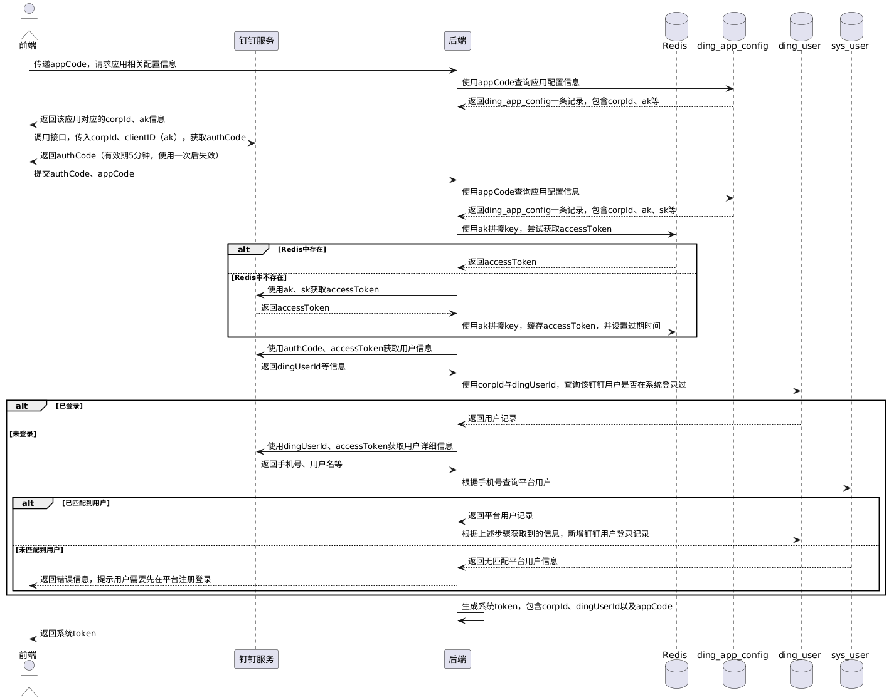
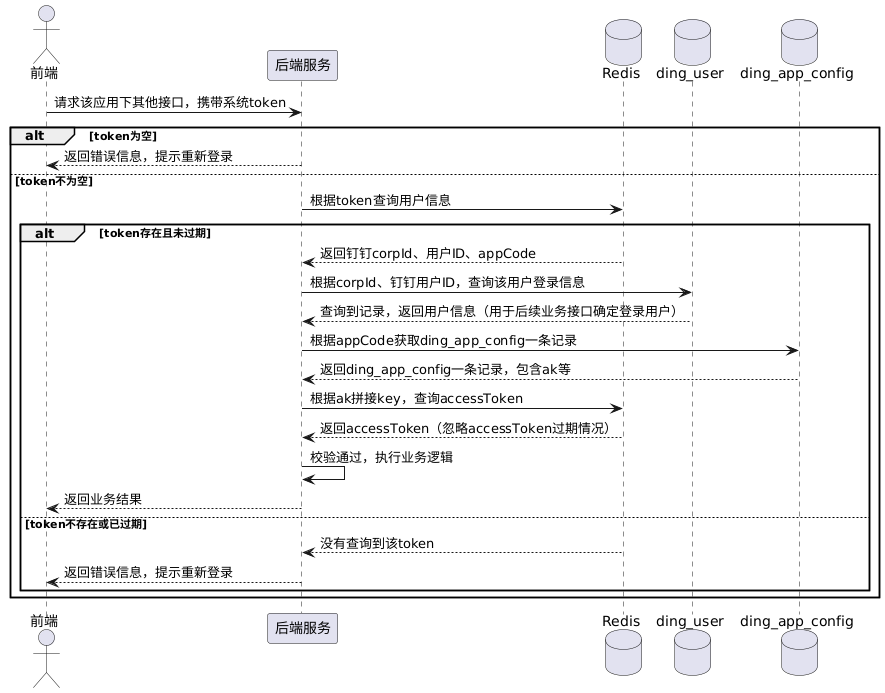
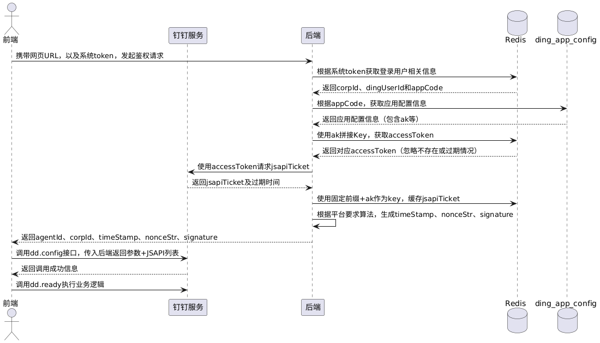

在钉钉企业内部`H5`微应用开发中，我们首先需要明确以下关键概念：

1. `CorpId`：钉钉企业的唯一标识，用于区分不同企业。
2. `AgentId`/`AppID`：企业内部应用的唯一标识。目前钉钉逐步使用`AppID`替代`AgentId`。
3. `ClientID`/`AppKey`：应用的唯一访问标识，相当于应用的`ak`。
4. `ClientSecret`/`AppSecret`：应用的唯一密钥，用于服务端鉴权，相当于应用的`sk`。
5. `authCode`：使用`CorpId`和`ClientID`调用钉钉接口生成临时授权码。有效期`5`分钟，使用一次后失效。该`authCode`包含用户信息的索引，不需要用户主动点击授权，只要用户打开微应用界面，就可以通过对应的`JSAPI`自动获取`authCode`。
6. `accessToken`：由`ClientID`/`AppKey`和`ClientSecret`/`AppSecret`在钉钉服务端获取的访问令牌，具有有效期。该令牌与应用相关联，与用户无关，后端需要对其进行缓存，以避免频繁调用钉钉接口。
7. 钉钉`userId`：员工在企业内部唯一标识，用于区分同一企业内的不同成员。

我们可以发现，一个`CorpId`与一个`AgentId`可以唯一定位钉钉企业下的一个微应用。由于每个微应用的`authCode`、`AppKey`和`AppSecret`都是独立的，所以每个微应用都需要单独执行完整的登录与鉴权流程。

我们的后端服务需要新建以下两张表：

```sql
CREATE TABLE `ding_app_config` (
  `id` BIGINT NOT NULL AUTO_INCREMENT COMMENT '主键ID',
  `app_code` VARCHAR(64) NOT NULL COMMENT '后端自定义的钉钉应用标识',
  `corp_id` VARCHAR(128) NOT NULL COMMENT '钉钉企业唯一id',
  `agent_id` VARCHAR(128) NOT NULL COMMENT '企业内部应用唯一id',
  `ak` VARCHAR(128) NOT NULL COMMENT 'ClientID (原AppKey和SuiteKey)',
  `sk` VARCHAR(256) NOT NULL COMMENT 'ClientSecret (原AppSecret和SuiteSecret)',
  `robot_code` VARCHAR(128) NOT NULL DEFAULT '' COMMENT '应用机器人code',
  `home_page_url` VARCHAR(128) NOT NULL DEFAULT '' COMMENT '应用首页地址',
  `create_time` DATETIME NOT NULL DEFAULT CURRENT_TIMESTAMP,
  `update_time` DATETIME NOT NULL DEFAULT CURRENT_TIMESTAMP ON UPDATE CURRENT_TIMESTAMP,
  PRIMARY KEY (`id`),
  UNIQUE KEY `uk_app_code` (`app_code`),
  UNIQUE KEY `uk_corp_agent` (`corp_id`, `agent_id`)
) ENGINE=InnoDB DEFAULT CHARSET=utf8mb4 COMMENT='钉钉微应用配置表';

CREATE TABLE `ding_user` (
  `id` BIGINT NOT NULL AUTO_INCREMENT COMMENT '主键ID',
  `user_id` BIGINT NOT NULL COMMENT '用户ID, 关联sys_user.id',
  `user_name` VARCHAR(255) NOT NULL DEFAULT '' COMMENT '用户名，关联sys_user.name',
  `ding_corp_id` VARCHAR(128) NOT NULL COMMENT '钉钉企业唯一id',
  `ding_user_id` VARCHAR(64) NOT NULL COMMENT '钉钉用户的userId',
  `ding_user_name` VARCHAR(255) NOT NULL DEFAULT '' COMMENT '钉钉用户名字',
  `ding_mobile` VARCHAR(20) NOT NULL COMMENT '钉钉手机号码',
  `ding_union_id` VARCHAR(64) NOT NULL DEFAULT '' COMMENT '钉钉用户的unionId',
  `create_time` DATETIME NOT NULL DEFAULT CURRENT_TIMESTAMP,
  `update_time` DATETIME NOT NULL DEFAULT CURRENT_TIMESTAMP ON UPDATE CURRENT_TIMESTAMP,
  PRIMARY KEY (`id`)
) ENGINE=InnoDB DEFAULT CHARSET=utf8mb4 COMMENT='钉钉微应用用户登录记录表';
```

表`ding_app_config`用于管理钉钉企业微应用的配置信息，每条记录对应一个微应用。其中字段`app_code`由后端自定义，用于唯一标识每个微应用，创建后不可修改。前端可通过该字段对系统接入的钉钉企业微应用进行管理。表`ding_user`用于记录系统用户与钉钉用户的关联关系，通过手机号建立关联，每个用户在每个企业下对应一条记录。

对于`ding_app_config`表，如果有业务需要，可以在其基础上进行扩展。例如，可以新增`tenant_id`、`app_name`、`app_icon`和`status`等字段，用于实现系统企业与钉钉企业的关联关系，并进一步与钉钉应用形成一对多的关系。其中，后三个字段可用于前端展示，便于动态管理应用与企业之间的关联。修改表结构的`DDL`语句如下：

```sql
ALTER TABLE `ding_app_config`
ADD COLUMN `tenant_id` BIGINT NOT NULL COMMENT '系统租户ID，关联sys_tenant.id' AFTER `id`,
ADD COLUMN `app_name` VARCHAR(128) NOT NULL COMMENT '钉钉应用名称' AFTER `app_code`,
ADD COLUMN `app_icon` VARCHAR(128) NOT NULL DEFAULT '' COMMENT '钉钉应用图标地址' AFTER `app_name`,
ADD COLUMN `status` TINYINT NOT NULL DEFAULT 0 COMMENT '0=未授权，1=已授权' AFTER `home_page_url`;
```

钉钉企业内部微应用免登接入系统平台的开发流程如下：



对于`accessToken`的管理，可以将其存储在`Redis`中：以固定前缀加上`ak`作为`Key`，将`accessToken`作为`Value`，并设置有效期。系统可根据`ak`拼接生成`Key`尝试获取`accessToken`，若获取成功则直接使用，若未获取到则重新生成并存储。

系统`token`的生成有两种方式：

1. 无状态方式：使用`JWT`生成`token`。
2. 有状态方式：生成随机`token`，并将其作为`key`，用户信息作为`value`存储在`Redis`中。

每个`token`中至少应包含`corpId`、钉钉用户`ID`和`appCode`信息。其中，`corpId`和钉钉用户`ID`用于唯一定位`ding_user`表中的一条数据，以获取登录用户信息；`appCode`则用于唯一定位`ding_app_config`表中的一条数据，以获取当前应用的配置信息。此外，`token`应设置有效期，例如`48`小时，并可将该过期时间一并返回给前端。

我们以有状态`token`为例，说明系统接入钉钉应用并获取到`token`后，调用该应用的其它接口的校验流程：



每个微应用都需要独立执行完整的登录与鉴权流程，因此前端需为每个应用单独保存对应的系统`token`，并在后续调用该应用的接口时携带该`token`。在传递给后端时，请求头的参数名应保持一致，例如使用`Ding-Authorization`。该参数与系统后台`token`的请求头`Authorization`理论上只能存在一个，用于区分钉钉登录和`PC`登录两种方式。中间件或拦截器可以根据对应请求头的`token`进行解析，从而判断具体的登录方式、可访问的接口范围以及登录用户身份。

当`H5`微应用的前端需要调用带鉴权的`JSAPI`时，必须先通过后端接口完成鉴权流程。整体流程如下：



前端传入网页`URL`，用于确保签名仅在对应页面生效，从而提升安全性。由于`jsapiTicket`属于应用维度，因此需要使用固定前缀加`ak`作为`Key`，并以`jsapiTicket`为`Value`缓存到`Redis`，以避免重复请求。生成签名时，后端需创建秒级时间戳`timeStamp`和`16`位随机字符串`nonceStr`，再根据平台要求的算法，结合`jsapiTicket`、前端传入的`URL`、`timeStamp`和`nonceStr`生成`signature`。当前端执行`dd.config`成功后，会在`dd.ready`中运行前面声明的`JSAPI`的调用。

钉钉企业内部微应用免登接入系统平台，其`PlantUML`代码如下所示：

```scss
@startuml
actor 前端
participant 钉钉服务
participant 后端
database Redis
database ding_app_config as Config表
database ding_user as 钉钉User表
database sys_user as 系统User表

前端 -> 后端: 传递appCode，请求应用相关配置信息
后端 -> Config表: 使用appCode查询应用配置信息
Config表 --> 后端: 返回ding_app_config一条记录，包含corpId、ak等
后端 --> 前端: 返回该应用对应的corpId、ak信息

前端 -> 钉钉服务 : 调用接口，传入corpId、clientID（ak），获取authCode
钉钉服务 --> 前端 : 返回authCode（有效期5分钟，使用一次后失效）
前端 -> 后端 : 提交authCode、appCode

后端 -> Config表 : 使用appCode查询应用配置信息
Config表 --> 后端 : 返回ding_app_config一条记录，包含corpId、ak、sk等

后端 -> Redis : 使用ak拼接key，尝试获取accessToken
alt Redis中存在
    Redis --> 后端 : 返回accessToken
else Redis中不存在
    后端 -> 钉钉服务 : 使用ak、sk获取accessToken
    钉钉服务 --> 后端 : 返回accessToken
    后端 -> Redis : 使用ak拼接key，缓存accessToken，并设置过期时间
end

后端 -> 钉钉服务 : 使用authCode、accessToken获取用户信息
钉钉服务 --> 后端 : 返回dingUserId等信息

后端 -> 钉钉User表 : 使用corpId与dingUserId，查询该钉钉用户是否在系统登录过
alt 已登录
    钉钉User表 --> 后端 : 返回用户记录
else 未登录
    后端 -> 钉钉服务 : 使用dingUserId、accessToken获取用户详细信息
    钉钉服务 --> 后端 : 返回手机号、用户名等
    后端 -> 系统User表 : 根据手机号查询平台用户
    alt 已匹配到用户
        系统User表 --> 后端 : 返回平台用户记录
        后端 -> 钉钉User表 : 根据上述步骤获取到的信息，新增钉钉用户登录记录
    else 未匹配到用户
        系统User表 --> 后端 : 返回无匹配平台用户信息
        后端 --> 前端 : 返回错误信息，提示用户需要先在平台注册登录
    end
end

后端 -> 后端 : 生成系统token，包含corpId、dingUserId以及appCode
后端 -> 前端 : 返回系统token
@enduml
```

获取到`token`后，再次进行登录时的校验流程，其`PlantUML`代码如下所示：

```scss
@startuml
actor 前端
participant 后端服务
database Redis
database ding_user as 钉钉User表
database ding_app_config as 钉钉Config表

前端 -> 后端服务 : 请求该应用下其他接口，携带系统token

alt token为空
    后端服务 --> 前端 : 返回错误信息，提示重新登录
else token不为空
    后端服务 -> Redis : 根据token查询用户信息
    alt token存在且未过期
        Redis --> 后端服务 : 返回钉钉corpId、用户ID、appCode
        后端服务 -> 钉钉User表 : 根据corpId、钉钉用户ID，查询该用户登录信息
        钉钉User表 --> 后端服务 : 查询到记录，返回用户信息（用于后续业务接口确定登录用户）
        后端服务 -> 钉钉Config表 : 根据appCode获取ding_app_config一条记录
        钉钉Config表 --> 后端服务 : 返回ding_app_config一条记录，包含ak等
        后端服务 -> Redis : 根据ak拼接key，查询accessToken
        Redis --> 后端服务: 返回accessToken（忽略accessToken过期情况）
        后端服务 -> 后端服务 : 校验通过，执行业务逻辑
        后端服务 --> 前端 : 返回业务结果
    else token不存在或已过期
        Redis --> 后端服务 : 没有查询到该token
        后端服务 --> 前端 : 返回错误信息，提示重新登录
    end
end
@enduml
```

前端调用带鉴权的`JSAPI`的时序图的`PlantUML`代码如下所示：

```scss
@startuml
actor 前端 as FE
participant 钉钉服务 as DingTalk
participant 后端 as BE
database Redis
database ding_app_config as Config表

FE -> BE : 携带网页URL，以及系统token，发起鉴权请求

BE -> Redis : 根据系统token获取登录用户相关信息
Redis --> BE : 返回corpId、dingUserId和appCode
BE -> Config表 : 根据appCode，获取应用配置信息
Config表 --> BE : 返回应用配置信息（包含ak等）

BE -> Redis : 使用ak拼接Key，获取accessToken
Redis --> BE : 返回对应accessToken（忽略不存在或过期情况）

BE -> DingTalk : 使用accessToken请求jsapiTicket
DingTalk --> BE : 返回jsapiTicket及过期时间
BE -> Redis : 使用固定前缀+ak作为key，缓存jsapiTicket

BE -> BE : 根据平台要求算法，生成timeStamp、nonceStr、signature
BE --> FE : 返回agentId、corpId、timeStamp、nonceStr、signature

FE -> DingTalk : 调用dd.config接口，传入后端返回参数+JSAPI列表
DingTalk --> FE : 返回调用成功信息
FE -> DingTalk : 调用dd.ready执行业务逻辑
@enduml
```

