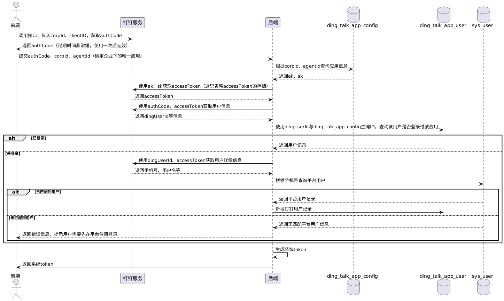
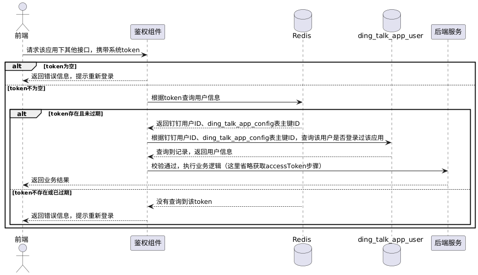

在钉钉企业内部`H5`微应用开发中，我们首先需要明确以下关键概念：

1. `CorpId`：钉钉企业的唯一标识，用于区分不同企业。
2. `AgentId`/`AppID`：企业内部应用的唯一标识。目前钉钉逐步使用`AppID`替代`AgentId`。
3. `ClientID`/`AppKey`：应用的唯一访问标识，相当于应用的`ak`。
4. `ClientSecret`/`AppSecret`：应用的唯一密钥，用于服务端鉴权，相当于应用的`sk`。
5. `authCode`：使用`CorpId`和`ClientID`调用钉钉接口生成临时授权码。该授权码有效期为`5`分钟，且仅能使用一次。这个过程不需要用户主动点击授权，它属于免登流程的一部分，只要用户打开微应用界面，就可以通过`JSAPI`自动获取`authCode`。
6. `accessToken`：通过`ClientID`/`AppKey`和`ClientSecret`/`AppSecret`在钉钉服务端获取的访问令牌。具有一定有效期，需后端缓存，以避免频繁调用接口。
7. 钉钉`userId`：企业内部唯一标识，用于区分同一企业内的不同成员。
8. 钉钉`unionId`：全钉钉全局唯一标识，可跨企业识别同一用户。

我们可以发现，一个`CorpId`与一个`AgentId`可以唯一定位钉钉企业下的一个微应用。由于每个微应用的`authCode`、`AppKey`和`AppSecret`都是独立的，所以每个微应用都需要单独执行完整的登录与鉴权流程。

我们的后端服务需要新建以下两张表：

```sql
CREATE TABLE `ding_talk_app_config` (
  `id` BIGINT NOT NULL AUTO_INCREMENT COMMENT '主键ID',
  `app_type` VARCHAR(64) NOT NULL DEFAULT '' COMMENT '后端自定义的应用标识',
  `corp_id` VARCHAR(128) NOT NULL COMMENT '钉钉企业唯一id',
  `agent_id` VARCHAR(128) NOT NULL COMMENT '企业内部应用唯一id',
  `ak` VARCHAR(128) NOT NULL COMMENT 'ClientID (原AppKey和SuiteKey)',
  `sk` VARCHAR(256) NOT NULL COMMENT 'ClientSecret (原AppSecret和SuiteSecret)',
  `create_time` DATETIME NOT NULL DEFAULT CURRENT_TIMESTAMP COMMENT '创建时间',
  `update_time` DATETIME NOT NULL DEFAULT CURRENT_TIMESTAMP ON UPDATE CURRENT_TIMESTAMP COMMENT '更新时间',
  PRIMARY KEY (`id`)
) ENGINE=InnoDB DEFAULT CHARSET=utf8mb4 COMMENT='钉钉微应用配置表';

CREATE TABLE `ding_talk_app_user` (
  `id` BIGINT NOT NULL AUTO_INCREMENT COMMENT '主键ID',
  `app_config_id` BIGINT NOT NULL COMMENT '钉钉客户端应用ID，关联ding_talk_app_config.id'
  `user_id` BIGINT NOT NULL COMMENT '用户ID, 关联sys_user.id',
  `user_name` VARCHAR(255) DEFAULT NULL COMMENT '用户名，关联sys_user.name',
  `ding_user_id` VARCHAR(64) NOT NULL COMMENT '钉钉用户的userId',
  `ding_user_name` VARCHAR(255) DEFAULT NULL COMMENT '钉钉用户名字',
  `ding_mobile` VARCHAR(20) DEFAULT NULL COMMENT '钉钉手机号码',
  `ding_union_id` VARCHAR(64) DEFAULT NULL COMMENT '钉钉用户的unionId',
  `create_time` DATETIME NOT NULL DEFAULT CURRENT_TIMESTAMP COMMENT '创建时间',
  `update_time` DATETIME NOT NULL DEFAULT CURRENT_TIMESTAMP ON UPDATE CURRENT_TIMESTAMP COMMENT '更新时间',
  PRIMARY KEY (`id`)
) ENGINE=InnoDB DEFAULT CHARSET=utf8mb4 COMMENT='钉钉用户微应用登录记录表';
```

表`ding_talk_app_config`用于管理钉钉企业微应用的配置信息，其中每条记录对应一个微应用。表`ding_talk_app_user`用于记录各微应用下已登录的用户信息，实现不同微应用之间的登录信息隔离。字段`app_type`为后端自定义，用于标识每个微应用，前端可通过该字段调用后端接口查询`ding_talk_app_config`表，以获取指定微应用的详细配置信息。

钉钉企业内部微应用免登接入系统平台的开发流程如下：



系统`token`的生成有两种方式：

1. 无状态方式：使用`JWT`生成`token`。
2. 有状态方式：生成随机`token`，并将其作为`key`，用户信息作为`value`存储在`Redis`中。

每个`token`中至少应包含钉钉用户`ID`以及`ding_talk_app_config`表的主键`ID`，它们可以唯一定位`ding_talk_app_user`表的一条数据，从而获取登录用户信息。此外，`token`应设置有效期，例如`48`小时，并将该过期时间一并返回给前端。

我们以有状态`token`为例，说明系统接入钉钉服务并获取到`token`后，再次进行登录时的校验流程：



在后续登录过程中，前端需传递对应微应用返回的`token`。对于`accessToken`的管理，可以将其存储在`Redis`中：使用固定前缀加上`ak`作为`key`，将`accessToken`作为`value`，并设置有效期。这样，在免登录场景下，系统可以根据`ak`拼装`key`尝试获取`accessToken`，若获取成功，则直接使用，若未获取到，则重新生成并存储。