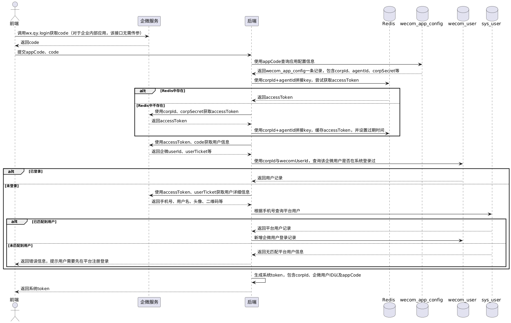

企业微信内部应用的登录流程与钉钉`H5`微应用相似，具体关键概念，等后续实现了整条流程后再整理。

我们的后端服务需要新建以下两张表：

```sql
CREATE TABLE `wecom_app_config` (
  `id` BIGINT NOT NULL AUTO_INCREMENT COMMENT '主键ID',
  `app_code` VARCHAR(64) NOT NULL DEFAULT '' COMMENT '后端自定义的企微应用标识',
  `app_name` VARCHAR(128) NOT NULL COMMENT '企微应用名称',
  `app_icon` VARCHAR(128) NOT NULL DEFAULT '' COMMENT '企微应用图标地址',
  `corp_id` VARCHAR(128) NOT NULL COMMENT '企微企业唯一id',
  `agent_id` VARCHAR(128) NOT NULL COMMENT '企业内部应用唯一id',
  `corp_secret` VARCHAR(256) NOT NULL COMMENT '应用级别的独立访问密钥',
  `status` TINYINT NOT NULL DEFAULT 0 COMMENT '0=未授权，1=已授权',
  `created_at` DATETIME NOT NULL DEFAULT CURRENT_TIMESTAMP,
  `updated_at` DATETIME NOT NULL DEFAULT CURRENT_TIMESTAMP ON UPDATE CURRENT_TIMESTAMP,
  PRIMARY KEY (`id`),
  UNIQUE KEY `uk_app_code` (`app_code`),
  UNIQUE KEY `uk_corp_agent` (`corp_id`, `agent_id`)
) ENGINE=InnoDB DEFAULT CHARSET=utf8mb4 COMMENT='企微应用配置表';

CREATE TABLE `wecom_user` (
  `id` BIGINT NOT NULL AUTO_INCREMENT COMMENT '主键ID',
  `user_id` BIGINT NOT NULL COMMENT '用户ID, 关联sys_user.id',
  `user_name` VARCHAR(255) NOT NULL DEFAULT '' COMMENT '用户名，关联sys_user.name',
  `wecom_corp_id` VARCHAR(128) NOT NULL COMMENT '企业微信企业唯一id',
  `wecom_user_id` VARCHAR(64) NOT NULL COMMENT '企微用户的userId',
  `wecom_avatar` VARCHAR(128) NOT NULL DEFAULT '' COMMENT '企微用户头像',
  `wecom_qr_code` VARCHAR(128) NOT NULL DEFAULT '' COMMENT '企微员工个人二维码',
  `wecom_mobile` VARCHAR(20) NOT NULL COMMENT '企微手机号码',
  `wecom_openid` VARCHAR(64) NOT NULL DEFAULT '' COMMENT '企微用户的openid',
  `create_time` DATETIME NOT NULL DEFAULT CURRENT_TIMESTAMP,
  `update_time` DATETIME NOT NULL DEFAULT CURRENT_TIMESTAMP ON UPDATE CURRENT_TIMESTAMP,
  PRIMARY KEY (`id`)
) ENGINE=InnoDB DEFAULT CHARSET=utf8mb4 COMMENT='企微应用用户登录记录表';
```

同样地，如果需要实现系统企业与企微企业的关联关系，可以新建下表：

```sql
CREATE TABLE `wecom_corp_bind` (
  `id` BIGINT NOT NULL AUTO_INCREMENT COMMENT '主键ID',
  `tenant_id` BIGINT NOT NULL COMMENT '系统租户ID，关联sys_tenant.id',
  `tenant_name` VARCHAR(128) NOT NULL COMMENT '系统租户名称，关联sys_tenant.name',
  `wecom_corp_id` VARCHAR(128) NOT NULL COMMENT '企微企业唯一id',
  `created_at` DATETIME NOT NULL DEFAULT CURRENT_TIMESTAMP,
  `updated_at` DATETIME NOT NULL DEFAULT CURRENT_TIMESTAMP ON UPDATE CURRENT_TIMESTAMP,
  PRIMARY KEY (`id`)
) ENGINE=InnoDB DEFAULT CHARSET=utf8mb4 COMMENT='企微企业绑定表';
```

企微企业内部应用免登接入系统平台的开发流程如下：



企微企业内部应用免登接入系统平台，其`PlantUML`代码如下所示：

```scss
@startuml
actor 前端
participant 企微服务
participant 后端
database Redis
database wecom_app_config as Config表
database wecom_user as 企微User表
database sys_user as 系统User表

前端 -> 企微服务 : 调用wx.qy.login获取code（对于企业内部应用，该接口无需传参）
企微服务 --> 前端 : 返回code

前端 -> 后端 : 提交appCode、code

后端 -> Config表 : 使用appCode查询应用配置信息
Config表 --> 后端 : 返回wecom_app_config一条记录，包含corpId、agentId、corpSecret等

后端 -> Redis : 使用corpId+agentId拼接key，尝试获取accessToken
alt Redis中存在
    Redis --> 后端 : 返回accessToken
else Redis中不存在
    后端 -> 企微服务 : 使用corpId、corpSecret获取accessToken
    企微服务 --> 后端 : 返回accessToken
    后端 -> Redis : 使用corpId+agentId拼接key，缓存accessToken，并设置过期时间
end

后端 -> 企微服务 : 使用accessToken、code获取用户信息
企微服务 --> 后端 : 返回企微userId、userTicket等

后端 -> 企微User表 : 使用corpId与wecomUserId，查询该企微用户是否在系统登录过
alt 已登录
    企微User表 --> 后端 : 返回用户记录
else 未登录
    后端 -> 企微服务 : 使用accessToken、userTicket获取用户详细信息
    企微服务 --> 后端 : 返回手机号、用户名、头像、二维码等
    后端 -> 系统User表 : 根据手机号查询平台用户
    alt 已匹配到用户
        系统User表 --> 后端 : 返回平台用户记录
        后端 -> 企微User表 : 新增企微用户登录记录
    else 未匹配到用户
        系统User表 --> 后端 : 返回无匹配平台用户信息
        后端 --> 前端 : 返回错误信息，提示用户需要先在平台注册登录
    end
end

后端 -> 后端 : 生成系统token，包含corpId、企微用户ID以及appCode
后端 --> 前端 : 返回系统token
@enduml
```

