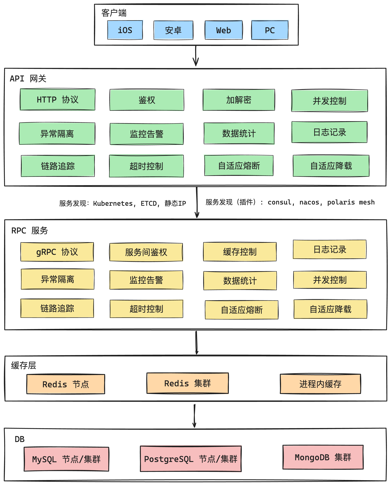

`go-zero`是一个专为简化微服务开发而设计的高效`Web`和`RPC`框架，集成了多种工程实践，提供了一整套从`RPC`通信到数据库访问等功能的工具和库。它类似于`Java`的`Spring Cloud`，但更加轻量和灵活，适用于构建分布式微服务系统。

### 框架的核心优势

#### 1. 自动化工具支持

`go-zero`强调工具驱动开发，开发者可以通过自动化生成工具快速生成接口、代码模板及微服务结构。通过这种方式，开发者可以在几分钟内完成服务的初始化，大大提升了开发效率，减少了重复性工作，使得开发者能够更加专注于业务逻辑和创新。

#### 2. 全面的功能覆盖

`go-zero`提供了广泛的功能支持，包括：

- **`Web API`**：快速构建高性能`RESTful API`；
- **`RPC`**：支持高效的`RPC`服务通信；
- 数据库访问：内置`ORM`解决方案，简化数据库操作；
- 缓存：内置对缓存的支持，提升服务性能；
- 容错与负载均衡：内置支持服务容错、负载均衡及熔断机制。

相较于其他微服务框架（如`go-micro`、`go-kit`等），`go-zero`在`Web API`支持方面更加友好，且无需额外启动复杂的服务，使得其更加轻便且定制性强。

#### 3. 高效的开发体验

`go-zero`的设计注重开发体验，框架内建了丰富的工具和生成器，开发者可以通过命令行工具自动生成代码，减少了大量重复劳动。此外，框架还提供了详细的文档和范例，帮助开发者快速上手。

### 应用场景与演进

#### 1. 单体应用阶段

在产品初期阶段，尤其是需求验证期，微服务架构可能过于复杂。此时，使用单体应用即可快速验证业务模型和获取用户反馈。`go-zero`在这一阶段同样表现出色，支持开发简单而高效的单体应用架构。

#### 2. 业务扩展与微服务架构

随着业务需求和规模的不断扩大，微服务架构变得不可或缺。`go-zero`提供了从单体应用到微服务架构的平滑过渡，能够灵活应对架构扩展的需求。在业务演进过程中，`go-zero`保持了高度的灵活性和可维护性，支持动态添加新的服务模块，保证了系统的可扩展性。

### 总结

`go-zero`的核心价值在于其高度的灵活性、易用性和全面的功能覆盖。它帮助开发者减少了重复代码的编写，简化了架构设计，降低了开发成本，让开发者能专注于业务创新和功能实现。无论是单体应用还是微服务架构，`go-zero`都能提供强有力的支持，满足从初期到扩展各阶段的业务需求。简单来说，`go-zero`让你少写重复代码，更多关注业务实现。

### `go-zero`架构图

