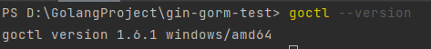

> `go-zero`的官方`GitHub`仓库地址：https://github.com/zeromicro/go-zero
> `go-zero`的官方文档：https://go-zero.dev/docs/tasks

#### 1. 安装`go-zero`库

在项目中使用`go-zero`非常简单，运行以下命令即可安装最新版本的`go-zero`库：

```bash
go get github.com/zeromicro/go-zero
```

#### 2. 安装`go-zero`工具包`goctl`

`goctl`是`go-zero`框架中的一个强大命令行工具，它用于生成和管理项目中的代码。

运行以下命令来安装`goctl`：

```bash
go install github.com/zeromicro/go-zero/tools/goctl@latest
```

#### 3. 验证安装是否成功

安装完成后，可以通过运行以下命令来检查`goctl`是否安装成功以及查看版本信息：

```sh
goctl --version
```


