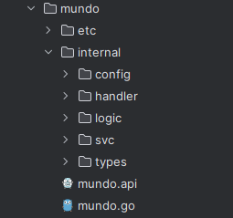
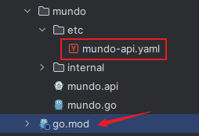
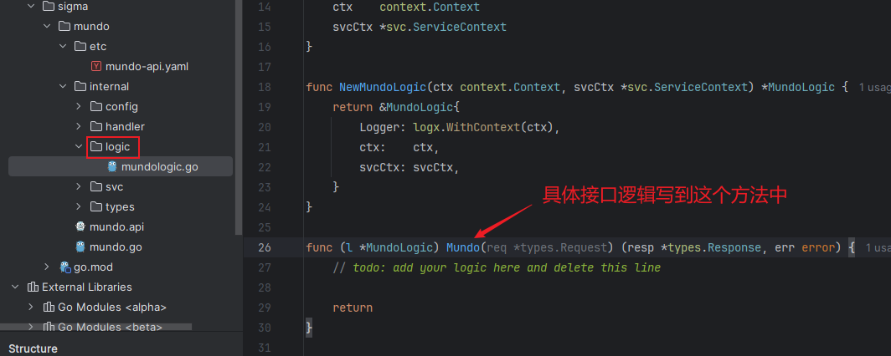
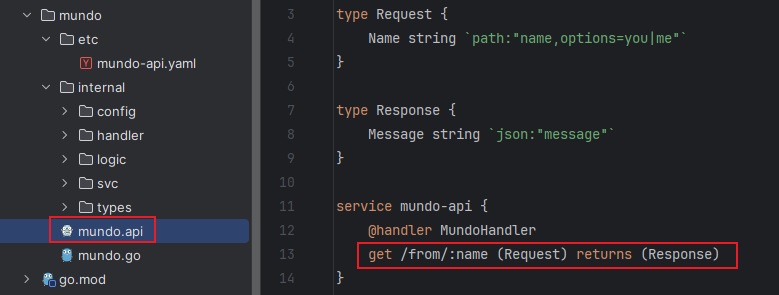
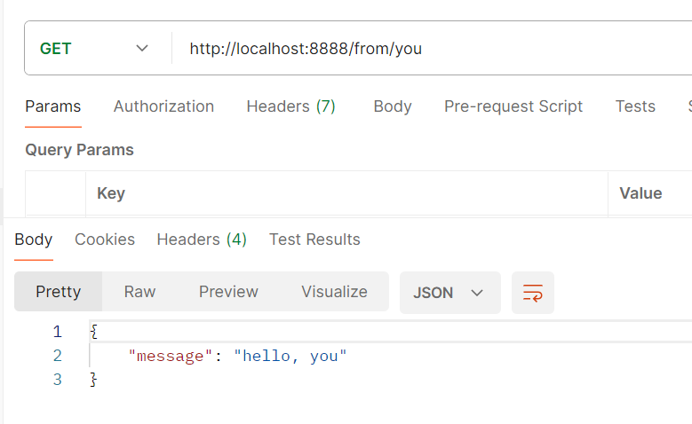

在上一节中，我们成功安装了`goctl`。接下来，我们将介绍如何使用`goctl`生成`API`服务。`API`服务类似于传统的单体应用，适合在项目初期快速开发和验证业务逻辑。

首先，在终端中切换到项目的根目录，然后执行以下命令：

```sh
goctl api new mundo
```

执行完上面指令后，生成代码的整体目录结构大概是这样的：



这就是`goctl`工具为我们生成的基础目录结构，我们将在此基础上开发`API`服务。在上述命令中，`mundo`是一个自定义的名称。该名称不仅创建了一个同名目录，并将生成的所有内容放置在该目录下，还决定了生成内容的命名。

项目初始化后，可能会发现一些文件的导入部分显示爆红。这通常是由于缺少依赖或模块未正确加载所致。我们可以通过运行`go mod tidy`命令来解决这些问题。如果执行后问题仍然存在，尝试重启`Goland`即可。

我们先运行一下`mundo.go`文件中的`main`函数，发现有一个报错：

```
2024/12/30 11:40:49 error: config file etc/mundo-api.yaml, open etc/mundo-api.yaml: The system cannot find the path specified.
```

这是因为程序无法找到指定的配置文件路径。通过查看代码，我们发现指定配置文件路径的代码如下：

```go
var configFile = flag.String("f", "etc/mundo-api.yaml", "the config file")
```

在`Go`程序中，“相对路径”并不是相对于代码文件所在的位置，而是相对于最近的由`GoModules`管理的目录。换句话说，`Go`编译器会从包含`go.mod`文件的最近目录开始解析相对路径。注意，路径开头不包含斜杠。

我们整体的项目目录结构是这样：



因此，需要修改指定配置文件路径的代码，将其更改为从项目根目录开始的相对路径：

```go
var configFile = flag.String("f", "mundo/etc/mundo-api.yaml", "the config file")
```

这样，路径将正确解析，再次启动`main`函数时，项目能够正常启动。

在生成的代码中，有一个名为`logic`的目录，专门用于存放具体的接口逻辑。在这个目录中，我们可以编写接口的实现方法：



例如我们写一个简单的返回逻辑：

```go
func (l *MundoLogic) Mundo(req *types.Request) (resp *types.Response, err error) {
	resp = &types.Response{
		Message: fmt.Sprintf("hello: %s", req.Name),
	}
	return
}
```

在`mundo.api`文件中，定义了这个接口的请求路径、入参、出参等信息：



我们按照`mundo.api`文件指定的接口路径，使用`Postman`调用接口，展示出接口返回结果：



> 注意：这只是一个生成`api`目录结构的示范，真正的开发中，应该先编写`.api`文件，再生成对应的代码。具体内容见下节。