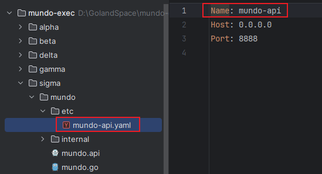
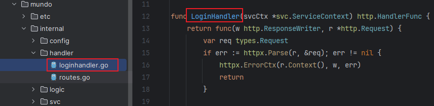
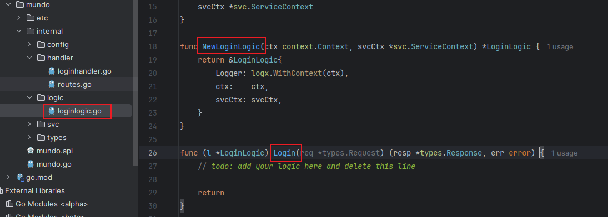
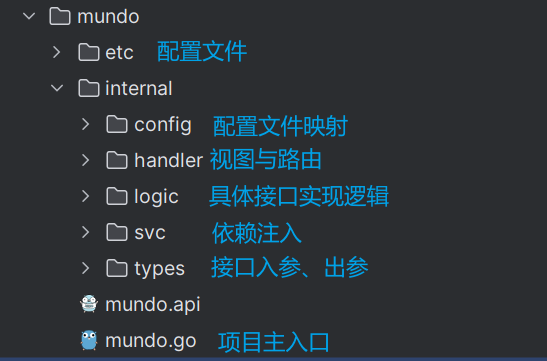

在上一节中，我使用`goctl`命令生成了一个接口服务。需要注意的是，它只是`go-zero`生成的一个示例。接下来，我将对`mundo.api`文件进行一些基本的讲解。

> 如果发现`Goland`项目中的`.api`文件不高亮，参考文章：https://blog.csdn.net/joeyoj/article/details/135922507。

在上文中，通过命令生成的示例`mundo.api`文件内容如下所示：

```go
syntax = "v1"

type Request {
	Name string `path:"name,options=you|me"`
}

type Response {
	Message string `json:"message"`
}

service mundo-api {
	@handler MundoHandler
	get /from/:name (Request) returns (Response)
}
```

我们发现，`.api`文件的格式与`gRPC`的`proto`文件格式类似。`type`关键字类似于`proto`文件中的`message`，用于定义入参和出参的结构，以供`service`块中的`api`使用。

在`.api`文件中，`service`关键字后面的变量命名并不强制要求大小写。该命名会影响`etc`目录下的`yaml`配置文件名，以及该配置文件第一行`Name`的值。例如命名为`mundo-api`，则会生成以下文件：



建议采用`xxx-api`的命名格式，这样生成的主函数文件名将是`xxx.go`。

对于`@handler`注解后的变量命名，大小写没有特定要求。该命名会影响`handler`目录下生成的文件名和方法名。如果命名为`xxxHandler`的格式，生成的代码将保持该名称；如果未采用此格式，则会自动加上`Handler`后缀。

例如，命名为`Login`时，`handler`目录下会生成以下命名的文件，内部函数名如下：



同样，这个变量命名也会影响`logic`目录下接口实现方法的名称，如下所示：



对于`@handler`注解后的变量命名，我们制定的规范是：首字母大写、驼峰命名法，并且不加`Handler`后缀，力求简洁明了。

对于`mundo.api`文件的文件名，没有严格要求，它不会影响生成的文件或代码的命名。接下来，我们修改`mundo.api`文件的内容，定义两个具体的接口，如下所示：

```go
syntax = "v1"

type LoginRequest {
	Username string `json:"username"`
	Password string `json:"password"`
}

type LoginResponse {
	Code    string `json:"code"`
	Message string `json:"message"`
}

type RegisterRequest {
	Username       string `json:"username"`
	Password       string `json:"password"`
	RepeatPassword string `json:"repeat_password,optional"` // 非必传参数
}

type RegisterResponse {
	Message string `json:"message"`
}

service mundo-api {
	@handler Login
	post /login (LoginRequest) returns (LoginResponse)

	@handler Register
	post /register (RegisterRequest) returns (RegisterResponse)
}
```

在`.api`文件中，如果未指定接口入参字段的`optional`标签，调用接口时必须传递该参数，并且参数类型必须与定义的数据类型匹配，否则会导致验证错误。传入的多余参数不会影响接口调用。

接下来，我们需要删除原先的`etc`和`internal`两个目录，以及`mundo.go`文件，只保留`mundo.api`文件。然后，在终端中切换到`mundo.api`文件所在的目录，运行以下命令：

```sh
goctl api go -api mundo.api -dir .
```

下面对该命令做出详细讲解：

- `api`：这是`goctl`工具的子命令，用于生成`API`相关的接口代码。
- `go`：指定生成的代码语言为`Go`。
- `-api mundo.api`：指定`API`描述文件，也就是我们要操作的`.api`文件。
- `-dir .`：指定生成的代码存放目录。`.`表示当前目录，生成的代码将被放置在当前目录下。

运行命令后，`goctl`将自动生成`etc`和`internal`两个文件夹，以及`mundo.go`文件。接下来，需要在`internal/logic`目录下实现这两个接口的具体逻辑。完成这些实现后，启动项目并调用接口进行测试。

这里也别忘了改`mundo.go`的配置文件路径部分部分：

```go
var configFile = flag.String("f", "mundo/etc/mundoapi.yaml", "the config file")
```

如果发现`.api`文件的内容不够整齐，需要格式化，在终端执行以下命令：

```sh
goctl api format --dir mundo.api
```

在正常情况下，我们无需每次都删除之前生成的所有内容后再执行命令，只需直接执行命令即可更新生成的代码。如果涉及到`service`或`@handler`等部分的删除，生成的代码可能依然保留这些内容，这时需要手动删除不再需要的部分。

在实际开发中，通常的流程是首先编写`.api`文件，然后执行相应的命令生成对应的代码。接下来，开发者可以根据生成的代码实现具体的接口逻辑。

对于`goctl`生成`api`代码中各文件或目录，这里做一个简要的功能总结：


