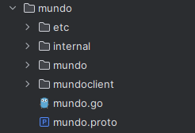
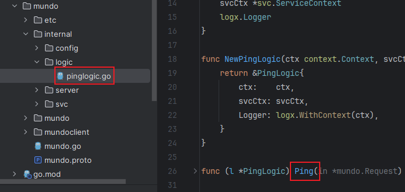

下面我们介绍如何使用`goctl`工具生成`rpc`服务，实际生成的内容基于`gRPC`的语法规则。

我们在`mundo`目录下使用以下命令：

```sh
goctl rpc new mundo
```

执行完成后，生成出来的代码的目录结构如下所示：



生成代码后，使用`go mod tidy`来引入缺少的依赖，然后更改一下`myrpc.go`文件的配置文件路径：

```go
var configFile = flag.String("f", "mundo/etc/mundo.yaml", "the config file")
```

执行`myrpc.go`的`main`函数，发现有如下报错：

```json
{"level":"warn","ts":"2025-01-02T10:13:56.137725+0800","logger":"etcd-client","caller":"v3@v3.5.15/retry_interceptor.go:63","msg":"retrying of unary invoker failed","target":"etcd-endpoints://0xc0001b9680/127.0.0.1:2379","attempt":0,"error":"rpc error: code = DeadlineExceeded desc = latest balancer error: last connection error: connection error: desc = \"transport: Error while dialing: dial tcp 127.0.0.1:2379: connectex: No connection could be made because the target machine actively refused it.\""}
```

日志信息显示，`etcd`客户端在尝试与`etcd`服务器通信时出现了错误，具体表现为`DeadlineExceeded`，表明请求执行时间超出了设定的超时时间。为进一步排查问题，我们查看`etc/mundo.yaml`的配置内容:

```yaml
Name: mundo.rpc
ListenOn: 0.0.0.0:8080
Etcd:
  Hosts:
  - 127.0.0.1:2379
  Key: mundo.rpc
```

启动该`gRPC`模块需要依赖`etcd`服务，并将其地址写入配置文件。我们通过`Docker`安装`etcd`，具体步骤可参考`Docker`安装软件。本实例中的`etcd`用于实现服务注册与发现，其中配置的`etcd`键（`key`）是服务的唯一标识，并支持用户自定义。

安装完成`etcd`后，只需将其地址信息写入上述配置文件。成功启动后，将仅显示以下内容：

```
Starting rpc server at 0.0.0.0:8080...
```

具体的接口实现逻辑定义在`internal/logic`目录下的文件中，我们在这里写接口的逻辑代码：



接口逻辑如下所示：

```go
func (l *PingLogic) Ping(in *mundo.Request) (*mundo.Response, error) {
	return &mundo.Response{
		Pong: fmt.Sprintf("hello, %s", in.Ping),
	}, nil
}
```

接口调用的步骤与`gRPC`的流程完全一致。在此，我们使用`BloomRPC`工具导入生成的`mundo.proto`文件，并进行接口调用：


这段过程展示了`go-zero`对`rpc`模块的生成与使用的一个简单示例。在实际开发中，通常是先编写`proto`文件，然后通过`goctl`工具生成相应的代码。

项目启动后也许会有如下的关于`etcd`的两条日志信息：

```json
{"level":"warn","ts":"2025-01-02T10:40:35.276792+0800","logger":"etcd-client","caller":"v3@v3.5.15/retry_interceptor.go:63","msg":"retrying of unary invoker failed","target":"etcd-endpoints://0xc0001b9e00/123.60.188.152:2379","attempt":0,"error":"rpc error: code = DeadlineExceeded desc = latest balancer error: last connection error: connection error: desc = \"transport: Error while dialing: dial tcp 127.0.0.1:2379: connectex: No connection could be made because the target machine actively refused it.\""}
{"level":"info","ts":"2025-01-02T10:40:35.276792+0800","logger":"etcd-client","caller":"v3@v3.5.15/client.go:210","msg":"Auto sync endpoints failed.","error":"context deadline exceeded"}
```

日志显示，即使已将`etcd`地址正确配置为实际的连接地址，`etcd`客户端仍持续尝试连接`127.0.0.1:2379`。由于该问题不影响接口调用，可暂时忽略。
