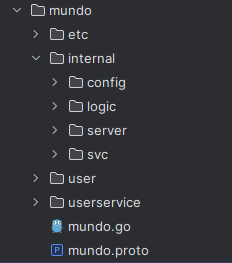
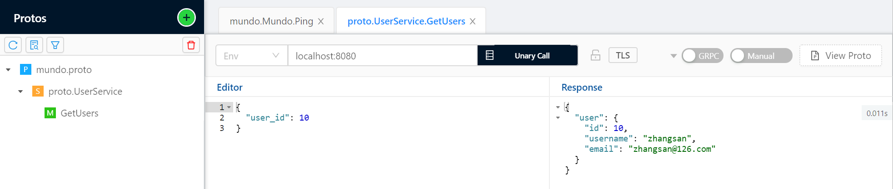
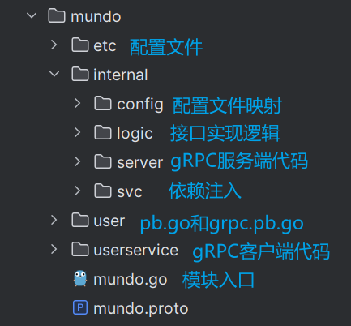

自定义`RPC`服务的开发流程与自定义`API`服务类似，都需要修改对应的`api`或`proto`文件，并通过`goctl`命令生成相应代码。其中，`proto`文件的语法与`gRPC`中使用的完全一致，具体细节可参考前文内容。

我们在`mundo.proto`文件中写下面的内容：

```protobuf
syntax = "proto3";

package proto;

option go_package = "./user";

message User {
  int32 id = 1;
  string username = 2;
  string email = 3;
}

service UserService {
  rpc GetUsers (UserRequest) returns (UserResponse);
}

message UserRequest {
  int32 user_id = 1;
}

message UserResponse {
  User user = 1;
}
```

删除`mundo`模块中除了`mundo.proto`外所有内容，在终端切换到这个`proto`所在的目录下，执行下面的命令：

```sh
goctl rpc protoc mundo.proto --go_out=. --go-grpc_out=. --zrpc_out=.
```

命令中的`--go_out`和`--go-grpc_out`参数与`gRPC`中的用法一致，用于指定`mundo.pb.go`和`mundo.pb.go`文件的输出位置；而`--zrpc_out`参数则用于指定`ZeroRPC`框架生成的代码（即`user`目录以外部分）的输出位置。

在正常开发过程中，我们无需删除所有内容后再重新执行命令，可以直接执行命令来更新生成的代码。如果涉及到接口的删除，之前生成的代码可能仍会保留，此时需要手动删除这些不再需要的部分。

生成的内容的目录结构如下：



具体的接口实现逻辑定义在`internal/logic`目录下的文件中，我们在这里写接口的逻辑代码：

```go
func (l *GetUsersLogic) GetUsers(in *user.UserRequest) (*user.UserResponse, error) {
	return &user.UserResponse{
		User: &user.User{
			Id:       in.UserId,
			Username: "zhangsan",
			Email:    "zhangsan@126.com",
		},
	}, nil
}
```

然后需要改两个地方，一个是在`mundo.go`文件中，改一下`yaml`配置文件的位置：

```go
var configFile = flag.String("f", "mundo/etc/mundo.yaml", "the config file")
```

另一个是`etc/myrpc.yaml`这个配置文件，更改`etcd`的地址为指定的信息。

```yaml
Name: myrpc.rpc
ListenOn: 0.0.0.0:8080
Etcd:
  Hosts:
    - 123.60.188.152:2379
  Key: myrpc.rpc
```

接下来，启动`myrpc.go`中的`main`函数，将模块运行起来，并使用`BloomRPC`工具调用接口：



以下是对`goctl`生成的`rpc`代码中各文件和目录的简要功能总结：

