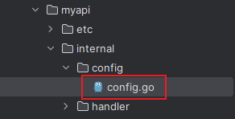
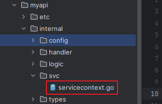
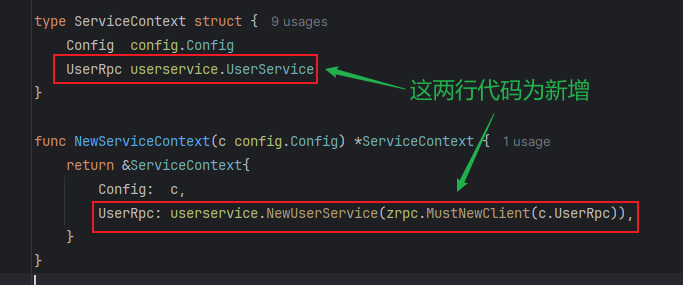
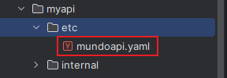
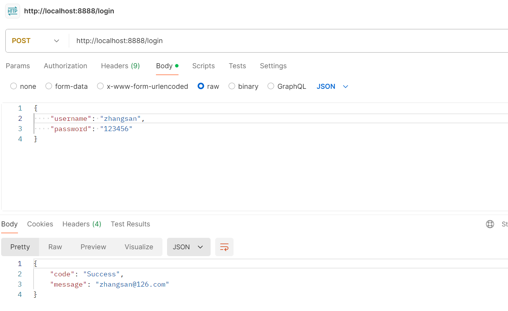
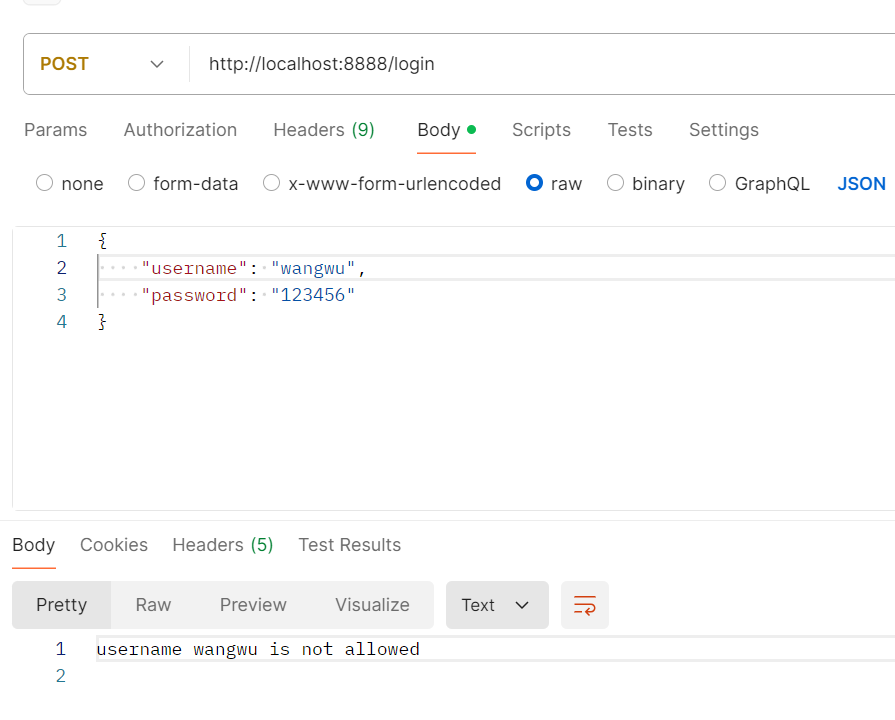

我们使用`goctl`工具创建了一个单体架构的`API`服务和一个微服务架构的`RPC`服务。接下来，我们需要实现`API`服务调用`RPC`服务的流程，类似于之前在`Gin`中调用`gRPC`的操作。目前，`RPC`服务的业务逻辑已编写完成，并且我们已将`RPC`服务的地址信息注册到`etcd`中。我们需要在`API`服务中获取`RPC`服务的地址信息，并调用相应的`RPC`接口。

这里为了区分，我们命名`API`服务的目录名为`myapi`，`RPC`服务的目录名为`myrpc`。

我们处理`api`的模块。更改处理配置文件映射的文件`config.go`：



在`Config`结构体中添加`zrpc.RpcClientConf`类型字段：

```go
type Config struct {
   rest.RestConf
   UserRpc zrpc.RpcClientConf
}
```

然后更改处理依赖注入的文件`servicecontext.go`：



新增`rpc`模块中定义的`userservice.UserService`客户端服务，用于调用具体的`rpc`接口：



```go
type ServiceContext struct {
	Config  config.Config
	UserRpc userservice.UserService
}

func NewServiceContext(c config.Config) *ServiceContext {
	return &ServiceContext{
		Config:  c,
		UserRpc: userservice.NewUserService(zrpc.MustNewClient(c.UserRpc)),
	}
}
```

然后更改配置文件`etc/mundoapi.yaml`，加入`etcd`的信息：



```yaml
Name: myapi
Host: 0.0.0.0
Port: 8888
UserRpc:
  Etcd:
    Hosts:
      - 10.40.18.26:2379
    Key: myrpc.rpc
```

这里的属性名`UserRpc`和`Config`结构体定义的字段名一致，`key`的值需要与`rpc`服务定义的`key`一致。

我们以`Login`接口为例，将调用`rpc`接口的代码写到这个接口里面，重点关注是如何调用`rpc`客户端代码的：

```go
func (l *LoginLogic) Login(req *types.LoginRequest) (resp *types.LoginResponse, err error) {
	userResp, _ := l.svcCtx.UserRpc.GetUsers(l.ctx, &user.UserRequest{
		UserId: 300,
	})
	if req.Username != userResp.User.Username {
		return nil, fmt.Errorf("username %s is not allowed", req.Username)
	}
	resp = &types.LoginResponse{
		Code:    "Success",
		Message: userResp.User.Email,
	}
	return
}
```

然后使用`Postman`调用这个`api`接口，展示出调用成功的结果：



或者是调用失败的结果：


