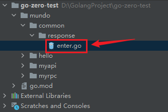
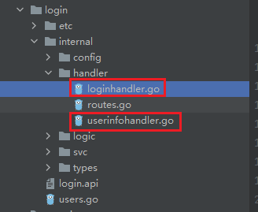
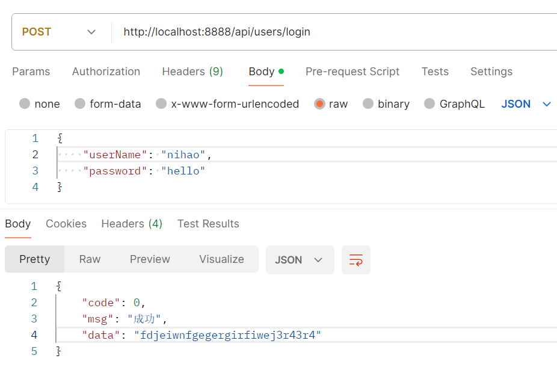
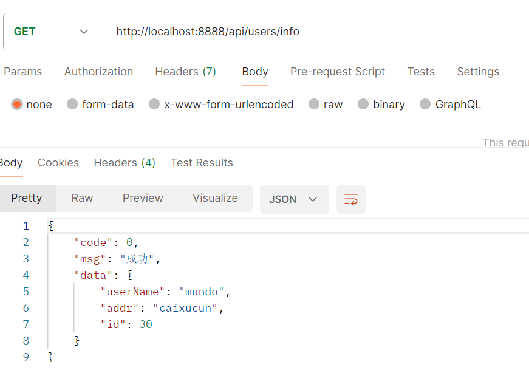

我们前面使用了`Go-zero`框架的工具`goctl`生成了`api`服务和`rpc`服务，其中`api`服务就类似于`Gin`框架，提供接口调用。

在使用`Gin`框架时，我们定义过一个标准返回结构，类似下面这种：

```go
type Response struct {
	Code    int         `json:"code"`
	Message string      `json:"message"`
	Data    interface{} `json:"data"`
}
```

这是因为`Gin`框架不用事先定义接口返回结构，比较灵活，在需要返回时直接调用这个结构的函数就可以了。

但是对于`goctl`生成`api`服务来说，每个接口都需要预先设定好返回结构，我们就需要给每个接口都写好这个`code`、`data`、`message`结构，例如这样：

```protobuf
syntax = "v1"

type LoginRequest {
  UserName string `json:"userName"`
  Password string `json:"password"`
}

type LoginResponse {
  Code int    `json:"code"`
  Data string `json:"data"`
  Msg  string `json:"msg"`
}

type UserInfo {
  UserName string `json:"userName"`
  Addr     string `json:"addr"`
  Id       uint   `json:"id"`
}

type UserInfoResponse {
  Code int      `json:"code"`
  Data UserInfo `json:"data"`
  Msg  string   `json:"msg"`
}

service users {
  @handler login
  post /api/users/login (LoginRequest) returns (LoginResponse)
  
  @handler userInfo
  get /api/users/info returns (UserInfoResponse)
}
```

这显然是非常麻烦的，我们应该给这个结构统一写到一个地方，方便所有接口使用。

我们创建一个公共的目录，写一个文件去封装这些内容：



在这个`enter.go`文件中，写以下内容：

```go
package response

import (
	"github.com/zeromicro/go-zero/rest/httpx"
	"net/http"
)

type Body struct {
	Code uint32      `json:"code"`
	Msg  string      `json:"msg"`
	Data interface{} `json:"data"`
}

func Response(r *http.Request, w http.ResponseWriter, resp interface{}, err error) {
	if err == nil {
		jsonBody := &Body{
			Code: 0,
			Msg:  "成功",
			Data: resp,
		}
		httpx.WriteJson(w, http.StatusOK, jsonBody)
		return
	}
	// 这里可以根据数据类型，指定不同的错误码，返回具体的错误信息
	errCode := uint32(10086)
	errMsg := "服务器错误"
	httpx.WriteJson(w, http.StatusBadRequest, &Body{
		Code: errCode,
		Msg:  errMsg,
		Data: nil,
	})
}
```

然后我们就可以把上面那个`api`文件改成这样：

```protobuf
syntax = "v1"

type LoginRequest {
	UserName string `json:"userName"`
	Password string `json:"password"`
}

type UserInfo {
	UserName string `json:"userName"`
	Addr     string `json:"addr"`
	Id       uint   `json:"id"`
}

service users {
	@handler login
	post /api/users/login (LoginRequest) returns (string)

	@handler userInfo
	get /api/users/info returns (UserInfo)
}
```

重新生成代码，然后我们要改一下这个地方：



代码改成这个样子，其中最后一句是更改部分，代表我们对`resp`的封装（另一个接口同理）：

```go
func loginHandler(svcCtx *svc.ServiceContext) http.HandlerFunc {
   return func(w http.ResponseWriter, r *http.Request) {
      var req types.LoginRequest
      if err := httpx.Parse(r, &req); err != nil {
         httpx.ErrorCtx(r.Context(), w, err)
         return
      }

      l := logic.NewLoginLogic(r.Context(), svcCtx)
      resp, err := l.Login(&req)
      response.Response(r, w, resp, err)
   }
}
```

再实现一下两个接口的具体逻辑，调用登录接口：



调用查询`info`接口：



这样就封装好了响应的数据结构。

当然，这种方法对于每个接口，都要修改它的`Handler`，也是比较麻烦。`goctl`提供了一种模板化的方案。

先全局搜一下`handler.tpl`这个文件，看看是否存在，如果不存在，就用下面命令新建：

```sh
goctl template init
```

在`windows`中，默认会被安装到`C:\Users\userw\.goctl\1.6.1\api`中，找到这个文件，拉到`Goland`里，更改文件内容如下：

```
package handler

import (
    "net/http"
    "github.com/zeromicro/go-zero/rest/httpx"
    "go-zero-test/mundo/common/response"
    {{.ImportPackages}}
)

func {{.HandlerName}}(svcCtx *svc.ServiceContext) http.HandlerFunc {
    return func(w http.ResponseWriter, r *http.Request) {
        {{if .HasRequest}}var req types.{{.RequestType}}
        if err := httpx.Parse(r, &req); err != nil {
            httpx.Error(w, err)
            return
        }{{end}}

        l := logic.New{{.LogicType}}(r.Context(), svcCtx)
        {{if .HasResp}}resp, {{end}}err := l.{{.Call}}({{if .HasRequest}}&req{{end}})
        {{if .HasResp}}response.Response(r, w, resp, err){{else}}response.Response(r, w, nil, err){{end}}
    }
}
```

这里的`go-zero-test/mundo/common/response`应该换成我们`response`文件目录的位置。未必完全可用，可能要做适当的调整。

这样再生成的`Handler`模块的代码，就是按照我们配置的格式生成了。