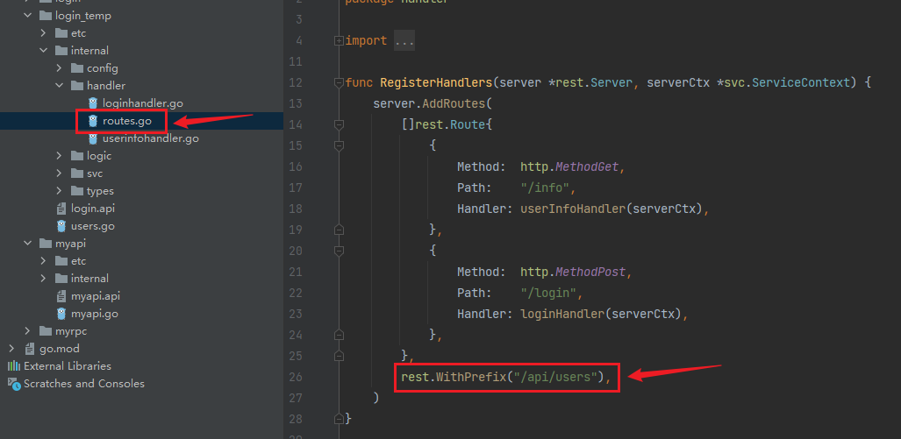
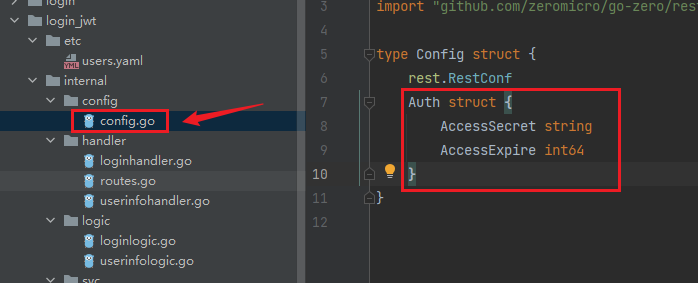
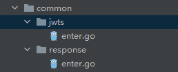
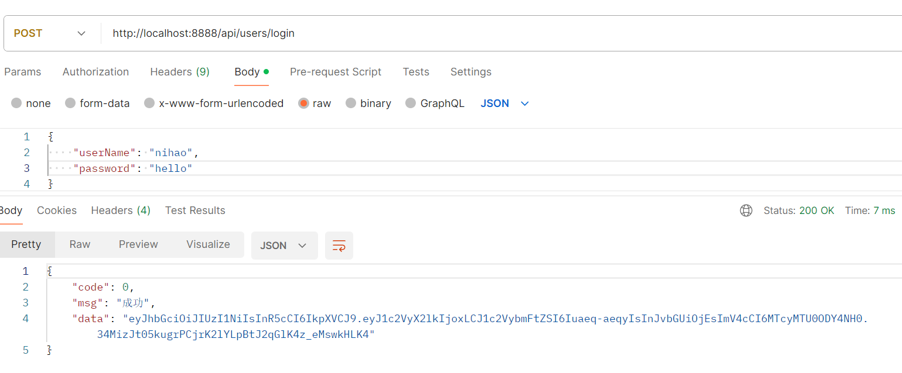
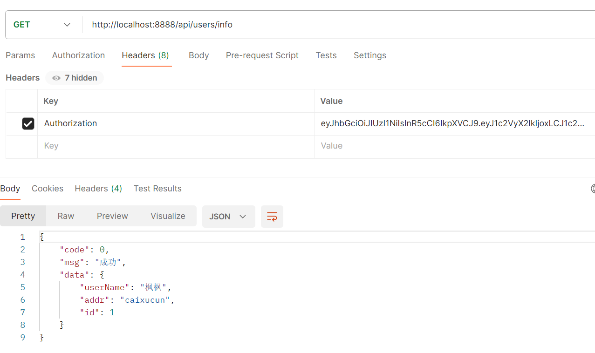
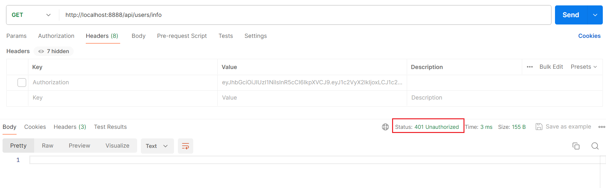

设置`api`前缀很简单，以前文的`api`文件为例，这样写就可以了：

```protobuf
syntax = "v1"

type LoginRequest {
	UserName string `json:"userName"`
	Password string `json:"password"`
}

type UserInfo {
	UserName string `json:"userName"`
	Addr     string `json:"addr"`
	Id       uint   `json:"id"`
}

@server (
	prefix: /api/users
)
service users {
	@handler login
	post /login (LoginRequest) returns (string)

	@handler userInfo
	get /info returns (UserInfo)
}
```

重新生成代码后，我们看这个文件中的代码就能看出来了：



前缀确实是加上了。

接下来配置下`JWT`的验证，我们把`api`后缀的文件改成下面这样：

```protobuf
syntax = "v1"

type LoginRequest {
	UserName string `json:"userName"`
	Password string `json:"password"`
}

type UserInfo {
	UserName string `json:"userName"`
	Addr     string `json:"addr"`
	Id       uint   `json:"id"`
}

service users {
    @handler login
    post /api/users/login (LoginRequest) returns (string)
}

@server (
	prefix: /api/users
	jwt:    Auth
)
service users {
	@handler userInfo
	get /info returns (UserInfo)
}
```

这里只需要在`@server`注解里加上`jwt: Auth`这一句就可以了。这里要对`login`这个接口做一步特殊处理，它不需要经过登录`JWT`校验，所以把它放到`@server`的前面，但是这样的话就需要补齐路径信息。

重新生成代码，我们看到`config.go`里出现了这几个属性：



我们把这些内容填充到配置文件中即可：

```
Name: users
Host: 0.0.0.0
Port: 8888
Auth:
  AccessSecret: asdfghjkl
  AccessExpire: 3600
```

密钥（`AccessSecret`）的定义是自定义的，最好在`8`位以上。过期时间（`AccessExpire`）没有指定单位，默认单位即为秒，`3600`秒即为`1`小时。

我们定义一个`JWT`公共代码，还是放到`common`包里，作为一个公共目录：



代码内容如下，使用到`github.com/golang-jwt/jwt/v4`这个库：

```go
package jwts

import (
	"errors"
	"github.com/golang-jwt/jwt/v4"
	"time"
)

// JwtPayLoad jwt中payload数据
type JwtPayLoad struct {
	UserID   uint   `json:"user_id"`
	Username string `json:"username"` // 用户名
	Role     int    `json:"role"`     // 权限  1 普通用户  2 管理员
}

type CustomClaims struct {
	JwtPayLoad
	jwt.RegisteredClaims
}

// GetToken 创建 Token
func GetToken(user JwtPayLoad, accessSecret string, expires int64) (string, error) {
	claim := CustomClaims{
		JwtPayLoad: user,
		RegisteredClaims: jwt.RegisteredClaims{
			ExpiresAt: jwt.NewNumericDate(time.Now().Add(time.Hour * time.Duration(expires))),
		},
	}
	token := jwt.NewWithClaims(jwt.SigningMethodHS256, claim)
	return token.SignedString([]byte(accessSecret))
}

// ParseToken 解析 token
func ParseToken(tokenStr string, accessSecret string, expires int64) (*CustomClaims, error) {
	token, err := jwt.ParseWithClaims(tokenStr, &CustomClaims{}, func(token *jwt.Token) (interface{}, error) {
		return []byte(accessSecret), nil
	})
	if err != nil {
		return nil, err
	}
	if claims, ok := token.Claims.(*CustomClaims); ok && token.Valid {
		return claims, nil
	}
	return nil, errors.New("invalid token")
}
```

具体实现逻辑可以参考网络基础中关于`JWT`的讲解，这里向外提供了生成`token`和解析`token`的两个函数。

然后实现一下`login`和`info`两个接口：

```go
func (l *LoginLogic) Login(req *types.LoginRequest) (resp string, err error) {
	auth := l.svcCtx.Config.Auth
	token, err := jwts.GetToken(jwts.JwtPayLoad{
		UserID:   1,
		Username: "Mundo",
		Role:     1,
	}, auth.AccessSecret, auth.AccessExpire)
	if err != nil {
		return "", err
	}
	return token, err
}
```

```go
func (l *UserInfoLogic) UserInfo() (resp *types.UserInfo, err error) {
	userId := l.ctx.Value("user_id").(json.Number)
	fmt.Printf("%v, %T, \n", userId, userId)
	username := l.ctx.Value("username").(string)
	uid, _ := userId.Int64()

	return &types.UserInfo{
		Id:       uint(uid),
		Addr:     "caixucun",
		UserName: username,
	}, nil
}
```

这样实现完成后，就可以使用`Postman`调用验证了。



把生成的`JWT token`复制，放到`info`接口的请求头里：



如果不带请求头`token`，会报状态码`401`：



这样就完成了权限的校验。权限校验这个地方，是由`Go-zero`框架自行加在对应的接口前面的。

上面内容中，如果没有带请求头`token`，直接返回`401`状态码，不是非常友好，我们希望在权限校验失败时，有一个友好的提示。

我们在这个模块的主函数文件中做如下的修改，这是一个回调函数：

```go
func main() {
	flag.Parse()

	var c config.Config
	conf.MustLoad(*configFile, &c)

	server := rest.MustNewServer(c.RestConf, rest.WithUnauthorizedCallback(JwtUnauthorizedResult))
	defer server.Stop()

	ctx := svc.NewServiceContext(c)
	handler.RegisterHandlers(server, ctx)

	fmt.Printf("Starting server at %s:%d...\n", c.Host, c.Port)
	server.Start()
}

func JwtUnauthorizedResult(w http.ResponseWriter, r *http.Request, err error) {
	httpx.WriteJson(w, http.StatusOK, response.Body{10087, err.Error(), nil})
}
```

对照着原本的内容查看修改部分。这里我们直接把`err`的具体内容作为`msg`返回给调用端，且错误码写死为`10087`，具体业务中，可以根据不同的`error`返回不同的错误码以及错误信息。