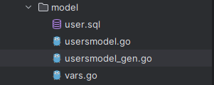

前面我们讲了`Go-zero`生成`api`服务与`rpc`服务，这些都是对外暴露了接口，没有对数据库的操作。`goctl`工具也可以使用命令生成`MySQL`相关代码，包括对应的实体类、`CRUD`操作方法、缓存逻辑等信息。

首先我们新建一个`model`目录，创建一个`user.sql`文件，保存下面的建表`DDL`：

```mysql
CREATE TABLE users (
    id INT AUTO_INCREMENT COMMENT '用户ID',
    name VARCHAR(50) NOT NULL COMMENT '用户名',
    email VARCHAR(100) NOT NULL COMMENT '电子邮件',
    created_at DATETIME NOT NULL DEFAULT CURRENT_TIMESTAMP COMMENT '创建时间',
    UNIQUE name_index (name),
    PRIMARY KEY (id)
) COMMENT='用户表';
```

在此之前，需要保证这张表在对应的`MySQL`数据库中存在。这个文件里可以有一张或多张表的建表`DDL`。

然后，把终端切换到`user.sql`所在目录，执行以下命令：

```sh
goctl model mysql ddl --src user.sql --dir .
```

表的主键定义必须单独写在一行中，不能直接在列定义中包含主键声明，否则会导致错误：`table users: missing primary key`。

执行完成后，在`model`目录下生成了三个文件：



`usermodel_gen.go`这个文件提供了实体类，以及最基础的增删改查接口：

```go
usersModel interface {
	Insert(ctx context.Context, data *Users) (sql.Result, error)
	FindOne(ctx context.Context, id int64) (*Users, error)
	FindOneByName(ctx context.Context, name string) (*Users, error)
	Update(ctx context.Context, data *Users) error
	Delete(ctx context.Context, id int64) error
}
```

其中生成了`FindOneByName`方法，是因为`name`字段有唯一约束。

> **注意：**我们发现`go-zero`生成的代码功能有限，使用起来不够便利，并且`gen.go`结尾的文件官方不建议直接对其进行编辑，直接拿到`db`对象进行操作也较为困难，所以我这里不建议使用`go-zero`来生成其增删改查方法。

为提升开发效率，建议使用`gorm-gen`生成增删改查方法。其生成方法与之前介绍的一致，可直接在接口逻辑中调用。`gorm-gen`的前置操作可以放到`svc`目录下的`NewServiceContext`函数中执行：

```go
func NewServiceContext(c config.Config) *ServiceContext {
	query.SetDefault(db.GetDB())
	return &ServiceContext{
		Config:  c,
		UserRpc: userservice.NewUserService(zrpc.MustNewClient(c.UserRpc)),
	}
}
```

然后我们在接口逻辑方法中就可以正常使用`gorm-gen`生成的接口完成增删改查的操作了：

```go
func (l *RegisterLogic) Register(req *types.RegisterRequest) (resp *types.RegisterResponse, err error) {
	usersQ := query.Users
	result, err := usersQ.Where(usersQ.Name.Eq("Alice")).First()
	if err != nil {
		wlog.Errorf("call usersQ.Where.First failed").Err(err).Log()
		return nil, err
	}
	fmt.Println(result)
	return
}
```

