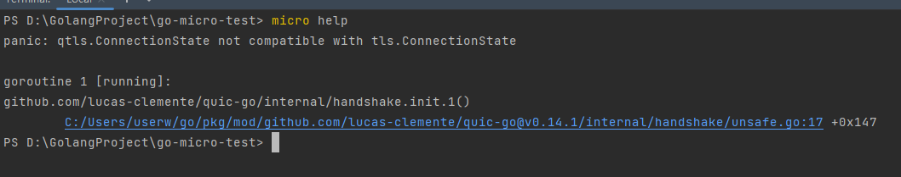
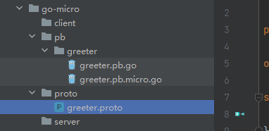

`Go-Micro`是一个基于`Go`语言的微服务框架，旨在简化和加速微服务的开发。它提供了一组工具和库，帮助开发者构建可扩展、分布式、容错性强的微服务应用。

下面讲解安装`Go-micro`的具体步骤，首先我们安装`Go-micro`和它的工具集：

```bash
go get github.com/micro/go-micro/v2
go get github.com/micro/micro/v2
```

我们还需要安装这个`micro`工具集的可执行文件：

```bash
go install github.com/micro/micro/v2@latest
```

执行`micro help`，发现报了这样一个问题：



这个问题是一个版本兼容性问题，具体是因为`Go`的版本太高，而`go-micro`的版本太低，或者说是`quic-go`版本太低。上网查了很多资料，除了降级`Go`版本，还没有其他行之有效的方案。

`Go-micro`框架的`v2`版本很久之前就不维护了，落伍了，大家都不建议使用，我这里也不再使用了。

然后安装`protobuf`（之前学`Grpc`时已经安装过，这里就不需要安装了）：

```bash
go install google.golang.org/protobuf/cmd/protoc-gen-go@latest
```

安装生成`micro`代码的工具集，并编译安装可执行文件：

```bash
go install github.com/micro/micro/v2/cmd/protoc-gen-micro@latest
```

安装完这些必备的库后，下面讲一下如何使用这些库开发微服务。

记得我们之前学过`Grpc`吗？其实它们的开发步骤是相似的。先回顾下开发`Grpc`的三个步骤：

1. 写`proto`文件，定义服务和消息
2. 使用`protoc`工具生成`pb.go`和`grpc.pb.go`文件
3. 编写`server`业务逻辑代码，并编写`client`去调用`server`

开发`Go-micro`微服务的逻辑和上面一样，区别就是使用`protoc`的命令不同，生成的文件也不同。

首先我们创建一个模块，目录结构差不多就是这样：


在`proto`文件夹定义一个文件，例如给他取名为`greeter.proto`，这里`proto`的语法和在`Grpc`里的是一样的。

```protobuf
syntax = "proto3";

package proto;

option go_package ="../pb/greeter";

service Greeter {
  rpc Hello(HelloRequest) returns (HelloResponse);
}

message HelloRequest {
  string name = 1;
}

message HelloResponse {
  string greeting = 1;
}
```

然后切换到这个`proto`文件的上级目录，执行下面命令：

```bash
protoc --proto_path=. --micro_out=. --go_out=. greeter.proto
```

> **注意：**这里使用到的是`--micro_out=.`，而`Grpc`里使用的是`--go-grpc_out=.`

执行完这条命令，就能发现生成的文件了，文件目录结构如下图所示：



生成了两个文件，一个就是和`Grpc`一样的`pb.go`，一个是`pb.micro.go`

这样就是`Go-micro`开发的安装和准备工作了。

> **注意：**`v2`版本不建议再使用了！！

之前了解过的`Go-micro`框架，是一个较为轻量级的微服务框架，它开源于`2015`年，在当时的市面上开源微服务框架较少的时代，它是为数不多的选择。但是它的缺点实在太多了！

1. `v2`版本的已经停止维护了，而且支持的`grpc`和`go`的版本都很旧，如果用新版本就会有兼容性问题。降低`grpc`版本后，`grpc`生成的文件又会因为版本过低而报错。
2. `v3`版本相对`v2`版本变化很大，有很多隐藏的坑，而且`v3`直接变为`M3O`，是一个平台了，商业性质的，更多功能需要付费才能享用。如果在生产平台上用这个版本，会非常不靠谱。
3. 这个框架的作者转去做云服务了，框架已经没什么更新了，社区维护力度也较弱。