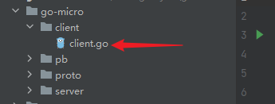
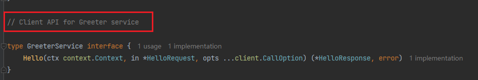

上一节我们编写完了服务端的代码，接下来我们编写客户端代码。

同样，在`client`目录下新建文件`client.go`：



然后编写`client`的代码，这里忽略了`error`的处理：

```go
import (
	"context"
	"fmt"
	"github.com/micro/go-micro/v2"
	"go-micro-test/go-micro/pb/greeter"
)

func main() {
	// 创建一个新的client服务并命名
	service := micro.NewService(micro.Name("greeter.client"))
	// 服务初始化
	service.Init()
	// 创建服务，通过名称绑定server
	greeterClient := greeter.NewGreeterService("greeter.server", service.Client())
	// 调用Hello方法，这个方法是在 greeter.pb.micro.go 文件中定义的
	resp, _ := greeterClient.Hello(context.Background(), &greeter.HelloRequest{Name: "Lixin"})
	// 打印输出结果
	fmt.Println(resp.Greeting)
}
```

`client`这里实际调用的是这个方法：



先运行`server`，再运行`client`，在`client`看到输出的结果：


调用成功！

运行`client`时，可能会出现这样的问题：


这是不经意发生的，也就是说可能第二次运行就好了，我根据报错也没找出是什么原因。

我只能认为是`go-micro`太垃圾了，不想用它了。

我看公司使用的是`v4`版本，我再看看`v4`版本好不好用吧。