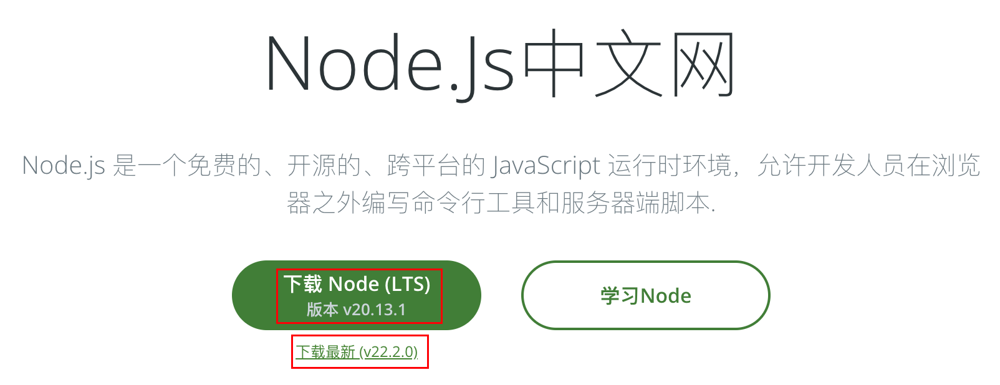
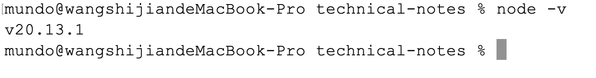
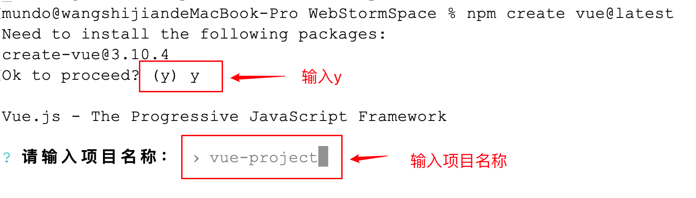
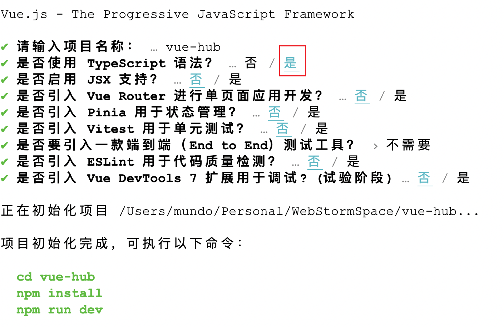
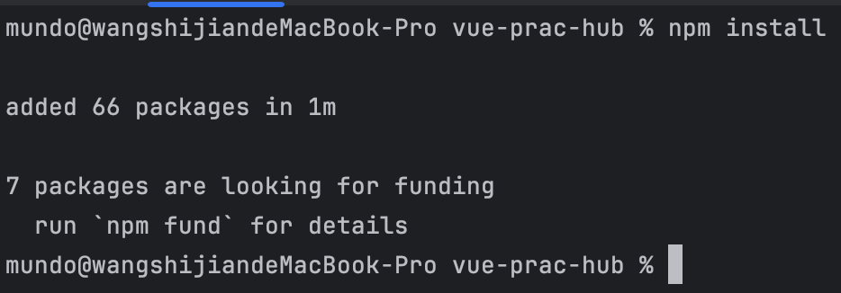
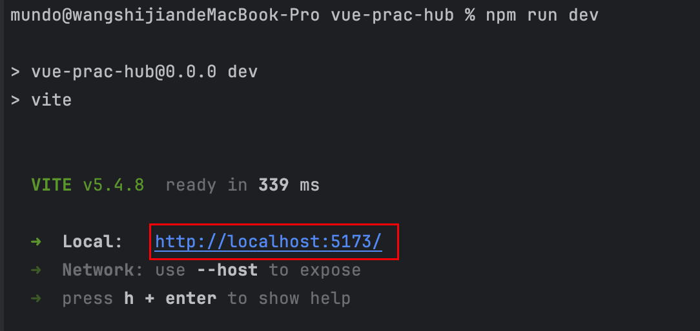
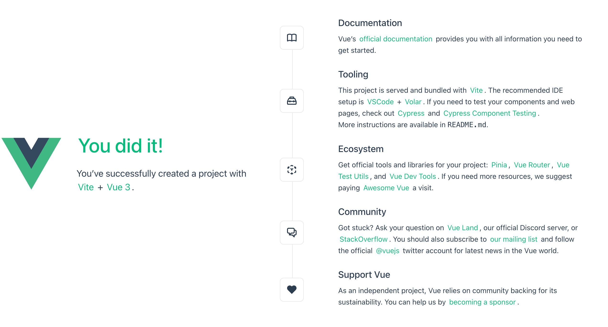
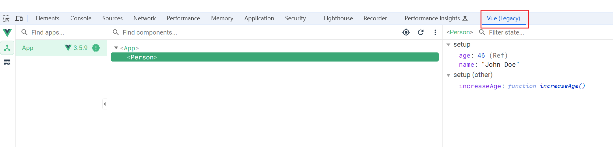

> 参考文档：https://cn.vuejs.org/guide/quick-start

在创建`Vue`工程之前，需要确保电脑已经安装`node.js`环境。我们进入该网址：https://nodejs.p2hp.com/

我们可以选择下载`LTS`版本，这是长期支持版本，也可以下载最新版本：



下载后直接点击安装，基本一路下一步即可。

安装后，使用`node -v`查看是否安装成功：



`node.js`安装完后，打开终端切换到打算创建项目的目录，在命令行中运行以下命令：

```sh
npm create vue@latest
```

运行上方命令有可能出现终端直接卡死的现象，我们使用以下命令查看`npm`代理：

```sh
npm config get registry
```

使用下方命令，更换`npm`镜像：

```
npm config set registry=https://registry.npmmirror.com
```

解决文档：https://blog.csdn.net/weixin_47588909/article/details/134904060

再次使用创建命令，在下面出现的结果中输入项目名称，规范是小写英文字母，用`-`间隔开：



后面会有很多的选项，我们只在“是否使用`TypeScript`语法”这一选项选择“是”，其余的均选“否”：



这样，一个`Vue`项目就初始化完成了。接下来，需要在项目的根目录下运行以下命令安装依赖：

```sh
npm install
```

该命令执行可能耗时较长，耐心等待。执行成功后展示结果如下：



接着执行以下命令，启动开发服务器：

```sh
npm run dev
```

运行完成后，会给我们一个本地的访问地址：



我们可以在浏览器直接对其进行访问：



展示出上图的结果，证明`Vue`工程已经创建成功。

为了方便调试和开发`Vue`应用程序，我们可以使用浏览器扩展`Vue.js devtools`。该扩展为开发者提供了强大的工具，便于检查和修改`Vue.js`应用的内部状态。以下是安装步骤：

1. 打开浏览器的扩展程序页面。
2. 访问`Chrome`应用商店（需要科学上网）。
3. 在商店中搜索`Vue.js devtools`扩展程序。
4. 点击“添加至`Chrome`”，完成安装。

安装成功后，你可以在开发者工具（按下`F12`）中使用`Vue.js devtools`，以可视化方式查看和调试`Vue`应用的状态与结构：

