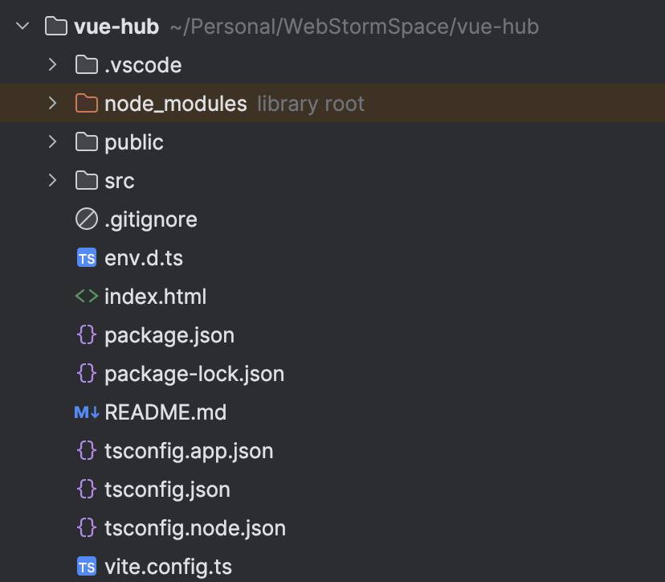
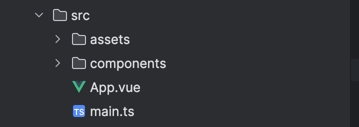
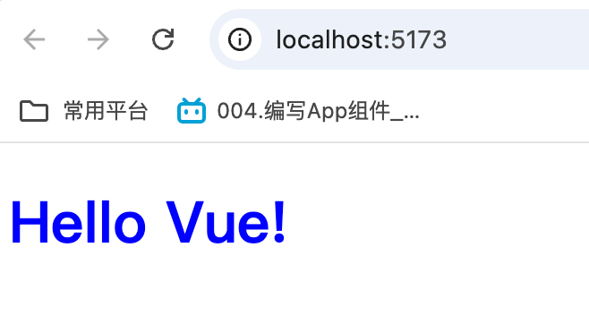

我们使用命令创建完一个`Vue`项目后，接着用`WebStorm`编辑器打开该项目。这时，我们可以看到自动生成了以下文件和目录：



对上面的目录与重要文件讲解如下（除`src`目录）：

- `.vscode`目录：包含一个`extensions.json`文件，定义了推荐在`vscode`编辑器中安装的官方插件。我们可以删除这个目录。
- `node_modules`目录：运行`npm install`命令生成的目录，用于存储项目所需的所有依赖包，可以在代码中直接使用。
- `public`目录是脚手架的根目录，只包含一个`favicon.ico`文件。该文件用于在用户访问项目时，浏览器的标签栏中显示图标。
- `env.d.ts`文件：添加全局变量和环境变量的类型声明，帮助`TypeScript`识别一些文件的内容。
- `index.html`文件：项目的入口文件。当通过命令`npm run dev`启动项目后，用户访问页面时将呈现该文件的内容。
- `package.json`文件用于定义项目的基本信息、依赖项、脚本和版本，是前端项目的核心配置文件。而`package-lock.json`文件则用于锁定依赖的确切版本，以确保在不同环境中安装依赖时的一致性。通过执行`npm install`命令，可以将指定的依赖及其版本下载到`node_modules`目录，从而为项目提供所需的库和工具。
- `tsconfig.app.json`、`tsconfig.json`、`tsconfig.node.json`：都是`TypeScript`的配置文件，保留即可。
- `vite.config.ts`文件：整个工程的主要配置文件。用于安装插件、配置代理及其他功能设置，优化项目的构建和开发流程。

我们暂时可以不深入关注上述目录或文件的内容，仅需了解其基本作用。但`src`目录下的源代码结构是我们必须熟悉的重点。

我们回头查看`index.html`文件的内容如下：

```html
<!DOCTYPE html>
<html lang="en">
  <head>
    <meta charset="UTF-8">
    <link rel="icon" href="/favicon.ico">
    <meta name="viewport" content="width=device-width, initial-scale=1.0">
    <title>Vite App</title>
  </head>
  <body>
    <div id="app"></div>
    <script type="module" src="/src/main.ts"></script>
  </body>
</html>
```

可以看到，代码中最关键的一步是引入`/src/main.ts`文件。所以我们查看`src`目录下的代码要从`main.ts`文件看起：

```typescript
import './assets/main.css'

import { createApp } from 'vue'
import App from './App.vue'

createApp(App).mount('#app')
```

- 第一行代码从`assets`目录导入全局的`CSS`样式文件`main.css`，确保在整个应用中都可以使用这些样式。

- 第二行代码是从`Vue`框架中导入`createApp`函数，这是`Vue 3`用于创建应用实例的核心函数，也就是用来初始化`Vue`实例。
- 第三行代码是导入根组件`App.vue`，这个文件是`src`目录下的另一个核心文件。这是应用的入口组件，`Vue`应用中的其他组件通常都会在这个组件中嵌套。`App.vue`通常包含整个应用的布局结构。
- 第四行代码调用`createApp`函数，传入根组件`App`，然后使用`.mount('#app')`将这个`Vue`实例挂载到`index.html`文件中`id="app"`的`DOM`元素上。这会让`Vue`实例控制这个`#app`元素，并把`App.vue`中定义的模板渲染出来。

`src`目录下的文件结构如下所示：



这里的`main.ts`和`App.vue`上面已经讲过，我们提到`App.vue`是项目的根组件，而`components`目录下的`.vue`文件则可以看作是根组件的“枝叶”。这些枝叶组件负责承载具体的功能和视图，通过与根组件协作，构成完整的页面结构。`assets`目录是前端项目中用于存放静态资源的文件夹，包含了`CSS`文件、图片文件等。

在`src`目录中，`main.ts`和`App.vue`是项目中不可或缺的两个核心文件。它们共同承担了项目的初始化和整体布局。

这是我们第一次接触以`.vue`为后缀的文件，接下来我们将对其内容结构进行简要讲解。`.vue`文件是`Vue.js`框架中特有的一种文件格式，通常用于构建`Vue`组件。每个`.vue`文件包含一个`Vue`组件，文件内部由模板、脚本和样式三个部分组成。这三个部分分别用`<template>`、`<script>`和`<style>`标签来定义。以下是它们的结构和作用：

1. `<template>`部分：定义组件的`HTML`模板，包含组件的`DOM`结构。除了标准的`HTML`语法外，还可以使用`Vue`特有的指令（如`v-for`、`v-if`等）和数据绑定（如`{{ message }}`）以动态渲染内容。
2. `<script>`部分：定义组件的逻辑，通常是一个`Vue`组件的选项对象，负责实现组件的功能和逻辑，包括状态管理与事件处理。此部分可使用`ES6`（现代`JavaScript`的稳定版本）或`TypeScript`语法（需配置`lang="ts"`）。
3. `<style>`部分：编写`CSS`代码，用于定义组件的样式，从而实现特定的视觉效果。样式可以是局部或全局的，建议设置`scoped`属性实现局部样式，即仅在当前文件内生效，从而避免污染全局环境。

一个`.vue`文件的完整示例如下所示：

```vue
<template>
  <div class="hello">
    <h1>{{ message }}</h1>
  </div>
</template>

<script lang="ts">
export default {
  name: 'HelloWorld',
  setup() {
    let message = 'Hello Vue!';
    return {
      message
    };
  }
}
</script>

<style scoped>
  .hello {
    color: blue;
  }
</style>
```

在这个例子中，`.vue`文件定义了一个简单的组件，它渲染一个包含`message`数据的`h1`标题，并应用局部蓝色样式。组件名称为`HelloWorld`，通常文件名也命名为`HelloWorld.vue`以保持一致性。

我们删除`src`目录下的所有内容，重新创建`App.vue`文件，保存上方的文件内容，并将`name`属性修改为`App`。随后，创建`main.ts`文件，并添加以下三行代码：

```typescript
import { createApp } from 'vue'
import App from './App.vue'

createApp(App).mount('#app')
```

重新在项目根目录下执行`npm run dev`命令，然后使用浏览器打开访问地址，看到如下内容展示：



