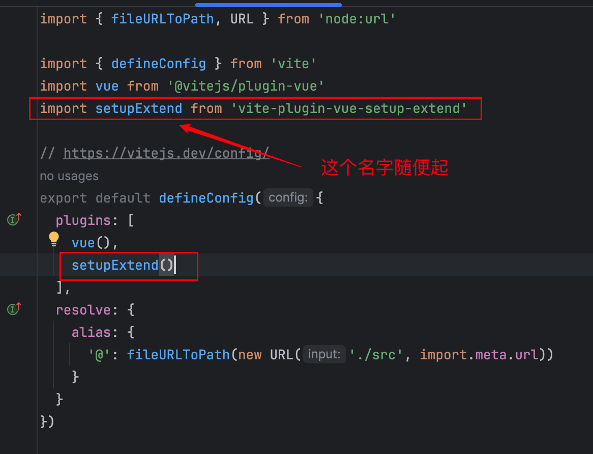

组合式`API`的核心在于`setup`函数，所有的组合函数都应在其中编写。因此，充分理解和掌握`setup`函数的工作原理至关重要。`setup`函数在组件实例创建之前执行，早于`beforeCreate`和`created`生命周期钩子。由于组件实例尚未完全创建，`setup`函数中无法访问`this`。此外，`setup`函数只在组件初始化时调用一次，其返回的对象或函数将直接暴露给模板用于渲染。

原`data`组件中定义的数据可以直接以`JavaScript`语法写在`setup`函数中：

```javascript
let name = 'zhangsan';
let age = 20;
let address = '蔡徐村'
```

但是仅仅定义了这些数据，模板中是无法使用的，需要我们在`setup`中写一个返回值：

```javascript
return {name, age, address}
```

大括号内可以包含任意多个变量，`return`的作用是将我们定义的变量“抛”给模板，让模版可以使用这些变量。

原`methods`组件中定义的方法也可以直接以`JavaScript`语法写在`setup`函数中，可以有两种编写方式：

```javascript
// 普通编写方式
function showName() {
  alert(name)
}
// 使用箭头函数的编写方式
const showName = () => {
  alert(name)
}
```

同样，函数也应写在大括号内，通过`return`将其“抛”给模板，以便在模板中使用。

```javascript
return {name, age, address, showName}
```

箭头函数是一种简洁的函数表达式语法，使用`=>`符号来定义函数。其格式如下：

```javascript
(param1, param2, ..., paramN) => {
  // function body
}
```

例如以下是一个带有两个参数的箭头函数：

```javascript
const sum = (a, b) => {
  return a + b;
};
console.log(sum(2, 3)); // 输出：5
```

如果函数体只有一行代码，并且这行代码是一个返回值，可以省略花括号`{}`和`return`关键字，直接写在箭头后面：

```javascript
const sum = (a, b) => a + b;
console.log(sum(2, 3)); // 输出：5
```

如果箭头函数只有一个参数，参数的括号`()`可以省略：

```javascript
const square = x => x * x;
console.log(square(4)); // 输出：16
```

如果箭头函数没有参数，需要用一对空括号`()`来表示参数部分：

```javascript
const greet = () => 'Hello, world!';
console.log(greet()); // 输出：Hello, world!
```

在`Vue 3`中，组合式`API`和选项式`API`可以共存，允许同时使用`setup`函数与`data`、`methods`等选项。如果`setup`中的数据或函数与`data`或`methods`中的名称冲突，`setup`中的内容具有更高的优先级。

由于`setup`函数的执行时机最早，因此在`data`、`methods`等选项中，可以通过`this`访问`setup`函数中定义的属性：

```javascript
data() {
  return {
    username: this.name
  }
},
```

反过来，`setup`函数无法读取`data`选项中定义的数据。

> 尽管`Vue`允许将组合式`API`和选项式`API`混合使用，但极其不推荐这种做法，容易造成混淆。

在编写`setup`代码时，我们发现需要在函数的结尾使用`return`来返回定义的变量和函数。也就是说，每新增一个变量或函数，都必须在结尾的大括号中添加它。这种方式容易导致遗漏，并且当大括号中的变量增多时，会造成代码噪音，从而降低可读性。

`Vue 3`提供了对`setup`的语法糖，允许我们不显式声明`setup`函数名以及返回值。以`Person`组件为例，写法如下所示：

```vue
<script lang="ts">
  export default {
    name: 'Person',
  }
</script>

<script setup lang="ts">
  import { ref } from 'vue';

  const name = 'John Doe';
  const age = ref(30);
  const increaseAge = () => {
    age.value++;
  };
</script>
```

我们将`setup`放置在`script`标签中并独立出来，实现无需手动编写返回值的效果。两个`script`标签必须使用相同的`lang`属性。不过，这样做需要额外添加一个`script`标签，而之前的标签中仅定义了一个非必填的`name`字段。是否还有进一步的简化方案呢？

我们使用以下命令下载一个插件：

```sh
npm i vite-plugin-vue-setup-extend -D
```

在项目的根目录下，找到文件`vite.config.ts`，添加以下两行代码：



接下来，我们可以将`name`元素也添加到`script`标签里：

```vue
<script setup lang="ts" name="Person">
```

使用`setup`语法糖，引入一个组件变得更加简便。只需通过`import`引入组件，并直接在模板中动态渲染，无需像以前那样在`setup`中手动`return`组件。例如我们在`App`组件中引入`Person`组件的代码如下所示：

```vue
<template>
  <div class="hello">
    <h1>{{ message }}</h1>
    <component :is="Person" />  <!-- 使用动态组件渲染 -->
  </div>
</template>

<script setup lang="ts" name="App">
  import Person from './components/Person.vue';  // 导入Person组件，并自动返回到模板

  let message = 'Hello Vue!';
</script>

<style scoped>
  .hello {
    color: blue;
  }
</style>
```

以上，关于`setup`函数的全部内容都讲解完毕。
