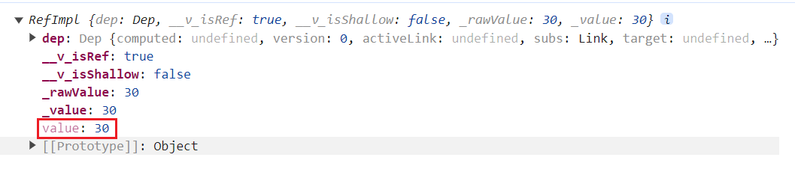
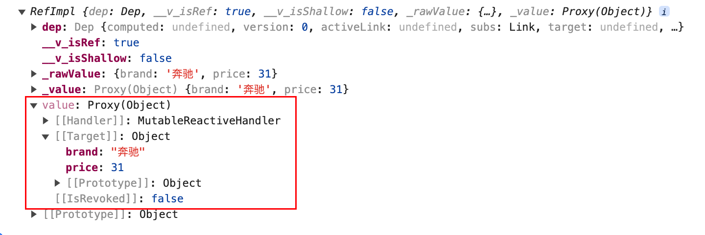
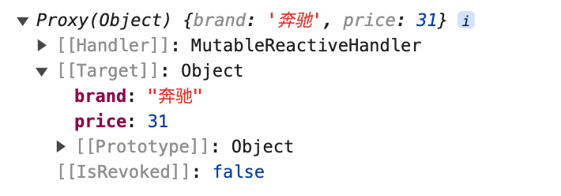

在`Vue`的`setup`函数中，管理组件的状态时，有两种方式可以声明变量：

1. 直接声明变量，如`const age = 30`，这些数据是非响应式的，`Vue`不会自动追踪它们的变化。
2. 使用`ref`函数声明响应式数据，如`const age = ref(30)`，`Vue`会追踪其变化，并自动更新视图。

`ref`函数用于将普通的`JavaScript`值包装为响应式对象，从而定义一个可被“追踪”的响应式数据。这个数据可以是基本数据类型（如`number`、`string`、`boolean`），也可以是复杂的对象。使用`ref`前，需在`setup`函数中导入它：

```javascript
import { ref } from 'vue';
```

`ref`函数的使用非常简单，只需将需要变为响应式的数据作为参数传入`ref`函数即可。示例如下：

```javascript
const count = ref(30);
const message = ref('Hello Vue 3!');
const isVisible = ref(false);
```

`ref`函数接收一个初始值，并返回一个包含该值的响应式引用对象。该对象内部有一个`value`属性，用于存储响应式数据的实际值。在`setup`函数中，无论是读取还是更新数据，都需要通过`.value`来进行操作：

```vue
<script lang="ts">
import { ref } from 'vue';

export default {
  setup() {
    const count = ref(30);
    const increment = () => {
      count.value++;
    };
    const print = () => {
      console.log(count.value)
    }
    return {
      count,
      increment,
      print
    };
  }
};
</script>
```

在上面的代码中，如果直接打印`count`本身，在控制台看到的内容如下所示：



可以明确地看到`count`这个引用对象有一个`value`属性，至于其余以`_`开头的属性，我们不必理会。

在模板中使用响应式数据无需显式调用`.value`，`Vue`会自动对其解包，只需要像普通变量一样直接使用`count`即可：

```vue
<template>
  <div class="person">
    <p>Age: {{ count }}</p>
    <button @click="increment">Increase Age</button>
    <button @click="print">Print Age</button>
  </div>
</template>
```

`ref`除了可以定义基本类型的响应式数据，也可以定义对象类型的响应式数据。如下所示：

```vue
<template>
  <div class="person">
    <p>Brand: {{ car.brand }}</p>
    <p>Price: {{ car.price }}</p>
    <button @click="increasePrice">Increase Price</button>
  </div>
</template>

<script setup lang="ts" name="Person">
  import { ref } from 'vue';

  let car = ref({brand: '奔驰', price: 30});
  const increasePrice = () => {
    car.value.price += 1;
  }
</script>
```

上面的`{brand:'奔驰',price:30}`就代表一个对象的实例，我们使用`ref`创建它的响应式对象。

在`increasePrice`函数中，我们通过`car.value.price`访问`car`对象的`price`属性。这是因为`ref`创建了一个引用对象，实际的数据存储在它的`value`属性中。因此，需要先通过`.value`访问到实际对象实例后，才能进一步访问对象的属性：



我们再定义一个数组类型的对象，并使用`ref`函数将其转换成响应式对象：

```vue
<template>
  <div class="person">
    <ul>
      <li v-for="game in games" :key="game.id">
        {{ game.id }} - {{ game.name }}
      </li>
    </ul>
    <button @click="changeGameName">修改游戏名称</button>
  </div>
</template>

<script setup lang="ts" name="Person">
  import {ref} from 'vue';

  let games = ref([
    {id: 1, name: '王者荣耀'},
    {id: 2, name: '原神'},
    {id: 3, name: '三国杀'}
  ]);
  const changeGameName = () => {
    games.value[2].name = '明日方舟';
  };
</script>
```

同样，我们需要先使用`.value`访问到实际的对象实例，再进一步访问其属性。

与基本类型的响应式数据类似，在模板中也无需显式使用`.value`，模板会自动对其进行解包。

除了`ref`函数，还有一个处理响应式数据的函数，那就是`reactive`。不过，它仅限于处理对象类型的数据，无法处理基本类型。`reactive`的使用方式与`ref`类似，区别在于使用`reactive`创建的对象类型响应式数据时，无需通过`.value`访问实际的对象实例。示例代码如下：

```vue
<template>
  <div class="person">
    <p>Brand: {{ car.brand }}</p>
    <p>Price: {{ car.price }}</p>
    <button @click="increasePrice">Increase Price</button>
  </div>
</template>

<script setup lang="ts" name="Person">
  import { reactive } from 'vue';
  
  let car = reactive({brand: '奔驰', price: 30});
  const increasePrice = () => {
    car.price += 1;
  }
</script>
```

将上方代码的`car`打印出来，如下所示：



可以看出，使用`ref`创建的对象类型的响应式数据，其`value`属性实际上就是通过`reactive`创建的对象类型的响应式数据。

> 建议在项目中统一使用`ref`函数定义对象类型的响应式数据，因为使用`reactive`可能存在丢失响应式的问题。`Vue`的作者尤雨溪也推荐我们使用`ref`而不是`reactive`。

在这里介绍两个`Vue`的工具：`toRefs`和`toRef`，它们的主要作用是将响应式对象中的属性转换为响应式引用。简单来说，它们在从对象中提取属性时，能够保证属性的响应式特性得以保留。用法示例如下：

```vue
<template>
  <div class="person">
    <p>Brand: {{ car.brand }}</p>
    <p>Price: {{ price }}</p>
    <button @click="increasePrice">Increase Price</button>
  </div>
</template>

<script setup lang="ts" name="Person">
  import { reactive, toRefs, toRef } from 'vue';

  let car = reactive({brand: '奔驰', price: 30});
  // let {brand, price} = toRefs(car) // 转换所有属性
  let price = toRef(car, "price") // 只转换指定属性
  const increasePrice = () => {
    price.value += 1;
  }
</script>
```

`toRefs`函数用于转换对象的所有属性，而`toRef`则仅转换指定的属性。提取出的属性响应式引用在修改时，将会同步影响原响应式对象中对应的属性。

如果响应式对象是通过`ref`创建的，在使用`toRefs`或`toRef`提取响应式引用时，需通过`.value`来访问具体的对象实例：

```vue
<template>
  <div class="person">
    <p>Brand: {{ car.brand }}</p>
    <p>Price: {{ price }}</p>
    <button @click="increasePrice">Increase Price</button>
  </div>
</template>

<script setup lang="ts" name="Person">
  import { ref, toRefs, toRef } from 'vue';

  let car = ref({brand: '奔驰', price: 30});
  // let {brand, price} = toRefs(car.value) // 转换所有属性
  let price = toRef(car.value, "price") // 只转换指定属性
  const increasePrice = () => {
    price.value += 1;
  }
</script>
```

这样可以更加方便地访问与修改响应式对象里的属性信息。

响应式对象的特点是，脚本中的变化会自动同步更新到模板。那么，模板中的变化是否也能同步影响脚本呢？答案是肯定的，我们可以通过使用`v-model`指令来实现这种双向数据绑定。

`v-model`通常用于绑定`input`、`textarea`等原生表单控件，使用示例如下：

```vue
<template>
  <div class="person">
    请输入车型：<input v-model="car.brand" />

    <p>Brand: {{ car.brand }}</p>
    <p>Price: {{ car.price }}</p>
  </div>
</template>

<script setup lang="ts" name="Person">
  import { ref } from 'vue';

  let car = ref({ brand: '奔驰', price: 30 });
</script>
```

这样一来，当我们在输入框中输入文字时，`car`对象的`brand`属性会实时更新，同时模板的显示内容也会随之变化。
