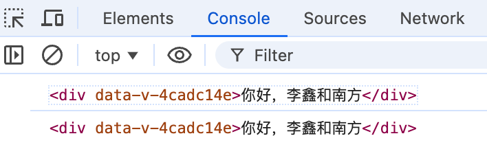

本节将延续上一节关于响应式数据的内容，对计算属性及`ref`标签的相关用法进行细致讲解。

如果我们希望基于响应式数据动态计算某些值，可以使用`computed`计算属性。`computed`是`vue`模块中的一个函数，可以在`setup`函数中引入并使用。比如，我们可以实现一个逻辑，当车型名称包含“奥迪”时，将价格打八折：

```vue
<template>
  <div class="person">
    请输入车型：<input v-model="car.brand" />

    <p>Brand: {{ car.brand }}</p>
    <p>Price: {{ discountedPrice }}</p>
  </div>
</template>

<script setup lang="ts" name="Person">
  import { ref, computed } from 'vue';

  let car = ref({ brand: '奔驰', price: 30 });
  const discountedPrice = computed(() => {
    return car.value.brand.includes('奥迪') ? car.value.price * 0.8 : car.value.price;
  });
</script>
```

使用`computed`计算属性，可以避免在模板中直接编写复杂的表达式，从而简化模板的结构，使代码更清晰、易维护。

`computed`和普通函数的区别在于，`computed`具有缓存机制，它的计算结果会被缓存，只有当其依赖的数据发生变化时，计算属性才会重新计算，而普通函数每次调用都会重新计算。这使得`computed`在处理依赖较多的数据时更高效。

通过上述方式定义的`discountedPrice`也是`ref`类型的响应式数据，但它是一个只读的计算属性，这意味着我们无法直接修改其值：

```js
const setDiscountedPrice = () => {
  discountedPrice.value = 60; // Vue: Cannot assign to 'value' because it is a read-only property.
}
```

它的值是基于其他响应式数据动态计算的，因此只能通过修改其依赖的数据来间接改变`discountedPrice`的值。

如果我们希望将这个计算属性变为可修改的，可以通过在`computed`函数中定义`get`和`set`方法来实现。首先，将原本的`return`逻辑移至`get`方法中，然后在`set`方法中实现具体的修改逻辑。需要注意的是，`set`方法有且只有一个参数，该参数对应我们手动赋给计算属性的值，从而实现对计算属性的修改：

```vue
<template>
  <div class="person">
    请输入车型：<input v-model="car.brand" />

    <p>Brand: {{ car.brand }}</p>
    <p>Price: {{ discountedPrice }}</p>

    <button @click="setDiscountedPrice">Increase Price</button>
  </div>
</template>

<script setup lang="ts" name="Person">
  import { ref, computed } from 'vue';

  let car = ref({ brand: '奔驰', price: 30 });
  const discountedPrice = computed({
    get() {
      return car.value.brand.includes('奥迪') ? car.value.price * 0.8 : car.value.price;
    },
    set(newPrice) {
      car.value.price = newPrice;
    }
  });
  const setDiscountedPrice = () => {
    discountedPrice.value = 60;
  }
</script>
```

实际上，对计算属性的修改本质上就是对其依赖的数据进行修改，只不过我们可以在`set`方法中指定修改逻辑。

在`Vue 3`中，`ref`属性可以应用于`HTML`标签或组件标签，用于定义一个引用，从而允许在`script`代码块中直接访问该元素或组件的实例。以下是`ref`在`HTML`标签上的使用示例：

```vue
<template>
  <div class="person">
    <div ref="hello">你好，李鑫和南方</div>
    <button @click="printHello">打印标签</button>
  </div>
</template>

<script setup lang="ts" name="Person">
  import { ref } from 'vue';
  const hello = ref(null);
  const printHello = () => {
    console.log(hello.value)
  }
</script>
```

这里要求，`ref`属性绑定的`DOM`元素与`setup`函数中定义的`ref`变量必须在同一个文件中，因为它们是基于同一个模板和`setup`函数的作用域进行关联的。只要属性名和变量名完全匹配，即可完成关联。

这里使用`ref(null)`创建一个初始值为`null`的响应式引用，显式表明该引用用于关联`DOM`元素，因此不需要预先定义值。

点击按钮后，在控制台打印内容如下所示：



这里打印的是`div`标签本身。我们看到标签内带有一个奇怪的字符串`data-v-4cadc14e`，这是因为我们在`style`标签中使用了`scoped`，此时`Vue`会自动为每个元素添加一个独特的`data-v-xxxxxxx`属性，这个属性的值是一个哈希值，确保每个组件的样式只会应用于该组件的元素。虽然我们打印出的`DOM`元素包含这个属性，但它并不会影响组件的功能，仅用于样式作用域的管理。

如果我们不想打印整个标签，而是打印标签元素中的文本内容，可以修改代码如下：

```javascript
console.log(hello.value.innerText)
```

我们思考一下在标签中使用`ref`属性有什么作用，能解决什么问题？我们使用`ref`属性标签是为了便捷地访问和操作`DOM`元素或组件实例。这一功能表面上似乎可以通过`id`属性来实现，例如这样：

```vue
<template>
  <div class="person">
    <div id="hello">你好，李鑫和南方</div>
    <button @click="printHello">打印标签</button>
  </div>
</template>

<script setup lang="ts" name="Person">
  // const hello = document.getElementById("hello");
  const printHello = () => {
    console.log(document.getElementById("hello"))
  }
</script>
```

我们注释掉了一行代码，因为它会在`setup`函数执行时尝试查找`DOM`元素，而此时该元素可能尚未挂载到页面上，从而导致返回`null`。虽然可以在`printHello`函数中调用找到该`DOM`元素，但却无法直接调用其`innerText`方法：

```javascript
console.log(document.getElementById("hello").innerText) // Vue: Object is possibly 'null'.
```

另一个问题是，`id`属性在整个项目中需要全局唯一，这意味着在不同文件中若存在相同`id`的标签，可能会引发一些问题。例如，如果在`App.vue`和`Person.vue`文件中都定义了`id`为`hello`的标签，那么上方代码执行时打印的`DOM`元素将始终指向`App.vue`中的元素。相比之下，`ref`属性仅在当前组件的作用域内有效，避免了这种冲突问题。