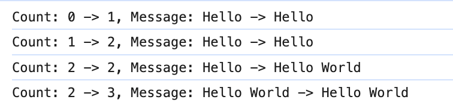

在前文中，我们已介绍了响应式数据的相关定义，包括基本类型和对象类型的响应式数据。如果希望在响应式数据发生变化时触发特定操作，就需要使用`watch`函数来进行监视。这一节我们对其进行讲解。

首先，对于使用`ref`定义的基本类型数据，使用`watch`函数对其进行监视的代码如下：

```vue
<script setup lang="ts" name="Person">
  import { ref, watch } from 'vue';

  const count = ref(0)
  const increaseCount = () => {
    count.value += 1;
  }

  watch(count, (newValue, oldValue) => {
    console.log(`Count changed from ${oldValue} to ${newValue}`);
  })
</script>
```

在这里，`watch`函数接收两个参数：第一个是被监视的对象，第二个是回调函数。回调函数包含两个参数，`newValue`和`oldValue`，分别表示数据的最新值和先前值，参数名称可以自定义。

`watch`也可以监视对象类型的响应式数据，代码如下所示：

```vue
<script setup lang="ts" name="Person">
  import { ref, watch } from 'vue';

  const user = ref({
    count: 0,
    message: 'Hello'
  })
  const increaseCount = () => {
    user.value.count += 1;
  }
  const changeMsg = () => {
    user.value.message = "Hello World"
  }
  const changeUser = () => {
    user.value = {
      count: 20,
      message: "Hello World too"
    }
  }

  watch(user, (newValue, oldValue) => {
    console.log(`user changes:`, oldValue, newValue);
  }, { deep: true });
</script>
```

这里我们注意到，`watch`函数新增了第三个参数 `{ deep: true }`。这是因为默认情况下，只有当`user`对象的引用发生改变时（也就是保存的地址改变），回调函数才会触发。而如果希望监听`user`对象内部属性的变化，则需要开启深度观察。

除了`deep: true`，还有一个参数`immediate: true`，代表回调函数会在观察开始时立即执行一次，一般用于执行初始化操作：

```javascript
watch(user, (newValue, oldValue) => {
  console.log(`user changes:`, oldValue, newValue);
}, { deep: true, immediate: true});
```

我们点击两次`increaseCount`，一次`changeMsg`，再点击一次`changeUser`，控制台打印结果如下：


我们发现，当修改对象的内部属性时，回调函数中打印的`oldValue`和`newValue`都显示为修改后的值。只有当对象本身发生变化时，回调函数才能正确显示更改前后的内容。这是因为，如果修改对象内部属性，回调函数获取的`oldValue`和`newValue`实际是同一个对象，因此内部属性值相同；而如果修改的是对象本身，回调函数会获取两个不同的对象，所以可以正确反应前后属性值的变化。

在`Vue`中可以对对象类型的响应式数据进行监视，无论是对象内部属性的修改，还是对象本身的修改，都会触发回调函数。但如果我们希望只监视对象内的某个特定属性，例如仅监视`user`对象的`count`属性，可以按如下方式实现：

```vue
<script setup lang="ts" name="Person">
  import { ref, watch } from 'vue';

  const user = ref({
    count: 0,
    message: 'Hello'
  })
  const increaseCount = () => {
    user.value.count += 1;
  }
  const changeMsg = () => {
    user.value.message = "Hello World"
  }
  const changeUser = () => {
    user.value = {
      count: 20,
      message: "Hello World too"
    }
  }

  watch(() => user.value.count, (newValue, oldValue) => {
    console.log(`user's count changes:`, oldValue, newValue);
  });
</script>
```

需要注意，`watch`在监视对象的具体属性时，接收的是一个`getter`函数，而不是直接的值。换句话说，`watch`的第一个参数不能写成`user.value.name`，因为这样传递的将是立即计算出的静态值，而非动态引用，导致无法跟踪该属性的变化。因此，建议使用箭头函数作为`getter`函数（即单返回值函数），以确保数据变化能够被动态监听。

同样地，如果要监听对象中的某个对象属性，也需在`watch`中传递`getter`函数。由于监听的是对象属性，为了在该属性本身变化或其内部属性变化时触发回调函数，还需开启深度监听：

```vue
<script setup lang="ts" name="Person">
  import { ref, watch } from 'vue';

  const user = ref({
    count: 0,
    message: 'Hello',
    address: {
      name: '蔡徐村',
      number: 30
    }
  })
  const increaseNumber = () => {
    user.value.address.number += 1;
  }
  const changeAddressName = () => {
    user.value.address.name = "坤徐菜"
  }
  const changeAddress = () => {
    user.value.address = {
      name: '鸡你太美村',
      number: 60
    }
  }

  watch(() => user.value.address, (newValue, oldValue) => {
    console.log(`user's count changes:`, oldValue, newValue);
  }, { deep: true });
</script>
```

我们分别点了`increaseNumber`、`changeAddressName`、`changeAddress`按钮，控制台打印结果如下：


我们发现，监视对象中的对象属性并开启深度监听时，其效果与直接监视对象类似。即当修改对象的内部属性时，回调函数接收的`oldValue`和`newValue`实际上是同一个对象，因此内部属性值保持一致；而当修改对象本身时，回调函数则会接收到两个不同的对象，从而正确反映出属性值的变化。

`watch`支持同时监视多个响应式数据，只需将它们放在一个数组中，如下所示：

```vue
<script setup lang="ts" name="Person">
  import { ref, watch } from 'vue';

  const count = ref(0)
  const message = ref('Hello');
  const increaseCount = () => {
    count.value += 1;
  }
  const changeMsg = () => {
    message.value = "Hello World"
  }

  watch([count, message], (newValue, oldValue) => {
  	console.log("value changes:", newValue, oldValue);
  });
</script>
```

在这种情况下，回调函数会在任何一个被观察的数据源发生变化时被触发。也就是说，只要`count`或`message`中的任意一个值发生变化，回调函数就会被调用，这样可以方便地处理多个数据源之间的逻辑关系。

上面的`watch`函数中`newValue`和`oldValue`的值均为数组类型，打印内容如下：


如果我们想更方便地处理数组中每个被监视的数据，可以写成如下格式：

```javascript
watch([count, message], ([newCount, newMessage], [oldCount, oldMessage]) => {
  console.log(`Count: ${oldCount} -> ${newCount}, Message: ${oldMessage} -> ${newMessage}`);
});
```

这样就可以拿到每个被监视数据的`newValue`和`oldValue`，打印内容如下：



如果觉得这样写比较繁琐，也可以在函数体内逐一提取`newValue`和`oldValue`这两个数组的每个元素：

```javascript
watch([count, message], (newValue, oldValue) => {
  let [newCount, newMessage] = newValue
  let [oldCount, oldMessage] = oldValue
  console.log(newCount, oldCount, newMessage, oldMessage)
});
```

这里的数组中同样可以包含对象类型，或对象内部属性的`getter`函数，我不再对其进行赘述。

如果将所有需要监视的数据都放入数组中，随着数据量的增加，代码将变得冗长且容易出错，而且我们还需要手动获取每个监视数据的旧值和新值，非常繁琐。对此，我们可以考虑使用`watchEffect`，它的作用是立即执行传入的回调函数，并自动追踪回调中依赖的响应式数据。一旦这些依赖数据发生变化，回调函数会自动重新执行：

```vue
<script setup lang="ts" name="Person">
  import { ref, watchEffect } from 'vue';

  const count = ref(0)
  const message = ref('Hello');
  const increaseCount = () => {
    count.value += 1;
  }
  const changeMsg = () => {
    message.value = "Hello World"
  }

  watchEffect(() => {
    console.log(`count is: ${count.value}, message is: ${message.value}`)
  })
</script>
```

在上述代码中，由于`watchEffect`的回调函数依赖了`count`和`message`两个响应式数据，因此会自动监视它们。程序启动时，回调函数会执行一次，之后每当`count`或`message`发生变化，回调函数都会再次执行。控制台打印结果如下：


使用`watchEffect`的一个不足之处在于，它无法像`watch`那样获取数据的旧值，只能获取改动后的新值。
