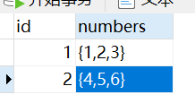

### 基础概念

1. DQL：select
   查询
2. DML：insert、delete、update
   增删改
3. DDL：create、drop、alter、truncate
   表的操作
4. TCL：commit、rollback
   事务操作

### 数据类型

**整数类型**：

1. int：正常情况数字就用它
2. bigint：处理特别巨大的数字，例如双十一交易量
3. tinyint：一般对应布尔值true和false

**浮点数类型**：

1. float：单精度浮点，占用4字节
2. double：双精度浮点，占用8字节
3. DECIMAL：用于存储精确小数的一种定点数类型，不属于浮点数。

设置浮点数时，可以同时设置它们的精度，就像`FLOAT(M, D)、DOUBLE(M, D)、DECIMAL(M, D)`，其中M表示总的位数，D表示小数点后的位数。

例如：`DOUBLE(14, 6)`表示小数点前保留8位，小数点后保留6位，总共14位。

**字符串类型**：

1. varchar：可变长度
2. char：固定长度
3. text：存储大文本数据，一般存储可变长度的字符串

varchar和char的区别：二者最大长度都是255，varchar可变长度，可以节省空间，但是动态分配空间速度可能很慢。二者在创建时必须手动定义长度。

怎么选：短字符串、定长字符串（如UUID）用char好一些；除了前面说的两种，其余情况用varchar会好一些。

text类型存储的是指向实际数据的指针，而数据本身存储在专用的数据页中。text类型的数据不适合建立索引或者在where子句后进行搜索。

**日期与时间类型**：

1. date：只有年月日，格式为'YYYY-MM-DD'
3. time：只有时分秒，格式为'HH:MM:SS'
3. datetime：有年月日时分秒，格式为'YYYY-MM-DD HH:MM:SS'
4. TIMESTAMP：和datetime存储一样的时间格式：'YYYY-MM-DD HH:MM:SS'

TIMESTAMP占用4个字节，datetime占用8个字节，但是TIMESTAMP表示范围较小，仅为'1970-01-01 00:00:01' UTC 到 '2038-01-19 03:14:07' UTC，而datetime类型为：'1000-01-01 00:00:00' 到 '9999-12-31 23:59:59'

不用纠结选择TIMESTAMP还是datetime，直接无脑**选datetime就好**。

这里需要注意：MySQL用now()函数获取当前时间，是datetime类型的。

**其他数据类型**：

在pgsql（PostgreSQL）中还有一种数据类型：数组类型。

数组类型通过在数据类型后加上`[]`来表示，例如这样：

```sql
CREATE TABLE array_table (
    id serial PRIMARY KEY,
    numbers int[]
);
```

numbers即为一个整型数组。将数据插入这个数组有两种方式：

```sql
INSERT INTO array_table (numbers) VALUES
(ARRAY[1, 2, 3]),
('{4, 5, 6}');
```

数据在表中存在的格式：



可以使用下标来访问数组中的元素（下标从1开始），例如：

```sql
SELECT numbers[1] FROM array_table where id = 1;
```

数组类型对应到代码的实体的数据类型：Java中为List类型，Go中为切片类型。

```go
type ArrayTable struct {
	ID      uint `gorm:"primaryKey"`
	Numbers []int
}
```

