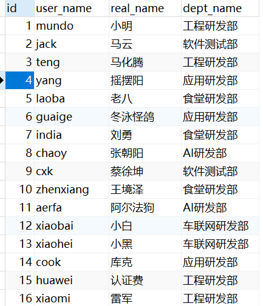
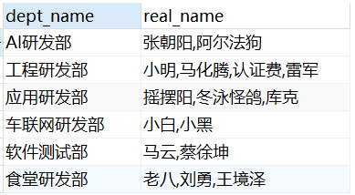

### 单行处理函数

对具体某一字段的某一个数据进行数学运算、字符串转换等。

单行处理函数的数量很多，可以自行上网搜索。

### 多行处理函数

一般就以下五种：

`count()  sum()  avg()  max()  min()`

多行处理函数又叫分组函数，必须先进行分组才能用，如果没有分组，整张表默认为一组

由sql关键字的执行顺序：

from…join…on…where…group by…having…select…distinct...order by…limit…

得出**结论**：on和where后面不能使用多行处理函数，having和select后面可以。

### 其余常用函数

#### 1. group_concat(distinct xxx separator x)

将分组中括号里字段进行字符串连接，如果分组中括号里的参数xxx有多行，每个字符串之间以特定符号进行分隔（如果不指定，默认以逗号分隔），一般搭配group by使用。

比如这样一张表user：

我们想拿到每个部门的成员信息，去重，以分号间隔。

sql语句

~~~ sql
select dept_name, group_concat(distinct real_name separator ',') as real_name
from user group by dept_name;
~~~

得到的结果

#### 2. find_in_set(str,strlist)

str为要查询的字符串，strlist为字段名，其参数以逗号分隔。返回str在strlist中的位置，以1开始。如果str不在strlist 或strlist 为空字符串，则返回值为0。

**find_in_set和in的区别**：

我们以上面查询得到的结果表为例，如果我们想找real_name中有老八的数据，我们用in就无法做到。

~~~ sql
select dept_name, real_name
from (
select dept_name, group_concat(distinct real_name separator ',') as real_name
from user
group by dept_name
) a
where '老八' in real_name;
~~~

报错了，in的正确语法应该是：

~~~ sql
select dept_name, real_name
from (
select dept_name, group_concat(distinct real_name separator ',') as real_name
from user
group by dept_name
) a
where '老八' in ('老八', '刘勇', '王境泽');
~~~

也就是说，in后面跟着的必须得是常量，写死的。

我们用find_in_set即可达到要求：

~~~ sql
select dept_name, real_name
from (
select dept_name, group_concat(distinct real_name separator ',') as real_name
from user
group by dept_name
) a
where find_in_set('老八', real_name) != 0;
~~~

拿到了有老八的那行数据。

所以，如果strlist是常量，我们使用in是没问题的，如果是变量，我们使用find_in_set。

**find_in_set和like的区别**：

find_in_set是精确匹配，也就是说要老八就只要老八。而like，如果有个人名字叫岛市老八，也会被匹配上，导致结果不准确。

