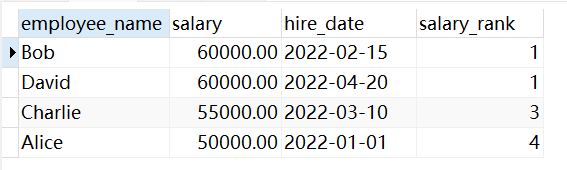
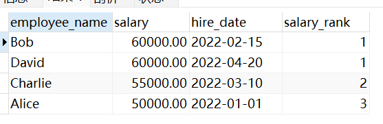

这一期再讲一些重要的MySQL函数，做补充。

### 1. RANK() 窗口函数

窗口函数是MySQL8.0引入的机制，RANK()函数用于在查询结果集中按照我们指定的排序规则，每行分配一个排名，它的语法规则是这样的：

```sql
SELECT
  column1,
  column2,
  RANK() OVER (ORDER BY column3 DESC) AS ranking
FROM
  your_table;
```

这里，`column1`, `column2` 是我选择的列，`RANK() OVER (ORDER BY column3 DESC) AS ranking`这一句中，`OVER`子句用于定义窗口规范，根据括号内的表达式定义排序顺序，然后由`RANK()`函数给每一行分配一个排名，如果两行有相同的值，它们共享相同的排名，且下一个排名会被跳过。

这里要保证`OVER`子句里定义的`ORDER BY`是有意义的，它返回的数据集也会按照这个`ORDER BY`进行排序。

例如有这样一张表，和这样几条数据：

```sql
CREATE TABLE employees (
  employee_id INT PRIMARY KEY,
  employee_name VARCHAR(50),
  salary DECIMAL(10, 2),
  hire_date DATE
);

INSERT INTO employees VALUES
  (1, 'Alice', 50000.00, '2022-01-01'),
  (2, 'Bob', 60000.00, '2022-02-15'),
  (3, 'Charlie', 55000.00, '2022-03-10'),
  (4, 'David', 60000.00, '2022-04-20');
```

现在使用窗口函数`RANK()`给每个员工按工资从高到低分配排名：

```sql
SELECT
  employee_name,
  salary,
  hire_date,
  RANK() OVER (ORDER BY salary DESC) AS salary_rank
FROM
  employees;
```

得到这样的结果：



我们也可以使用`DENSE_RANK()`来代替`RANK()`，达到不跳过下一排名的目的：

```sql
SELECT
  employee_name,
  salary,
  hire_date,
  DENSE_RANK() OVER (ORDER BY salary DESC) AS salary_rank
FROM
  employees;
```

得到这样的结果：



再讲一下它为什么叫窗口函数？

我们通过select查询出的结果集，就叫做窗口，窗口函数就是在这个窗口上执行计算，在不破坏原始查询结果的情况下，为结果集中的每一行提供附加的信息，如排名、聚合等。