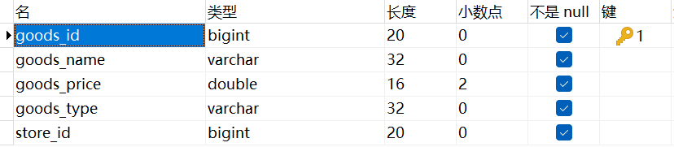
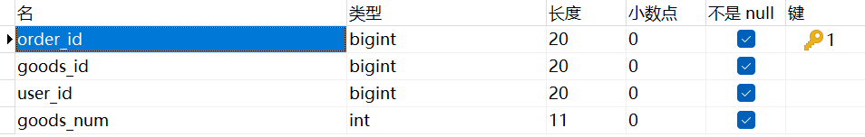
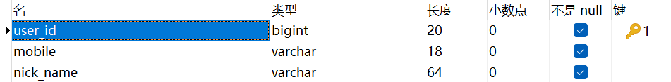
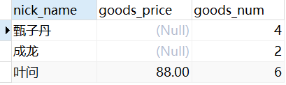

单独一个join是内连接，建议写成inner join增强可读性。

left join 和 right join是外连接，也可以在join前面加一个outer。

**内连接**：连接结果仅包含符合连接条件的行，参与连接的两个表都要满足on之后的连接条件。

**外连接**：连接结果不仅包含符合连接条件的行，也包含不符合条件的行。外连接分为左外连接、右外连接和全外连接。

内连接外连接怎么选？

例如这样一个需求：查询所有订单中商品总额（商品数量*商品价格）都大于500的用户昵称。

商品表字段

订单表字段

用户表字段

这种情况，我们在连接商品表和订单表的时候，就要注意：如果我们使用外连接，并把商品总额大于500这个条件放到on后面判断，就会导致结果不准确。

~~~ sql
select c.nick_name
from t_order a
left join t_goods b
on a.goods_id = b.goods_id
and a.goods_num * b.goods_price > 500
left join t_user c
on a.user_id = c.user_id;
~~~

我们发现匹配的结果比预计的要多，找一下原因。

~~~ sql
select c.nick_name, b.goods_price, a.goods_num
from t_order a
left join t_goods b
on a.goods_id = b.goods_id
and a.goods_num * b.goods_price > 500
left join t_user c
on a.user_id = c.user_id;
~~~

多查询出两个字段，得出了这样的结果。

**发现原因**：我们连接商品表和订单表的时候，使用left join确定t_order表为主表，也就是说就算数据不匹配，t_order表中所有数据都会展示，t_goods表中不匹配的数据被查询出为Null，所以我们连接订单表与用户表查询用户昵称的时候，就会把所有订单对应的用户昵称查询出来，这显然是不准确的。

还有一点需要注意：一个人可能下了多个订单，所以我们在查询用户昵称时要做去重处理。

解决完这些问题后，sql代码如下：

判断条件放到where里

~~~ sql
select distinct c.nick_name
from t_order a
left join t_goods b
on a.goods_id = b.goods_id
left join t_user c
on a.user_id = c.user_id
where a.goods_num * b.goods_price > 500;
~~~

使用内连接代替外连接

~~~ sql
select distinct c.nick_name
from t_order a
inner join t_goods b
on a.goods_num * b.goods_price > 500
and a.goods_id = b.goods_id
left join t_user c
on a.user_id = c.user_id;
~~~

