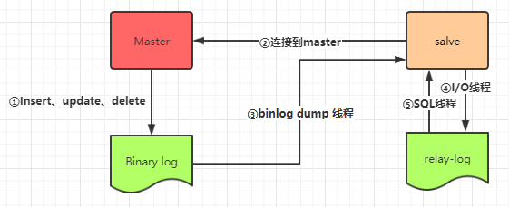

虽然我们平时都在说：数据库分库分表，但其实分库分表**根本不是一件事**，我们可以只分库，可以只分表，也可以既分库又分表，每个情境解决的问题也不一样。

这一节我们重点讲一下分库。

分库主要解决的问题：**并发量大**。数据库的连接数是有限的，不能无限增多。如果数据库的QPS（Queries Per Second）过高，数据库连接数不足，就要考虑分库了。

### 分库的分类

一般分库有这么两种情况：

1. 读写分离，一主多从，主库负责写操作，从库负责读操作。这种情况，所有数据库所含的数据都是一致的。
2. 一般在微服务场景中，按照业务模块或功能划分数据库，把每张表放到对应的数据库中。这种情况，每个数据库里的数据都是不同的，它们一起向外提供服务。

上面两种情况，实际上都是做数据库层面负载均衡的处理。

第二种情况很好理解和实现，不同的微服务模块可以有不同的配置文件，它们可以指向自己对应的数据库，完成整个项目层面的分库操作。

第一种情况可以和第二种情况一同使用，也就是说每个业务模块也还可以做主从复制的架构。

这里主要讲一下MySQL一主多从的结构。

### MySQL主从复制

主从复制、一主多从目标就是提高数据库的并发性能。单机部署MySQL会出现两个问题，一是在高并发状态下，会造成读写压力过大，二是如果单机MySQL宕机了，会直接造成服务不可用，或者数据丢失等问题，也就是不具备高可用性。

MySQL主从复制是其自带的功能，无需第三方工具帮助。

主从复制的原理是这样的：

其中Master为主库，Slave为从库。主库负责处理写操作，更新数据，而从库负责复制主库的数据。

1. Master启动二进制日志（binlog），这个日志的记录被称为复制事件，每个事件都包含Master对数据库进行操作的1个或多个SQL记录。
2. Master创建一个复制账户，授予适当的权限。
3. 所有Slave通过复制账户连接到Master，请求Master上的二进制日志。
4. Master通过`binlog dump` 线程，将binlog文件发送给Slave，这个线程还会传递一个位置信息，让Slave知道从何处开始获取二进制日志的内容。
5. Slave会把binlog的内容存储到自己的relay log（中继日志）中，相当于一份数据副本
6. Slave有一个I/O线程和一个SQL线程，I/O线程负责读取relay log内容，SQL线程负责执行这些SQL语句。
7. Slave会持续监听Master的变化，不断请求Master发送binlog，保持数据与主服务器同步。

### MySQL读写分离

读写分离要建立在主从复制的基础上，并且主库负责写，从库负责读。

这个一般都是使用一些三方库或框架完成。

对于Java：可以使用ShardingSphere-JDBC。

对于Go：可以使用GORM的DBResolver插件。