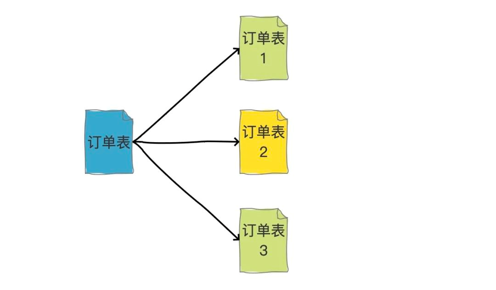
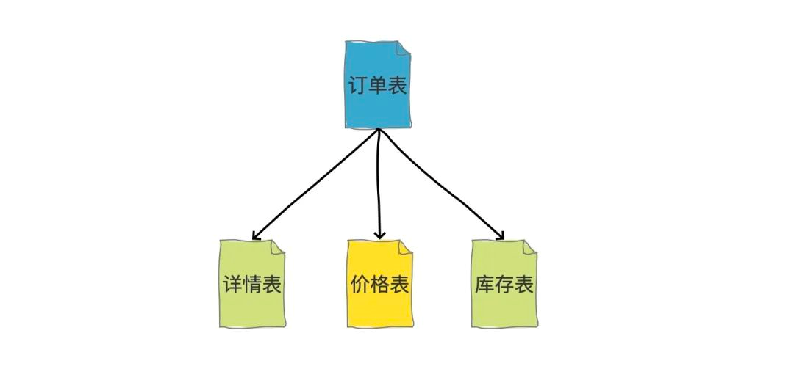
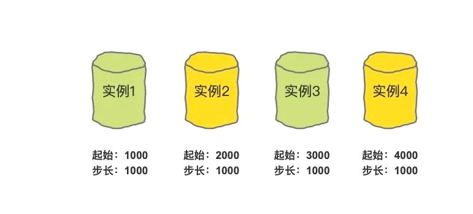

上节我们具体讲了分库的内容，分库主要解决的是并发量大的问题。

分表解决什么问题？**数据量大**的问题。如果单表数据量非常大，即使并发量不高，也会遇到存储或查询的瓶颈。如果做了很多索引优化或者SQL语句优化还是无法解决问题，那就要考虑分表了。

通过将一张表的数据拆分到多张表中，减少单表的数据量，从而提升查询速度。

一般认为单表数据超过500w行，或者单表容量超过2GB后，才会考虑做分表处理（横向分表）。

同时还有这些情况需要考虑分表：

1. 表的宽度较大：表中的列很多，每次查询涉及大量的列，考虑分表减小每个查询涉及的列数。
2. 频繁的数据更新：在高并发环境下可能会引起频繁的锁竞争，考虑分表减轻锁竞争压力。

### 分表的分类

做分表操作时通常涉及到这样两个概念：横向拆分（水平拆分）和纵向拆分（垂直拆分），可以这么理解，横向拆分是拆数据，纵向拆分是拆字段。

横向拆分就像这样：

纵向拆分就像这样：

这里重点讲横向拆分，横向拆分离不开一个概念，那就是**分表字段**，这个字段的值决定这条数据被分到哪张表里。选择一个合适的分表字段非常重要，这个字段的选择会影响数据的均匀分布以及查询的性能。

### 分表字段选择

分表字段的选择原则：

1. 选择高基数的字段，也就是字段的值有较大的变化范围，有助于在分表时可以均匀分散。
2. 在查询中频繁用于排序或过滤的字段，有助于提高查询性能。
3. 还需要考虑未来的数据增长和业务变化，选择能够应对未来扩展的字段。
4. 选择不太容易变更的字段，因为如果变更频繁，数据库需要大规模调整。

例如一张订单表，我们就可以通过**买家ID**作为分表字段，因为买家查看自己订单，肯定是通过买家ID进行过滤，可以根据这个信息快速定位到数据在哪张表，并且每个买家的订单信息都肯定在同一张表里。

如果这张订单表，我们不使用买家ID查询，而是使用订单号查询呢？

解决办法是：生成订单号的时候，一定可以知道买家ID，比如我们要分256张表，可以用买家ID先取哈希再对256取模，得到值的范围是000~255，然后把这个路由结果作为一段固定值放到订单号中，这就是基因法。

这样按照订单号查询的时候，解析出这段数字，直接去对应分表`table_000 ~ table_255`查询就好了。

至于还有其他种类的查询，没有买家ID，也没订单号的，那其实就属于是**低频查询**或者非核心功能查询了，那就可以用ES等搜索引擎的方案来解决了。

### 分表算法

常用分表算法有三种：直接取模、哈希取模、一致性哈希。

1. 直接取模：适用于分表字段是数字的情况，而且这个数字需要够大，够分散。

2. 哈希取模：可以解决分表字段是字符串或者其他类型的情况，我们需要使用适当的哈希函数。

3. 一致性哈希：是一种特殊的哈希算法，它在节点的增减时能够最小程度地影响已有的映射关系。

前两种取模方式有一个缺点，就是如果需要扩容，比如原来256张表即可，现在需要512张表，这就需要重新计算哈希值，涉及到数据迁移，非常麻烦。

而一致性哈希可以最小程度影响数据的变化，这个可以单独出一节详细讲一下。

### 全局ID生成

涉及到分表操作，就有一个问题，就是唯一ID的生成问题。

在单表中我们可以用数据库自增主键做唯一ID，但是如果做了分表，多张单表中的自增主键就一定会发生冲突。那就不具备全局唯一性了。

有几个解决方案：

1. UUID：可以做到强全局唯一，但是通常不推荐用它做唯一ID，一是太长，二是字符串查询效率较慢。
2. 雪花算法：这个是加强版的自增主键，可确保生成的ID在分布式系统中唯一。（具体可以去前面章节查看）
3. 所有表的自增主键都由同一张表生成，这种方式存在单点问题，如果它挂了，整个系统都不可用了。
4. 基于多个单表+步长做自增主键，大致就是下图这样：

如果某张表的步长用完了怎么办？所有的表都生成一个新的起始值。实例1从5000开始，步长1000，以此类推。

推荐使用**雪花算法**生成唯一ID。

### 分表问题

1. 做了分表之后，所有读和写操作，都需要带着分表字段，才能知道去哪张表查询。如果不带分表字段，就要进行全表扫描，而且是把所有分表都要扫描一遍。
2. 跨表的事务处理更为繁琐和困难。
3. 不能跨多表进行分页查询，或者排序。
4. 系统的扩展性更加复杂。