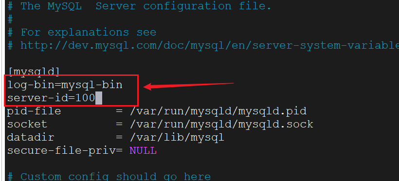
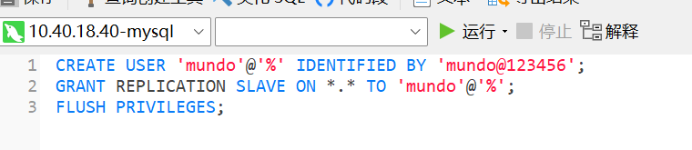
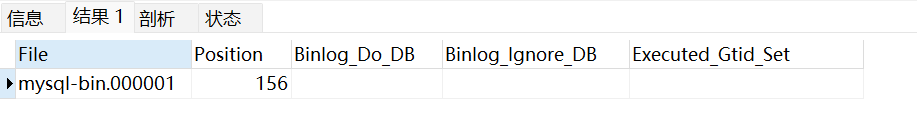
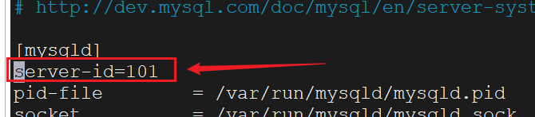
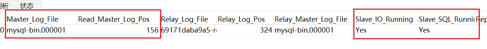
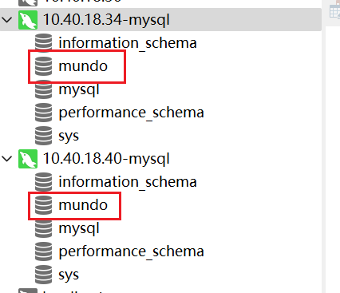
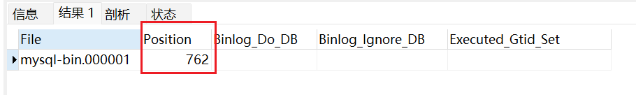
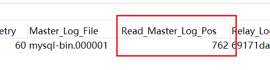

这里我创建一个Master和一个Slave

Master：10.40.18.34:3306

Slave：10.40.18.40:3306

在这两台机器上都安装上MySQL，我这里都是使用docker安装的。

首先，我们在**主库**的MySQL，已经设置了数据卷挂载，配置文件是设置在`/home/docker/mysql/conf`的

我们修改下面这个配置文件

```bash
vim /home/docker/mysql/conf/my.cnf
```

加上下面内容：

```
log-bin=mysql-bin
server-id=100
```



1. log-bin：启用二进制日志，设置二进制文件的前缀
2. server-id：服务器唯一id，随意设置

做完这步配置后，需要重启MySQL，这里我们重启docker容器。这步非常重要，不然配置文件无法生效。

下一步需要执行这句SQL

```sql
CREATE USER 'mundo'@'%' IDENTIFIED BY 'mundo@123456';
GRANT REPLICATION SLAVE ON *.* TO 'mundo'@'%';
FLUSH PRIVILEGES;
```

登录Navicat，执行语句即可



第一句SQL，表示创建一个叫`mundo`的用户，它可以从任何主机（用“%”表示）连接到数据库，并设置了它的用户名和密码为`mundo@123456`

第二句SQL表示授予用户`mundo`复制从服务器的权限，意味着此用户可以从Master读取二进制日志事件并将它们复制到Slave。`*.*`表示这个权限适用于所有数据库的所有表。

第三句SQL表示使之前的更改立即生效，而无需重启MySQL。

然后我们执行这样一行语句，查看Master的状态：

```sql
show master status;
```

得到这样一个表格：



File就是二进制文件binlog的名称，前缀就是我们前面在配置文件设置的，Position是这个文件在Master中的位置。

需要注意的是：执行完这句SQL后就不要在Master上执行其他操作了，不然会改变Position的位置。

这两个值是要在Slave中使用到的。

接下来配置从库信息

从库也需要修改下面这个配置文件：

```bash
vim /home/docker/mysql/conf/my.cnf
```

加上这一行就好，只是做一个唯一标识：

```
server-id=101
```



同样，修改完后也需要重启docker容器。

接下来，连接Slave客户端，执行下面命令：

```bash
CHANGE MASTER TO 
  MASTER_HOST='10.40.18.40',
  MASTER_USER='mundo',
  MASTER_PASSWORD='mundo@123456',
  MASTER_LOG_FILE='mysql-bin.000001',
  MASTER_LOG_POS=156;
  
start slave;
```

其中`MASTER_HOST`是主库的主机名或IP地址

`MASTER_USER`和`MASTER_PASSWORD`是主库创建的用户名和密码等信息

`MASTER_LOG_FILE`和`MASTER_LOG_POS`是Master中看到的binlog的名称和这个文件在Master中的位置

最后，需要使用`start slave`，启动复制过程。

然后可以看一下Slave的状态：

```sql
show slave status;
```

关注这些内容：



看到Master的binlog文件和位置是我们设置的值，而且IO线程和SQL线程都是Yes状态，就代表配置成功。

如果看到Slave_IO_Running为Connecting，需要先停止Slave：

```bash
stop slave;
```

在上面连接Slave客户端命令最后加上一条，变成这样：

```bash
CHANGE MASTER TO 
  MASTER_HOST='10.40.18.40',
  MASTER_USER='mundo',
  MASTER_PASSWORD='mundo@123456',
  MASTER_LOG_FILE='mysql-bin.000001',
  MASTER_LOG_POS=156,
  GET_MASTER_PUBLIC_KEY=1;
  
start slave;
```

在Master中创建一个数据库，在Slave中同步了。



Master中建了一张表，Slave也同步过去了。配置成功！

刚才执行了建表操作，再查看一下Master的状态：



我们看到binlog文件的位置变了，那么需不需要更改Slave的配置呢？



答案是不需要，Slave会自动同步Master中binlog的位置。