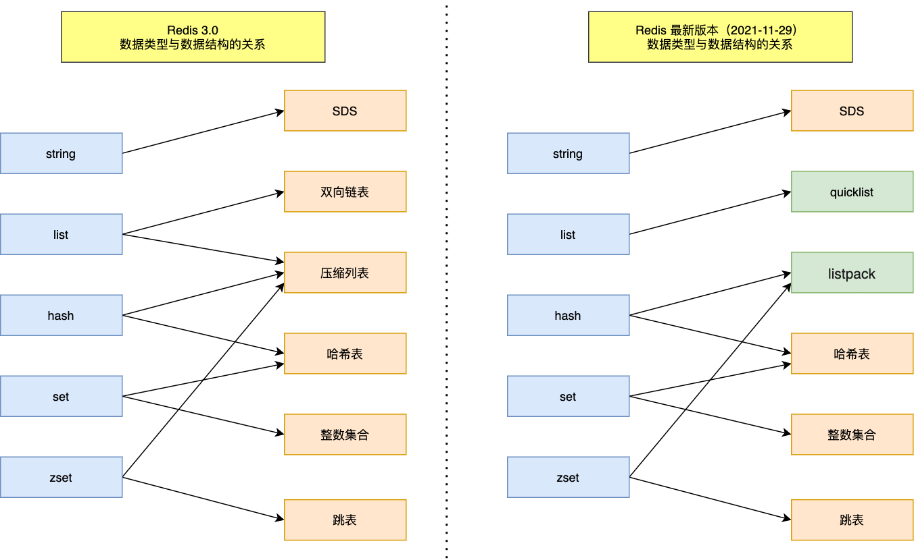
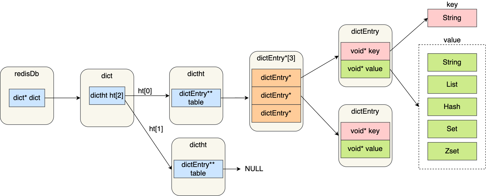

### 1. redis数据结构

redis的数据是 key-value 形式的键值对，其中 key 其实都是字符串的形式，而 value 的数据类型，也就是数据的保存形式，底层实现的方式就用到了数据结构。

所以我们一直说的“redis五种数据结构”，严格上来说是“redis五种**数据类型**”。

redis数据类型和底层数据结构的对应关系图如下：

可以看出，redis3.0与之后的版本，对象底层数据结构是有所不同的。

1. redis3.0中list数据类型的底层数据结构由【双向列表】和【压缩列表】实现，而在3.2版本之后，list数据类型底层数据结构由quicklist实现。
2. 压缩列表数据结构已经废弃，由listpack数据结构替代了。

所以，在redis3.0之后的版本，redis的数据结构有六种：SDS、quicklist、listpack、哈希表、整数集合、跳跃列表。

### 2. redis对象与数据结构关系

我们都知道redis是一个 key-value 形式的数据库，所有的 key 都是字符串，而 value 可以是字符串，也可以是list、hash、set、sortedset这些数据类型。

这些键值对怎么保存在redis中？
redis使用了一个哈希表保存所有键值对。哈希表的优点就是可以用O(1)的时间复杂度快速查找键值对对象，哈希表其实也是一个数组，每个元素都是一个哈希桶。
哈希表存放键值对的关系图如下所示

再搭配上面的redis数据类型和数据结构的关系，就知道redis对象和数据结构的关系了。

redis是用C语言实现的，所以redis的数据结构实际上就是C语言的数据结构。

如果想更深层次了解redis的数据结构，可以看这位大佬写的文章：[redis数据结构详解](https://blog.csdn.net/qq_34827674/article/details/121654479)