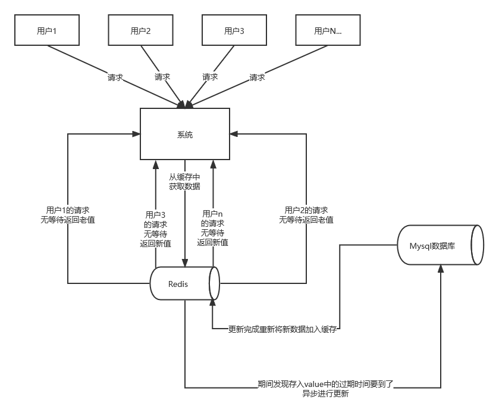

缓存击穿，指指的是某一个经常被访问的**热key**缓存过期的那一刻，**大量请求**访问这个key，会瞬间穿透缓存服务器同时访问数据库，导致数据库访问压力很大，出现过载的情况。

如何解决缓存击穿？

首先要分清缓存击穿和缓存穿透的区别：缓存穿透多数情况下数据库中是没有这条数据的，而缓存击穿时，数据库是有这条数据的，只是在缓存中过期了，因为这条数据是热key，并发访问量非常大，所以会导致数据库过载。

我们有如下几种解决方案：

1. 设置热点key永不过期。

   这里并不是给这个数据的存活时间设置为永久，而是将过期时间存在key对应的value里，如果发现要过期了，通过一个后台的异步线程进行缓存的重建。
   

2. 使用互斥锁。

   在单体项目中是这样的原理：数据的缓存过期后，只有**首个访问的线程**可以访问数据库，其他线程等待这个线程查询到数据，更新缓存后即可直接从缓存中获取数据。加锁排队只是为了减轻数据库的压力，并没有提高系统吞吐量。在高并发情况下，缓存重建期间key是锁着的，这是过来1000个请求999个都在阻塞的，同样会导致用户等待超时，这是个治标不治本的方法。所以在高并发场景下，尽可能不使用加锁的方式。
   以下是使用互斥锁解决缓存击穿的代码：

~~~ go
package main

import (
	"fmt"
	"sync"
	"time"

	"github.com/go-redis/redis"
)

var (
	redisClient *redis.Client
	mutex       = &sync.Mutex{}
)

func getValueFromCache(key string) (string, error) {
	val, err := redisClient.Get(key).Result()
	if err == redis.Nil {
		// 当缓存中不存在该键时
		mutex.Lock()
		defer mutex.Unlock()
		// 再次检查以防其他 goroutine 已经获取了数据
		val, err = redisClient.Get(key).Result()
		if err == redis.Nil {
			// 模拟数据库调用返回的信息
			dbValue := "some_value_from_db"
			err := redisClient.Set(key, dbValue, 10*time.Minute).Err()
			if err != nil {
				return "", err
			}
			val = dbValue
		}
	}
	return val, err
}

func main() {
	redisClient = redis.NewClient(&redis.Options{
		Addr:     "localhost:6379",
		Password: "", // 没有设置密码
		DB:       0,  // 使用默认数据库
	})

	// 模拟多个并发请求
	var wg sync.WaitGroup
	for i := 0; i < 5; i++ {
		wg.Add(1)
		go func() {
			defer wg.Done()
			value, err := getValueFromCache("some_key")
			if err != nil {
				fmt.Println("出现错误:", err)
			} else {
				fmt.Println("拿到数据:", value)
			}
		}()
	}
	wg.Wait()
}
~~~

​	加锁操作也可以通过Redis的分布式锁来实现。

3. 定时刷新。
   这个和第一条大同小异，我们可以在后台写一个定时任务，假如这条数据的存活时间为10分钟，我们可以每9分钟执行一次定时任务，将数据库中查到的数据更新到缓存中，刷新存活时间。

4. 缓存预热
   在系统启动时进行缓存的预热，加载一些核心数据到缓存中，避免启动后大量请求落到数据库。