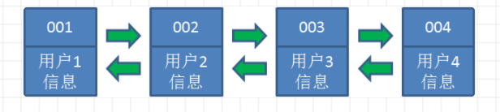
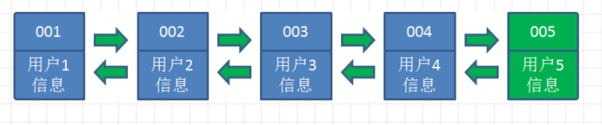
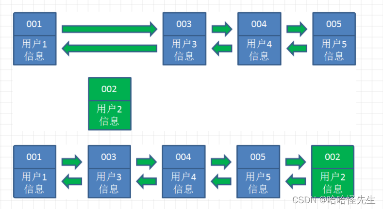
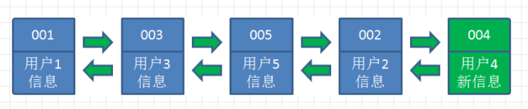
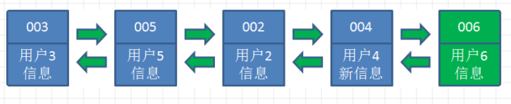

前面在Redis的内存淘汰机制中，提到了Redis最常用的淘汰策略就是LRU，下面我们讲一下。

LRU：Least Recently Used，最近最少使用，是一种常用的缓存淘汰策略。

其核心思想是基于数据的历史访问记录，即最近最少使用的数据会被优先淘汰。

LRU的实现方法是哈希表和双向链表的结合。哈希表用于快速定位数据，双向链表用来维护数据的访问顺序，确保最近访问的数据始终位于链表头部，而最久被访问的数据位于链表尾部。

当有新的数据被访问时，如果数据已经存在于缓存中，将其移动到链表的头部，表示该数据是最近被访问的。如果数据不存在于缓存中，读数据库，并将其添加到链表的头部，同时检查链表长度是否已满。如果已满，从链表的尾部移除最久未被访问的数据，以便为新数据腾出空间。（哈希链表的长度根据缓存的容量来定义）

假设现在缓存中有这四个数据：



当访问用户5时，发现哈希链表中没有这个数据，从数据库中读出来，插入到链表中：



当访问用户2时，由于哈希链表中有用户2的数据，我们把它掐断，放到链表最右端，表示它是最近使用的。



同理访问用户4：



当访问用户6，用户6在缓存中没有，需要读库，插入到链表中，但此时链表长度已满，我们把最左端的用户1删掉，然后插入用户6。



用Go语言完成代码编写：

```go
type Node struct {
    key, value int
    prev, next *Node
}

type LRUCache struct {
    capacity int  // 缓存的容量，表示可以存储的最大节点数
    cache map[int]*Node
    head, tail *Node
}

func Constructor(capacity int) LRUCache {
    return LRUCache{
        capacity: capacity,
        cache: make(map[int]*Node),
        head: &Node{},
        tail: &Node{},
    }
}

// 将节点插入到双向链表的头部
func (this *LRUCache) addToHead(node *Node) {
    node.prev = this.head
    node.next = this.head.next
    this.head.next.prev = node
    this.head.next = node
}

// 从双向链表中移除指定节点
func (this *LRUCache) removeNode(node *Node) {
    node.prev.next = node.next
    node.next.prev = node.prev
}

// 将指定节点移动到双向链表的头部，表示最近访问
func (this *LRUCache) moveToHead(node *Node) {
    this.removeNode(node)
    this.addToHead(node)
}

func (this *LRUCache) get(key int) int {
    if node, ok := this.cache[key]; ok {
        // 如果节点存在于缓存中，将其移动到头部，表示最近访问
        this.moveToHead(node)
        return node.value
    }
    return -1  // 节点不存在于缓存中，返回-1表示未找到
}

func (this *LRUCache) put(key int, value int) {
    if node, ok := this.cache[key]; ok {
        // 如果节点已存在于缓存中，更新节点的值，并将其移动到头部
        node.value = value
        this.moveToHead(node)
    } else {
        // 如果节点不存在于缓存中，创建新节点，将其添加到头部，并检查是否需要淘汰最久未被访问的节点
        newNode := &Node{key: key, value: value}
        this.cache[key] = newNode
        this.addToHead(newNode)
        if len(this.cache) > this.capacity {
            // 缓存已满，淘汰最久未被访问的节点（尾部节点）
            tailKey := this.tail.prev.key
            this.removeNode(this.tail.prev)
            delete(this.cache, tailKey)
        }
    }
}
```

