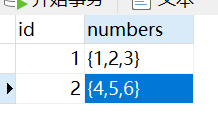

### 基础概念

| 类别  | 操作                                  | 描述     |
| ----- | ------------------------------------- | -------- |
| `DQL` | `select`                              | 查询     |
| `DML` | `insert`、`delete`、`update`          | 增删改   |
| `DDL` | `create`、`drop`、`alter`、`truncate` | 表的操作 |
| `TCL` | `commit`、`rollback`                  | 事务操作 |

### 数据类型

#### 1. 整数类型

- `int`：正常情况数字就用它。

- `bigint`：处理特别巨大的数字，例如双十一交易量。

- `tinyint`：一般对应布尔值`true`和`false`。

#### 2. 浮点数类型

- `float`：单精度浮点，占用`4`字节。

- `double`：双精度浮点，占用`8`字节。

- `DECIMAL`：用于存储精确小数的一种定点数类型，不属于浮点数。

设置浮点数时，可以同时设置它们的精度，就像`FLOAT(M, D)`、`DOUBLE(M, D)`、`DECIMAL(M, D)`，其中`M`表示总的位数，`D`表示小数点后的位数。例如：`DOUBLE(14, 6)`表示小数点前保留`8`位，小数点后保留`6`位，总共`14`位。

#### 3. 字符串类型

- `varchar`：可变长度。

- `char`：固定长度。

- `text`：存储大文本数据，一般存储可变长度的字符串。

`varchar`、`char`和`text`的区别：

- 最大长度：`varchar`和`char`默认最大长度都是`255`，`text`可以存储更大的文本数据。
- 长度类型：`varchar`是可变长度，可以节省空间，但是动态分配空间速度可能较慢；`char`是固定长度，创建时必须手动定义长度；`text`类型数据存储在专用的数据页中，适合存储大文本数据。
- 使用场景：短字符串、定长字符串（如`UUID`）用`char`更好；一般情况下用`varchar`较好；`text`适合存储大文本数据，但不适合建立索引或者在`where`子句中进行搜索。

#### 4. 日期与时间类型

- `date`：只有年月日，格式为`YYYY-MM-DD`。

- `time`：只有时分秒，格式为`HH:MM:SS`。

- `datetime`：有年月日时分秒，格式为`YYYY-MM-DD HH:MM:SS`。

- `TIMESTAMP`：和`datetime`存储一样的时间格式：`YYYY-MM-DD HH:MM:SS`。

`TIMESTAMP`占用`4`个字节，`datetime`占用`8`个字节，但是`TIMESTAMP`表示范围较小，仅为`1970-01-01 00:00:01 UTC` 到 `2038-01-19 03:14:07 UTC`，而`datetime`类型为：`1000-01-01 00:00:00` 到 `9999-12-31 23:59:59`。

不用纠结选择`TIMESTAMP`还是`datetime`，全部选用`datetime`就好。

> **注意：**`MySQL`用`now()`函数获取当前时间，是`datetime`类型的。

#### 5. 枚举类型

`ENUM`用于存储一组预定义的字符串值，类似于一个有限的字符串集合，但只能从中选择一个值。使用`ENUM`类型可以增强数据库的数据完整性和约束，确保只允许合法的预定义值，避免无效或错误的输入。

以下是一个使用`ENUM`类型定义的表字段示例：

```mysql
CREATE TABLE example_table (
    status ENUM('active', 'inactive', 'pending') NOT NULL
);
```

`ENUM`类型在存储时并不直接存储字符串，而是存储一个整数值。每个字符串值都有一个索引，默认从`1`开始。第一个值为`1`，第二个值为`2`，依此类推。如果插入一个字符串值，`MySQL`会将其转换为相应的整数。例如，插入`'active'`时，实际存储的是整数`1`；插入`'inactive'`时，存储的是整数`2`。

由于`ENUM`实际存储的是整数值，因此存储和比较性能上通常优于普通的字符串类型（如`VARCHAR`）。如果`ENUM`的枚举值较少，查询时也会更加高效。但是`ENUM`类型本身没有排序机制，排序是基于其存储的整数值进行的。假设你希望根据某些实际意义上的排序（例如按名称的字典顺序排序），则需要额外处理。

如果该列设置了`NOT NULL`约束，插入一个不在定义范围内的值时，`MySQL`会返回错误；若未设置`NOT NULL`约束，则该列的值会被设为`NULL`。如果没有明确指定默认值，`MySQL`会自动将`ENUM`类型列的默认值设置为枚举值列表中的第一个值。

> **注意：**`ENUM`类型字段在外部展示时与`VARCHAR`类型相同，在`Go`语言中，它对应的数据类型为`string`。

#### 6. 数组类型

在`pgsql`（`PostgreSQL`）中还有一种数据类型：数组类型，通过在数据类型后加上`[]`来表示，例如这样：

```sql
CREATE TABLE array_table (
    id serial PRIMARY KEY,
    numbers int[]
);
```

`numbers`字段的数据类型即为一个整型数组。将数据插入这个数组有两种方式：

```sql
INSERT INTO array_table (numbers) VALUES
(ARRAY[1, 2, 3]),
('{4, 5, 6}');
```

数据在表中存在的格式如下图：



可以使用下标来访问数组中的元素（下标从`1`开始），例如：

```sql
SELECT numbers[1] FROM array_table where id = 1;
```

数组类型字段对应到代码的实体类字段的数据类型：`Java`中为`List`类型，`Go`中为切片类型。

```go
type ArrayTable struct {
	ID      uint `gorm:"primaryKey"`
	Numbers []int
}
```

