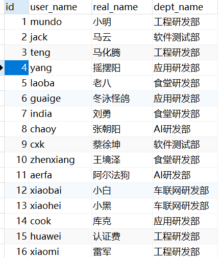
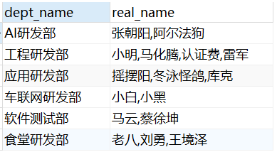

### 一、单行处理函数

常用单行处理函数可以简单分为几类：

- 数学函数：`ABS(x)`（绝对值）、`CEIL(x)`（向上取整）、`ROUND(x, n)`（四舍五入）、`MOD(x, y)`（取余）。
- 字符串函数：`UPPER(str)`/`LOWER(str)`（大小写转换）、`TRIM(str)`（去空格）、`CONCAT(str1, str2)`（拼接）。
- 日期时间函数：`NOW()`（当前时间）、`CURDATE()`（当前日期）、`YEAR(date)`（提取年份）。
- 类型/逻辑函数：`CAST(x AS type)`（类型转换）、`IF(condition, true_val, false_val)`（条件判断）。

单行处理函数还有很多，用到的时候可以自行上网搜索。

### 二、多行处理函数

一般有以下五种多行处理函数：`COUNT()`、`SUM()`、`AVG()`、`MAX()`、`MIN()`。

多行处理函数也称为分组函数或聚合函数，必须先通过`GROUP BY`进行分组才能使用；如果未分组，则整张表默认视为一组。

根据`SQL`关键字的执行顺序：

```sql
FROM...JOIN...ON...WHERE...GROUP BY...HAVING...SELECT...DISTINCT...ORDER BY...LIMIT...
```

可以得出结论：`ON`和`WHERE`后不能使用多行处理函数，而`HAVING`和`SELECT`后可以使用。

### 三、其余常用函数

#### 1. `group_concat(distinct xxx separator x)`

将分组中括号里字段进行字符串连接，如果分组中括号里的参数`xxx`有多行，每个字符串之间以特定符号进行分隔（如果不指定，默认以逗号分隔），一般搭配`group by`使用。

比如这样一张表`user`：



我们想拿到每个部门的成员信息，去重，以逗号间隔。`sql`语句如下：

~~~ sql
select dept_name, group_concat(distinct real_name separator ',') as real_name
from user group by dept_name;
~~~

得到的结果：



#### 2. `find_in_set(str, strlist)`

`str`为要查询的字符串，`strlist`为字段名，其参数以逗号分隔。返回`str`在`strlist`中的位置，以`1`开始。如果`str`不在`strlist`中，或`strlist` 为空字符串，则返回值为`0`。

`find_in_set`和`in`的区别：

我们以上面查询得到的结果表为例，如果我们想找`real_name`中有老八的数据，用`in`就无法做到。

~~~ sql
SELECT dept_name, real_name
FROM (
    SELECT dept_name, GROUP_CONCAT(DISTINCT real_name SEPARATOR ',') AS real_name
    FROM user
    GROUP BY dept_name
) a
WHERE FIND_IN_SET('老八', real_name);
~~~

会报错，因为`in`的正确语法应该是：

~~~ sql
SELECT dept_name, real_name
FROM (
    SELECT dept_name, GROUP_CONCAT(DISTINCT real_name SEPARATOR ',') AS real_name
    FROM user
    GROUP BY dept_name
) a
WHERE '老八' IN ('老八', '刘勇', '王境泽');
~~~

也就是说，`in`后面跟着的必须得是常量，写死的。

我们用`find_in_set`即可达到要求：

~~~ sql
SELECT dept_name, real_name
FROM (
    SELECT dept_name, GROUP_CONCAT(DISTINCT real_name SEPARATOR ',') AS real_name
    FROM user
    GROUP BY dept_name
) a
WHERE FIND_IN_SET('老八', real_name) != 0;
~~~

拿到了有老八的那行数据。

所以，如果`strlist`是常量，使用`in`是没问题的，如果是变量，则使用`find_in_set`。

`find_in_set`和`like`的区别：

- `find_in_set`是精确匹配，也就是说要老八就只要老八。

- `like`可能会匹配到部分字符串，比如有个人名字叫岛市老八，也会被匹配上，导致结果不准确。


