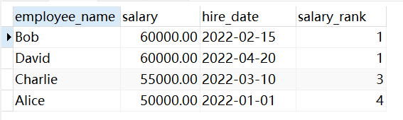
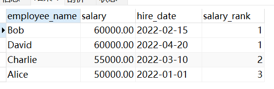

这一期再讲一些重要的`MySQL`函数，做补充。

### 1. `RANK()`窗口函数

窗口函数是`MySQL 8.0`引入的特性，`RANK()`函数根据指定排序规则为查询结果中的每一行分配排名。其语法规则如下：

```mysql
SELECT
    column1,
    column2,
    RANK() OVER (ORDER BY column3 DESC) AS ranking
FROM
    my_table;
```

`column1`和`column2`是查询中需要选择的列，而`RANK() OVER (ORDER BY column3 DESC) AS ranking`这一部分的作用是为每一行数据分配一个排名。具体来说，`OVER`子句定义了窗口的排序规则，`ORDER BY column3 DESC`表示按照`column3`列的值降序排序。`RANK()`函数根据这个排序规则为每一行分配一个排名，从`1`开始递增。

如果多个行的排序值相同，它们会共享相同的排名，且紧接着的排名会跳过这些重复的值。例如，如果有两行数据的排序值相同，且排名为`1`，那么下一行的排名将是`3`，而不是`2`。

确保`OVER`子句中定义的`ORDER BY`子句是合理和有意义的，因为查询返回的数据集会根据这个`ORDER BY`子句进行排序，不仅影响排名的计算，也影响结果集的显示顺序。

例如有这样一张表，和这样几条数据：

```sql
CREATE TABLE employees (
  employee_id INT PRIMARY KEY,
  employee_name VARCHAR(50),
  salary DECIMAL(10, 2),
  hire_date DATE
);

INSERT INTO employees VALUES
  (1, 'Alice', 50000.00, '2022-01-01'),
  (2, 'Bob', 60000.00, '2022-02-15'),
  (3, 'Charlie', 55000.00, '2022-03-10'),
  (4, 'David', 60000.00, '2022-04-20');
```

现在使用窗口函数`RANK()`给每个员工按工资从高到低分配排名：

```sql
SELECT
    employee_name,
    salary,
    hire_date,
    RANK() OVER (ORDER BY salary DESC) AS salary_rank
FROM
    employees;
```

得到这样的结果：



我们也可以使用`DENSE_RANK()`来代替`RANK()`，达到不跳过重复的值的目的：

```sql
SELECT
    employee_name,
    salary,
    hire_date,
    DENSE_RANK() OVER (ORDER BY salary DESC) AS salary_rank
FROM
    employees;
```

得到这样的结果：



窗口函数之所以得名，是因为它在查询结果集（即“窗口”）上执行计算，它可以在不改变原始查询结果的前提下，为每一行添加额外信息，如排名、聚合值等。窗口函数能够在查询中为每一行提供额外的上下文，而不影响原始的结果集。

