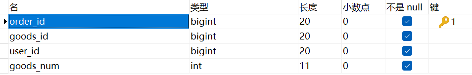
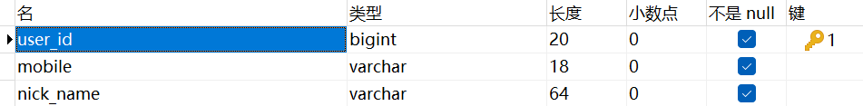
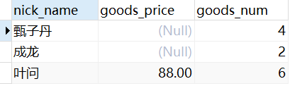

### 连接类型概述

- 内连接：连接结果仅包含符合连接条件的行，即两个表中都满足`on`后面指定的连接条件的行。单独使用`join`时，默认为内连接，为了提升可读性，建议写成`inner join`。
- 外连接：返回符合连接条件的行，同时保留未匹配的行。左外连接 (`left join`) 保留左表（第一个表）中的所有行，而右外连接 (`right join`) 则保留右表（第二个表）中的所有行。可以在`join`前加上`outer`以增强可读性，如`left outer join`。

### 内连接与外连接的选择

在以下需求中，我们需要查询所有订单中商品总额（商品数量 * 商品价格）大于 `500` 的用户昵称：

商品表字段：

订单表字段：

用户表字段：

当使用外连接时，如果将商品总额大于`500`的条件放在`on`子句中进行判断，可能会导致结果不准确。以下是示例`SQL`查询：

~~~ sql
select c.nick_name
from t_order a
left join t_goods b
on a.goods_id = b.goods_id
and a.goods_num * b.goods_price > 500
left join t_user c
on a.user_id = c.user_id;
~~~

我们发现返回的结果比预计的要多，找一下原因，我们多`select`两个字段出来：

~~~ sql
select c.nick_name, b.goods_price, a.goods_num
from t_order a
left join t_goods b
on a.goods_id = b.goods_id
and a.goods_num * b.goods_price > 500
left join t_user c
on a.user_id = c.user_id;
~~~

多查询出两个字段，得出了这样的结果：

发现原因：在连接商品表和订单表时，我们选择了使用`left join`，将`t_order`表作为主表，这意味着无论条件是否满足，都会保留`t_order`表中的所有行，并将未匹配的外表字段设为空值。因此，在连接订单表与用户表并查询用户昵称时，系统会返回所有订单对应的用户昵称，这显然会导致结果不准确。

还有一点需要关注：一个人可能下了多个订单，所以我们在查询用户昵称时要做去重处理。

### 优化建议

#### 1. 将判断条件移至`where`子句中，确保在`where`子句中应用商品总额大于`500`的条件，而不是在`on`子句中。

~~~ sql
select distinct c.nick_name
from t_order a
left join t_goods b on a.goods_id = b.goods_id
left join t_user c on a.user_id = c.user_id
where a.goods_num * b.goods_price > 500;
~~~

这种方法可以保证过滤条件应用于最终结果，避免不必要的数据展示。

#### 2. 使用内连接代替外连接，如果连接的表中存在复杂的过滤条件，可以考虑使用内连接来确保结果的准确性。

~~~ sql
select distinct c.nick_name
from t_order a
inner join t_goods b on a.goods_num * b.goods_price > 500 and a.goods_id = b.goods_id
left join t_user c on a.user_id = c.user_id;
~~~

这种方法会先过滤出符合条件的订单和商品组合，然后再与用户表进行连接，确保最终结果准确。
