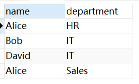

### 1. `group by`

`group by`用于将`select`语句查到的结果集进行分类，通常和分组函数`count()`、`sum()`、`avg()`、`max()`、`min()`一起使用。

它的一般语法结构如下：

```sql
SELECT 列1, 列2, 分组函数(列3) as 别名
FROM 表名 
WHERE 条件 
GROUP BY 列1, 列2 
HAVING 条件;
```

除了分组函数列以外，其他列必须全部出现在`group by`之后，否则会报错：`must appear in the GROUP BY clause or be used in an aggregate function`（也就是必须出现在`GROUP BY`子句中或在分组函数中使用）

`HAVING`用于对分组后的数据进行再次过滤，可以对包含聚合函数的列进行过滤。由于只有在分组后才能使用聚合函数，而`WHERE`的执行顺序在`GROUP BY`之前，所以`WHERE`不可对聚合函数列进行过滤。

例如一张表叫`search_table`，包含 `search_word`（查询词）、`search_by`（查询人） 以及其他字段。要找到每个查询词对应每个查询人的查询次数，并筛选出查询频率大于等于`5`的前十条数据，`SQL`语句是：

```sql
SELECT search_word, search_by, COUNT(*) as frequency
FROM search_table
GROUP BY search_word, search_by
HAVING COUNT(*) >= 5
ORDER BY frequency DESC
LIMIT 10;
```

### 2. `distinct`

当查询中存在重复的记录时，可以使用`DISTINCT`关键字消除重复项，这个关键字只能出现在`select`语句所有字段最前方。

例如有一张表`employees`，包含`name`和`department`两个字段，表内有以下数据：

```sql
INSERT INTO employees (name, department) VALUES 
('Alice', 'HR'),
('Bob', 'IT'),
('Alice', 'HR'),
('David', 'IT'),
('Alice', 'Sales');
```

我们这样使用`distinct`关键字：

```sql
SELECT DISTINCT department FROM employees;  -- 获取唯一的部门列表
SELECT COUNT(DISTINCT department) FROM employees;  -- 计算唯一部门的数量
SELECT DISTINCT name, department FROM employees;  -- 获取唯一的员工姓名和部门的组合
```

第三条查询语句的查询结果集是这样的：



在使用`DISTINCT`关键字时，`SQL`会对`SELECT`语句中所有字段的组合进行去重，只有当所有字段的值都相同时，才会被视为重复记录并从结果集中移除。

### 3. `limit`和`offset`

有以下三种语法结构：
- `LIMIT startIndex, length`
- `LIMIT length OFFSET startIndex`
- `LIMIT length`

前两种表示从第`startIndex`条记录（从`0`开始计数）开始，向后获取`length`条记录。第三种相当于`startIndex`为`0`的情况。

例如：`LIMIT 0, 10`等同于 `LIMIT 10 OFFSET 0`或`LIMIT 10`，即获取前十条记录。

在进行分页查询时，假设每页显示`pageSize`条记录，并且需要查询第`pageNo`页的数据，`SQL`语句可以如下编写：

```sql
LIMIT (pageNo - 1) * pageSize, pageSize;
LIMIT pageSize OFFSET (pageNo - 1) * pageSize;
```

### 4. `union`

`UNION`关键字用于将多个`SELECT`查询的结果合并成一个结果集。这个结果集包含所有查询返回的行，并且每一行都会出现在结果中。如果有多个查询并希望将它们的结果合并（类似于“横向合并”），可以使用`UNION`。`union`的基本语法如下：

```sql
SELECT column1, column2, ...
FROM table1
WHERE condition1
UNION
SELECT column1, column2, ...
FROM table2
WHERE condition2;
```

需要注意的一点是，`UNION`要求多个`SELECT`查询的列数相同、列顺序一致，并且对应列的数据类型必须兼容。`UNION`并不要求多个`SELECT`查询的列名一致，例如，下面的查询是合法的，即使列名不同：

```
SELECT id, name FROM employees_2021
UNION
SELECT employee_id, employee_name FROM employees_2022;
```

返回结果集的列名会来自第一个`SELECT`语句中的列名。在上文的例子中，结果集会是：

```sh
id     | name
-----------------
1      | Alice
2      | Bob
...
```

`UNION`会去除重复的结果，只保留唯一的行，而`UNION ALL`则不会进行去重。如果不需要去重，可以使用`UNION ALL`代替`UNION`，因为去重操作会增加额外的计算开销，影响查询性能。

`UNION`操作可以与`ORDER BY`和`LIMIT`一起使用，其中`ORDER BY`用于对合并后的结果集进行排序，`LIMIT`用于限制返回的行数。需要注意的是，这些操作是在所有查询结果合并后执行的，而不是针对单个查询的结果：

```mysql
SELECT column1, column2
FROM table1
UNION
SELECT column1, column2
FROM table2
ORDER BY column1
LIMIT 10;
```

### 5. `SQL`查询关键字执行顺序

执行顺序：`from...join...on...where...group by...having...select...distinct...order by...limit...`。

有一个特殊情况：在`pgsql`中，可以在`group by`后面跟`select`设置的别名，但是`having`后面不能跟。在`mysql`中，`group`和`having`后面都可以跟`select`设置的别名，这是数据库对`SQL`语句语法做出的优化。

例如，下面这条语句在`MySQL`中合法，但是在`pgsql`中不合法（需要把`having`后面的`count`改为`count(*)`）：

```sql
SELECT FLOOR(age / 10) * 10 AS age_group,
       email AS mail,
       COUNT(*) AS count
FROM user_info
GROUP BY age_group, mail
HAVING count > 0;
```

> **注意：**分组函数不能在`on`和`where`语句后出现，因为`on`和`where`的执行在`group by`前。