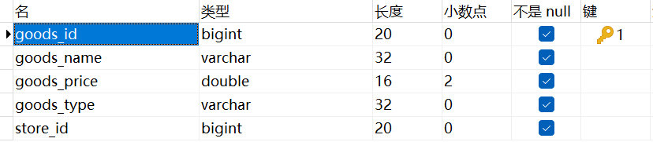

### 一、修改数据（`DML`）

语法规则：

~~~ sql
update 表名 set 字段名1 = 字段值1, 字段名2 = 字段值2 where 字段名 = 字段值;
~~~

`update`可以与`case...when...then...else...end`搭配，达到类似编程语言中`switch`的效果。

具体的语法格式是这样的：
~~~ mysql
CASE
    WHEN cond1 THEN value1
    WHEN cond2 THEN value2
    WHEN condN THEN valueN
    ELSE value
END;
~~~
以下面这个商品表为例，有一个需求：为所有价格超过`100`元的商品打五折，如果打折后小于`100`则置为`100`：



它的`SQL`语句对应如下：
~~~ mysql
UPDATE t_goods
SET goods_price = CASE
    WHEN goods_price > 200 THEN goods_price * 0.5
    WHEN goods_price > 100 AND goods_price < 200 THEN 100
    ELSE goods_price
END;
~~~

### 二、修改表结构（`DDL`）

#### 1. 添加/删除字段

~~~ sql
alter table 表名 add 字段名 字段类型(长度);
alter table 表名 drop 字段名;
~~~

#### 2. 更改字段名/字段类型

~~~ sql
alter table 表名 change 老字段名 新字段名 字段类型(长度);
~~~

#### 3. 增加/删除字段默认值约束

~~~ sql
alter table 表名 modify 字段名 字段类型(长度) default 默认值;
alter table 表名 modify 字段名 字段类型(长度);
~~~

#### 4. 增加/删除字段非空约束

~~~ sql
alter table 表名 modify 字段名 字段类型(长度) not null;
alter table 表名 modify 字段名 字段类型(长度);
~~~

#### 5. 增加/删除字段唯一约束（唯一索引）

~~~ sql
alter table 表名 modify 字段名 字段类型(长度) unique;
alter table 表名 drop index 字段名;
~~~

在`MySQL`中，添加唯一约束会自动在该字段上创建一个和字段名相同的唯一索引，而添加非空约束并不会创建索引。

如果想指定索引名，也可以这样创建这个唯一约束（唯一索引）：

```mysql
ALTER TABLE 表名 ADD CONSTRAINT 索引名 UNIQUE (字段名);
```

