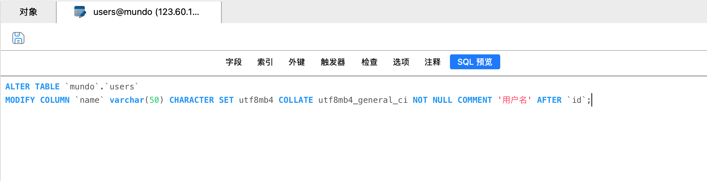

### 一、修改数据（`DML`）

语法规则：

~~~ sql
UPDATE tbl_name SET col1 = val1, col2 = val2 WHERE col = val;
~~~

`update`可以与`CASE...WHEN...THEN...ELSE...END`搭配，达到类似编程语言中`switch`的效果。

具体的语法格式是这样的：
~~~ mysql
CASE
    WHEN cond1 THEN value1
    WHEN cond2 THEN value2
    ...
    WHEN condN THEN valueN
    ELSE default_value
END;
~~~
以下面这个`t_goods`表为例，要为所有价格超过`100`元的商品打五折，如果打折后小于`100`则置为`100`：


它的`SQL`语句如下所示：
~~~ mysql
UPDATE t_goods
SET goods_price = CASE
    WHEN goods_price > 200 THEN goods_price * 0.5
    WHEN goods_price > 100 AND goods_price < 200 THEN 100
    ELSE goods_price
END;
~~~

### 二、修改表结构（`DDL`）

> `MySQL 8.0`关键字和保留字文档：https://dev.mysql.com/doc/refman/8.0/en/keywords.html
>
> 在创建表，以及修改表结构时，需要注意避免使用关键字和保留字作为字段名。

#### 1. 添加/删除字段

~~~ sql
ALTER TABLE tbl_name ADD [COLUMN] col1 DATA_TYPE(LENGTH);
ALTER TABLE tbl_name DROP [COLUMN] col1;
~~~

这里的`COLUMN`关键字是可选的语法糖，省略它不会影响语义或执行结果。但在正式文档、多人协作或教学场景中，建议保留`COLUMN`关键字，以增强可读性和表达的明确性，尤其是在大型脚本中有助于避免潜在歧义。

在新增字段时，可以在字段定义后附加约束条件、默认值、注释等信息。

#### 2. 更改字段名

~~~ sql
ALTER TABLE tbl_name CHANGE [COLUMN] old_col new_col DATA_TYPE(LENGTH);
~~~

`CHANGE COLUMN`可以同时修改字段名和字段类型。因此，在指定新字段名的同时，必须明确写出新的字段类型。即便只想修改字段名而保持类型不变，也必须将原有的数据类型一并写出。

#### 3. 更改字段类型

```sql
ALTER TABLE tbl_name MODIFY [COLUMN] col1 NEW_DATA_TYPE(LENGTH);
```

#### 4. 增加/删除字段默认值约束

~~~ sql
ALTER TABLE tbl_name MODIFY [COLUMN] col1 DATA_TYPE(LENGTH) DEFAULT val;
ALTER TABLE tbl_name MODIFY [COLUMN] col1 DATA_TYPE(LENGTH);
~~~

#### 5. 增加/删除字段非空约束

~~~ sql
ALTER TABLE tbl_name MODIFY [COLUMN] col1 DATA_TYPE(LENGTH) NOT NULL;
ALTER TABLE tbl_name MODIFY [COLUMN] col1 DATA_TYPE(LENGTH);
~~~

在创建或修改表结构时，应结合具体业务需求，合理设置字段的非空约束和默认值。可根据实际业务情况选择使用`NOT NULL`、`NOT NULL DEFAULT xxx`或`DEFAULT NULL`等方式进行配置：

- `NOT NULL`：当字段没有合理的默认值能够表示“空”或“未定义”状态时，应设置为`NOT NULL`。此时强制调用方必须显式传值，可有效防止因缺省导致的逻辑异常或安全隐患。如果调用方未传值，数据库报错。
- `NOT NULL DEFAULT xxx`：适用于字段在业务上具有通用的默认含义。即使调用方未显式传值，系统也能填入默认值，避免报错或产生`NULL`。适合用于状态类、标志类等字段，这种方式可以保证数据一致性，减少在查询、统计时对`NULL`的特殊判断。
- `DEFAULT NULL`：表示字段为可选项，`NULL`表示值未知，有实际的业务意义，不宜强行设定默认值，否则可能引发逻辑歧义。此类字段后续会用于特殊场景处理，如数据补偿、延迟填充等。`MySQL`中，若不设置任何约束，默认为`DEFAULT NULL`。

对于可为空的`VARCHAR`字段，若无明确业务需求区分`NULL`与空字符串`''`，建议统一设置为`NOT NULL DEFAULT ''`，以降低逻辑复杂度，避免因空值判断导致的潜在问题。类似地，对于`INT`等数值类型字段，若无需区分`0`与`NULL`，也建议设为`NOT NULL DEFAULT 0`。如果`INT`类型字段需要区分`0`与`NULL`，则在`Go`实体中应使用`*int`类型，以确保能正确反映数据库中的空值状态。

#### 6. 增加/删除字段唯一约束（唯一索引）

~~~ sql
ALTER TABLE tbl_name MODIFY [COLUMN] col1 DATA_TYPE(LENGTH) UNIQUE;
ALTER TABLE tbl_name DROP INDEX col1;
~~~

在`MySQL`中，添加唯一约束会自动在该字段上创建一个和字段名相同的唯一索引，而添加非空约束并不会创建索引。

如果想自定义索引名，也可以这样创建这个唯一约束（唯一索引）：

```mysql
ALTER TABLE tbl_name ADD CONSTRAINT index_name UNIQUE (col1);
```

以上修改表结构的语法仅供参考。在实际开发中，不建议手动编写`ALTER TABLE`语句，推荐使用`AI`辅助生成，或通过`Navicat`工具先进行字段修改但不立即保存，然后在`SQL`预览中查看并保存自动生成的`DDL`语句，以确保语法的正确：


