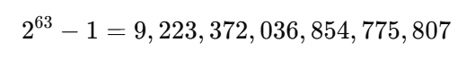

### 1. 主键`ID`的要求 

在分布式与微服务架构下，表的主键`ID`设计可参考以下要求，具体取舍应结合业务实际场景：
1. 全局唯一：确保在整个系统范围内，每条数据的主键`ID`均唯一，避免数据冲突与一致性问题。
2. 单调递增：在需要顺序写入或排序的场景中，主键`ID`应保持有序，且后续生成的`ID`必须大于之前生成的`ID`。
3. 信息安全：在涉及敏感数据的场景中，可选择无明显规律的`ID`生成方式，防止通过`ID`推测数据量或被恶意爬取。
4. 时间追溯：`ID`中可包含生成时间信息，便于在开发、调试和排查问题时快速确定数据生成的时间顺序。
5. 性能要求：`ID`生成应具备高并发、高吞吐能力，同时长度适中，避免因过长带来存储和网络传输的额外开销。

### 2. 自增主键

在数据库中，自增主键是一种由数据库自动递增生成的整数值，用于唯一标识表中的每一行记录。

#### 2.1 自增主键优点

1. 实现简单：数据库自动维护主键`ID`的生成与唯一性，开发者无需编写额外逻辑。
2. 写入高效：数据库引擎对自增列的索引结构进行了优化，插入性能较高，并减少了额外索引维护的开销。

#### 2.2 自增主键缺点

1. `ID`冲突风险：在分布式或多节点场景下，如果自增序列未能保持全局同步，可能导致`ID`重复。
2. 扩展性受限：在分表或多库场景中，需要规划各表的起始`ID`值；合表操作时容易发生主键冲突。
3. 单点故障隐患：若自增序列生成依赖单一节点，该节点故障将影响写入操作，需配合冗余机制与故障恢复方案确保可用性。

### 3. `UUID`

`UUID`（通用唯一标识符）是一种全球范围内几乎不重复的标识符，通常由`32`个`16`进制字符组成，并按`8-4-4-4-12`的格式分组，例如：`28ab278b-641b-4ff9-b430-d13a6772c5a1`。

我们可以使用`Google`官方维护的`UUID`库，来创建`UUID`主键。首先引入该库：

```sh
go get github.com/google/uuid
```

使用以下代码，来创建一个唯一的`UUID`：

```go
u := uuid.New()
fmt.Println(u.String())
```

#### 3.1 `UUID`的优点

1. 全局唯一性强：基于时间戳、随机数等多因素生成，重复概率极低，适用于大规模分布式系统。
2. 本地生成高效：无需依赖数据库或网络请求，各节点可独立生成，避免因同步问题导致的`ID`冲突。
3. 安全性好：结构复杂且无明显规律，不易被猜测，适合对标识符保密性有要求的场景。
4. 跨系统兼容性强：格式标准化，便于不同系统、语言或平台间传递与使用。

#### 3.2 `UUID`的缺点

1. 存储与索引开销大：长度较长（典型存储为`16`字节），作为主键会显著增加索引体积。
2. 插入与查询性能下降：无序性导致索引频繁分裂，影响插入和范围查询的效率。
3. 可读性与可用性差：不便于人工输入、记忆或直接识别，不适合作为对外展示的标识符。

> `UUID`在线生成器：https://www.uuidgenerator.net/


### 4. 雪花算法
雪花算法是一种常用于分布式系统的唯一`ID`生成策略，生成结果为按时间有序递增的`64bit`整数。其结构由以下部分组成：

- `1bit`符号位：固定为`0`，保证生成的`ID`为正数。

- `41bit`时间戳：精确到毫秒级，用于记录`ID`生成的时间。

- `10bit`机器标识：用于区分不同节点或工作进程。

- `12bit`序列号：在同一毫秒内区分不同的`ID`，支持单节点每毫秒生成最多`4096`个`ID`。

由于最高位固定为`0`，其最大值如下所示：



这代表雪花算法最多可以生成`19`位十进制数，例如：`1881976623637467136`。

在`MySQL`中，建议使用`BIGINT UNSIGNED`（或`BIGINT`）类型存储雪花算法生成的`ID`。

在`Go`语言中，可以通过引入第三方库`github.com/bwmarrin/snowflake`实现雪花算法`ID`的生成：

```sh
go get github.com/bwmarrin/snowflake
```

创建雪花算法`ID`的方式非常简洁，示例如下：

```go
// 创建节点（node），节点ID范围是0~1023（代表10bit机器标识）
node, _ := snowflake.NewNode(1)
// 生成雪花ID（返回类型为int64）
id := node.Generate()
```

其中，`NewNode`的参数用于指定节点`ID`，不同节点应分配唯一的`ID`，以避免在分布式环境下发生`ID`冲突。

#### 4.1 雪花算法优点

1. 高性能：本地生成，无需依赖网络请求，单节点每秒可生成数百万个唯一`ID`，能够满足高并发场景需求。
2. 分布式友好：多节点可并行生成`ID`且无冲突，适用于大规模分布式系统。
3. 时间有序性：生成的`ID`按时间递增，有利于数据库索引优化，减少插入性能损耗。
4. 实现简洁：算法结构清晰，易于实现与部署，维护成本低。

#### 4.2 雪花算法缺点

1. 时钟回拨风险：依赖系统机器时钟，若发生回拨，可能导致生成重复`ID`。
2. 节点数量限制：`10bit`机器标识限制了单集群最多支持`1024`个节点。
3. 并发量上限：`12bit`序列号限制同一节点每毫秒最多生成`4096`个`ID`，超出部分需等待下一毫秒生成。

> 雪花算法在线生成器：https://toolset.marco79423.net/en/snowflake-id-generator


### 5. 如何选择
- 自增`ID`：适用于单体或小规模系统，如个人项目、小型企业应用等。在无需跨节点生成唯一`ID`、且数据规模可控的场景中，能以最低的复杂度获得较好的性能与可维护性。
- **`UUID`**：适用于对全局唯一性和安全性要求较高的分布式系统，例如大型分布式平台、安全敏感型业务，或需要在不同系统间传递唯一标识的场景。
- 雪花算法：适用于高并发、需时间有序的分布式系统，例如互联网平台、微服务架构应用等，能够在多节点环境中快速生成有序且唯一的`ID`，兼顾性能与可扩展性。