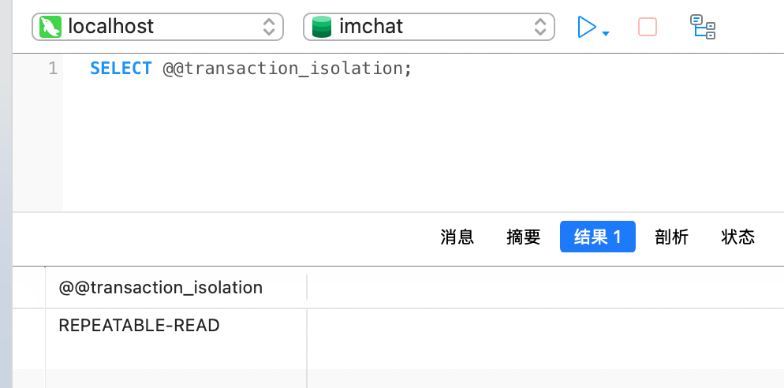

### 一、事务及其四个特性（`ACID`）

事务是指一组作为单个逻辑单元执行的一系列操作，这些操作要么全部成功，要么全部回滚。事务主要涉及`DML`语句，因此可以理解为绑定在一起的多条`DML`语句同时成功或失败。

事务的四个特性（`ACID`）包括：

1. 原子性（`Atomicity`）：一个事务中所有`DML`操作，要么同时成功要么全部失败回滚，不会出现部分成功的情况。
2. 一致性（`Consistency`）：事务在执行前后，数据库必须处于符合所有约束规则的合法状态，包括数据库约束、业务逻辑约束等。
3. 隔离性（`Isolation`）：事务之间的隔离级别包括：读未提交、读已提交、可重复读、序列化。
4. 持久性（`Durability`）：事务结束后的修改数据永久保存在数据库中，即使系统故障数据也不会丢失。

### 二、事务的四种隔离级别

#### 1. 读未提交（`Read Uncommitted`）

最低的隔离级别。写事务`A`还未提交的数据就被读事务`B`读取，这会导致脏读问题。

> 脏读（`Dirty Read`）是指一个事务读取了另一个尚未提交的事务所修改的数据。如果该未提交事务随后回滚，被读取的数据便成为无效的脏数据。

#### 2. 读已提交（`Read Committed`）

写事务`A`提交后，读事务`B`才能读取到写事务`A`提交的数据。这解决了脏读问题，但未解决不可重复读的问题。

> 不可重复读（`Non-repeatable Read`）指同一事务在前后两次读取同一数据时，由于其他事务在此期间完成了更新并提交，导致两次读取结果不一致。例如，事务`T1`首次读取`id=1`的用户余额为`100`；期间事务`T2`将该行余额更新为`200`并提交；当事务`T1`再次读取该用户余额时，读到的结果变为`200`。

#### 3. 可重复读（`Repeatable Read`）

在开启读事务`B`时，相当于给当前读取的数据范围加了写锁。在读事务`B`提交之前都不会释放写锁，这样之后读取到的数据值不会变化，解决了不可重复读的问题，但未解决幻读（`Phantom Read`）的问题。

> 幻读（`Phantom Read`）指同一事务在前后两次按相同条件查询数据时，由于其他事务在此期间对该查询范围内的数据进行了新增或删除操作，导致两次查询的结果集不一致。例如，事务`T1`首次查询余额大于`0`的用户共`10`条；其间事务`T2`插入一条余额大于`0`的新用户并提交；当事务`T1`再次执行相同查询条件时，结果变为`11`条。
>
> 不可重复读主要关注数据值的变化（修改），而幻读则关注数据行数的变化（增删）。

`MySQL`的默认事务隔离级别为可重复读，`PostgreSQL`和`Oracle`的默认事务隔离级别为读已提交。

#### 4. 序列化（`Serializable`）

数据库事务的最高隔离级别。在此级别下，事务串行执行，一个事务提交后，另一个事务才可以开启。可以避免脏读、不可重复读、幻读等问题，但效率低下，耗费数据库性能，不推荐使用。

### 三、事务的基本操作语法

可以使用以下任意一种方式显式开启事务：

```sql
START TRANSACTION;
BEGIN;
```

接着执行`DML`语句，当所有`DML`操作执行成功后，提交事务：

```sql
COMMIT;
```

如果事务中途发生异常，需要撤销本次事务内的所有修改：

```sql
ROLLBACK;
```

事务的使用示例如下所示：

```sql
START TRANSACTION;

-- 1. 扣款
UPDATE account SET balance = balance - 100 WHERE id = 1;

-- 2. 加款
UPDATE account SET balance = balance + 100 WHERE id = 2;

-- 3. 写交易流水
INSERT INTO trade_log (from_account_id, to_account_id, amount, created_at) VALUES (1, 2, 100, NOW());

COMMIT;
```

使用以下命令，可以查看当前数据库的隔离级别：

```sql
SELECT @@transaction_isolation;
```

查看结果如下所示：



如果执行了新增一条数据然后回滚，执行`INSERT`操作时，数据会被写入`InnoDB`的缓冲池（`buffer pool`），也就是内存中会暂时存在这条记录，同时会生成`undo`日志，用于记录如何撤销这次插入操作。在事务内部可以看到这条新数据，但其他事务无法感知。

当执行`ROLLBACK`操作时，`InnoDB`会根据`undo`日志撤销插入行为，这条记录会从缓冲池和事务上下文中移除，最终效果是数据库表内容完全没有变化。对于外部观察者（其他事务或查询）而言，这条数据从始至终都不可见。

但是，即使事务发生回滚，自增主键值也已经被自增计数器分配，并不会回退。也就是说，这个`ID`已经被系统消耗，后续插入的新记录将继续使用更大的自增值，而不会复用该数值。