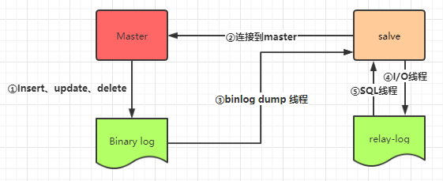

数据库分库分表是一个常见的架构设计策略，但实际上，它并非必须同时进行。可以根据具体情况选择只分库、只分表，或同时分库分表，以解决不同的问题。这一节我们讲解分库的内容。

分库主要解决的问题：并发量大。数据库的连接数是有限的，不能无限增多。如果数据库的`QPS`（`Queries Per Second`）过高，数据库连接数不足，就要考虑分库了。

### 1. 分库的目的和分类

分库主要解决的问题是处理高并发。数据库连接数有限，高`QPS`（`Queries Per Second`，每秒查询数）会导致连接不足。以下是两种常见的分库方式：

1. 读写分离：一主多从，主库负责写操作，从库负责读操作。所有库中的数据保持一致性。
2. 微服务场景：按业务模块或功能划分数据库，每个微服务模块对应一个数据库。每个数据库中的数据是独立的。

这两种方式实际上都是数据库层面的负载均衡策略。第二种方式很好理解和实现，不同的微服务模块有不同的配置文件，指向自己模块对应的数据库，完成微服务层面的分库操作。在每个微服务模块下，也可以使用第一种方式进行读写分离的架构。

### 2. `MySQL`主从复制

主从复制、一主多从目标就是提高数据库的并发性能。单机部署`MySQL`会出现两个问题，一是在高并发状态下，会造成读写压力过大，二是如果单机`MySQL`宕机了，会直接造成服务不可用，或者数据丢失等问题，也就是不具备高可用性。

`MySQL`主从复制是其自带的功能，无需第三方工具帮助，其原理如下图所示：



在这个架构中，主库（`Master`）负责处理写操作并更新数据，而从库（`Slave`）则负责复制主库的数据。

1. `Master`库启动二进制日志（`binlog`），记录所有数据库操作的复制事件。每个事件包含`Master`库执行的一个或多个`SQL`记录（如`INSERT`、`UPDATE`、`DELETE`）。
2. `Master`库创建一个复制账户，并授予适当的权限。
3. 所有`Slave`通过复制账户连接到`Master`库，请求`Master`库上的二进制日志。
4. `Master`库通过`binlog dump`线程将`binlog`文件发送给`Slave`库，并传递一个位置信息，指示从哪里开始获取二进制日志内容。
5. `Slave`库将接收到的`binlog`内容存储到自己的`relay log`（中继日志）中，形成一份数据副本。
6. `Slave`库拥有一个`I/O`线程和一个`SQL`线程。`I/O`线程负责读取`relay log`内容，`SQL`线程负责执行这些`SQL`语句。
7. `Slave`库持续监听`Master`库的变更，定期请求新的`binlog`，以保持数据与主服务器的同步。

### 3. `MySQL`读写分离

读写分离建立在主从复制的基础上，主库处理写操作，从库处理读操作。`Java`可以使用`ShardingSphere`等中间件完成读写分离，`Go`语言可以使用`Gorm`的`DBResolver`插件来实现。首先我们下载该插件：

```sh
go get gorm.io/plugin/dbresolver
```

接下来，我们在创建`db`对象时，需要对其进行一些额外的配置：

```go
masterDSN := "root:123456@tcp(10.40.18.34:3306)/mundo?charset=utf8mb4&parseTime=True&loc=Local"
slaveDSN1 := "root:123456@tcp(10.40.18.34:3307)/mundo?charset=utf8mb4&parseTime=True&loc=Local"
slaveDSN2 := "root:123456@tcp(10.40.18.34:3308)/mundo?charset=utf8mb4&parseTime=True&loc=Local"
db, err := gorm.Open(mysql.Open(masterDSN), &gorm.Config{})
if err != nil {
	wlog.Fatal("call gorm.Open failed").Err(err).Log()
}
err = db.Use(dbresolver.Register(dbresolver.Config{
	Replicas: []gorm.Dialector{
		mysql.Open(slaveDSN1),
		mysql.Open(slaveDSN2),
	},
	Policy: dbresolver.RoundRobinPolicy(),
}))
if err != nil {
	wlog.Fatal("call db.Use failed").Err(err).Log()
}
```

首先，配置主库的地址信息。然后，通过`db.Use`配置从库的地址信息，并设置路由策略。在路由策略上，我们可以选择两种方式：`RoundRobinPolicy`（轮询策略）和`RandomPolicy`（随机策略）。

配置完成后，使用该`db`对象进行的增删改操作会在主库执行，查询操作会在从库执行。如果使用`gorm-gen`生成的代码，只需在调用`query.SetDefault()`函数时传入该`db`对象即可。
