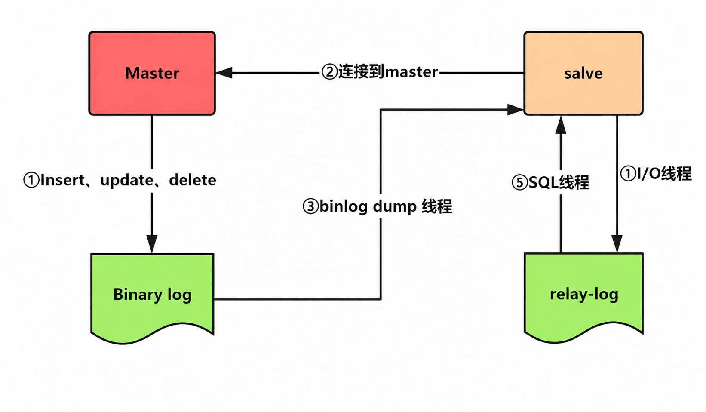

数据库分库分表是一个常见的架构设计策略，但实际上，它并非必须同时进行。可以根据具体情况选择只分库、只分表，或同时分库分表，以解决不同的问题。这一节我们讲解分库的内容。

分库主要解决的问题：并发量大。数据库的连接数是有限的，不能无限增多。如果数据库的`QPS`（`Queries Per Second`）过高，数据库连接数不足，就要考虑分库了。

### 1. 分库的目的和分类

分库主要解决的问题是处理高并发。数据库连接数有限，高`QPS`（`Queries Per Second`，每秒查询数）会导致连接不足。以下是两种常见的分库方式：

1. 读写分离：一主多从，主库负责写操作，从库负责读操作。所有库中的数据保持一致性。
2. 微服务场景：按业务模块或功能划分数据库，每个微服务模块对应一个数据库。每个数据库中的数据是独立的。

这两种方式实际上都是数据库层面的负载均衡策略。第二种方式很好理解和实现，不同的微服务模块有不同的配置文件，指向自己模块对应的数据库，完成微服务层面的分库操作。在每个微服务模块下，也可以使用第一种方式进行读写分离的架构。

### 2. `MySQL`主从复制

主从复制、一主多从目标就是提高数据库的并发性能。单机部署`MySQL`会出现两个问题，一是在高并发状态下，会造成读写压力过大，二是如果单机`MySQL`宕机了，会直接造成服务不可用，或者数据丢失等问题，也就是不具备高可用性。

`MySQL`主从复制是其自带的功能，无需第三方工具帮助，其原理如下图所示：



`MySQL`主从复制的核心是`binlog`机制。主库开启二进制日志后，每一条数据变更操作，无论是插入、更新还是删除，都会被记录为一个复制事件写入`binlog`。与此同时，主库上需要创建一个专用的复制账户并授予相应权限，供从库连接时使用。

从库启动后，会通过该复制账户主动连接主库，向主库请求`binlog`内容。主库收到请求后，会启动一个`binlog dump`线程，将`binlog`文件连同一个位置标记一并发送给从库，这个位置标记告诉从库应当从哪个偏移量开始消费日志。

从库侧由两个线程协同工作。`I/O`线程负责与主库保持连接，持续接收传输过来的`binlog`，并将其写入本地的中继日志`relay log`，完成数据的搬运。`SQL`线程则独立地读取`relay log`中的事件内容，在本地依次重放对应的`SQL`语句，完成实际的数据同步。这种两阶段的设计让接收与执行解耦，即便网络出现抖动，已接收但尚未执行的日志仍可安全保留在`relay log`中等待处理。

整个过程是持续进行的，从库的`I/O`线程会不间断地监听主库的新增变更，每当主库产生新的`binlog`事件，从库便会请求并拉取，以此维持与主库之间的数据一致性。

### 3. `MySQL`读写分离

读写分离建立在主从复制的基础上，主库处理写操作，从库处理读操作。`Java`可以使用`ShardingSphere`等中间件完成读写分离，`Go`语言可以使用`Gorm`的`DBResolver`插件来实现。首先我们下载该插件：

```sh
go get gorm.io/plugin/dbresolver
```

接下来，我们在创建`db`对象时，需要对其进行一些额外的配置：

```go
masterDSN := "root:123456@tcp(10.40.18.34:3306)/mundo?charset=utf8mb4&parseTime=True&loc=Local"
slaveDSN1 := "root:123456@tcp(10.40.18.34:3307)/mundo?charset=utf8mb4&parseTime=True&loc=Local"
slaveDSN2 := "root:123456@tcp(10.40.18.34:3308)/mundo?charset=utf8mb4&parseTime=True&loc=Local"
db, err := gorm.Open(mysql.Open(masterDSN), &gorm.Config{})
if err != nil {
	wlog.Fatal("call gorm.Open failed").Err(err).Log()
}
err = db.Use(dbresolver.Register(dbresolver.Config{
	Replicas: []gorm.Dialector{
		mysql.Open(slaveDSN1),
		mysql.Open(slaveDSN2),
	},
	Policy: dbresolver.RoundRobinPolicy(),
}))
if err != nil {
	wlog.Fatal("call db.Use failed").Err(err).Log()
}
```

首先，配置主库的地址信息。然后，通过`db.Use`配置从库的地址信息，并设置路由策略。在路由策略上，我们可以选择两种方式：`RoundRobinPolicy`（轮询策略）和`RandomPolicy`（随机策略）。

配置完成后，使用该`db`对象进行的增删改操作会在主库执行，查询操作会在从库执行。如果使用`gorm-gen`生成的代码，只需在调用`query.SetDefault()`函数时传入该`db`对象即可。
