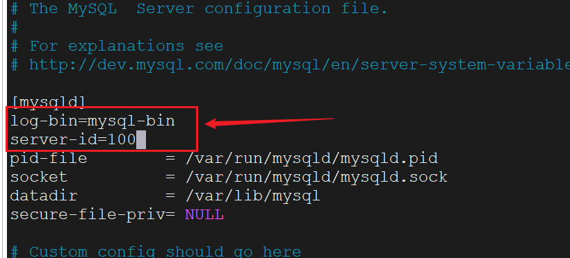
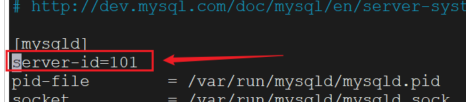
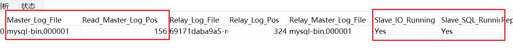
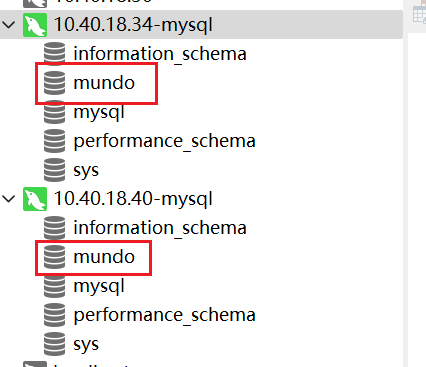
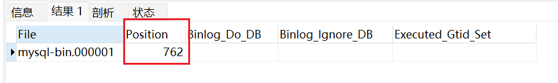

这里我使用`docker`创建一个`Master`和一个`Slave`，共两个`MySQL`数据库：

- `Master`：`10.40.18.34:3306`。

- `Slave`：`10.40.18.40:3306`。

我们在主库的`MySQL`，已经设置了数据卷挂载，配置文件在宿主机的`/home/docker/mysql/conf`目录里。

我们修改下面这个配置文件：

```bash
vim /home/docker/mysql/conf/my.cnf
```

加上以下的内容：

```sh
log-bin=mysql-bin
server-id=100
```



- `log-bin`：启用二进制日志，设置二进制文件（`binlog`）的前缀。

- `server-id`：服务器唯一`id`，随意设置不与其他服务器重复即可。

做完这步配置后，需要重启`MySQL`，这里我们重启`docker`容器即可。这步非常重要，不然配置文件无法生效。

下一步需要在主库执行这句`SQL`，创建复制账户，供`Slave`使用：

```sql
CREATE USER 'mundo'@'%' IDENTIFIED BY 'mundo@123456';
GRANT REPLICATION SLAVE ON *.* TO 'mundo'@'%';
FLUSH PRIVILEGES;
```

登录`Navicat`，执行语句即可：


- 第一条`SQL`创建了一个名为`mundo`的用户，允许从任意主机（使用`%`表示）连接到数据库，密码为`mundo@123456`。

- 第二条`SQL`授予了用户`mundo`从主服务器复制数据的权限。`*.*`表示这个权限适用于所有数据库的所有表。
- 第三条`SQL`使之前对权限的更改立即生效，而无需重启`MySQL`服务器。

然后我们执行这样一行语句，查看`Master`的状态：

```sql
show master status;
```

得到这样一个表格：


`File`就是二进制文件`binlog`的名称，前缀是我们前面在配置文件设置的。`Position`是这个文件在`Master`中的位置。这两个值是要在`Slave`中使用到的。

> **注意：**执行完上面这句`SQL`后就不要在`Master`上执行其他操作了，不然会改变`Position`的值。

接下来配置从库信息，从库也需要修改下面这个配置文件：

```bash
vim /home/docker/mysql/conf/my.cnf
```

加上这一行就好，只是做一个唯一标识，不同的`Slave`不能重复：

```sh
server-id=101
```



同样，修改完后也需要重启`docker`容器，以更新配置文件。

接下来，让`Slave`客户端连接到`Master`的`binlog`文件，执行下面命令：

```bash
CHANGE MASTER TO 
  MASTER_HOST='10.40.18.40',
  MASTER_USER='mundo',
  MASTER_PASSWORD='mundo@123456',
  MASTER_LOG_FILE='mysql-bin.000001',
  MASTER_LOG_POS=156;
  
start slave;
```

其中`MASTER_HOST`是主库的主机名或IP地址，`MASTER_USER`和`MASTER_PASSWORD`是主库创建的用户名和密码等信息，`MASTER_LOG_FILE`和`MASTER_LOG_POS`是`Master`中看到的`binlog`的名称和这个文件在`Master`中的位置`Position`。

最后，需要使用`start slave`，启动复制过程。

然后可以看一下`Slave`的状态：

```sql
show slave status;
```

关注这些内容：



看到`Master`的`binlog`文件和位置是我们设置的值，而且`IO`线程和`SQL`线程都是`Yes`状态，就代表配置成功。

如果看到`Slave_IO_Running`为`Connecting`，需要先停止`Slave`：

```bash
stop slave;
```

在上面让`Slave`客户端连接到`Master`的`binlog`文件的最后加上一条命令：

```bash
CHANGE MASTER TO 
  MASTER_HOST='10.40.18.40',
  MASTER_USER='mundo',
  MASTER_PASSWORD='mundo@123456',
  MASTER_LOG_FILE='mysql-bin.000001',
  MASTER_LOG_POS=156,
  GET_MASTER_PUBLIC_KEY=1;
  
start slave;
```

主从同步配置完成后，测试一下效果，在`Master`中创建一个数据库，在`Slave`中同步了：



`Master`中建了一张表，`Slave`也同步过去了。证明配置已经成功。

刚才执行了建表操作，再查看一下`Master`的状态：



我们看到`binlog`文件的位置变了，那么需不需要更改`Slave`的配置呢？


答案是不需要，`Slave`会自动同步`Master`中`binlog`的位置。