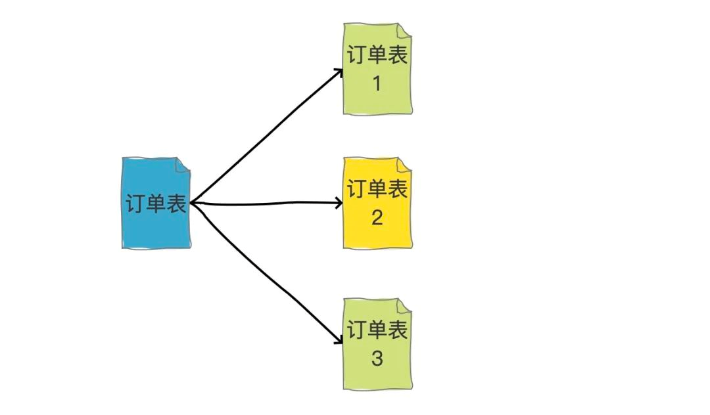
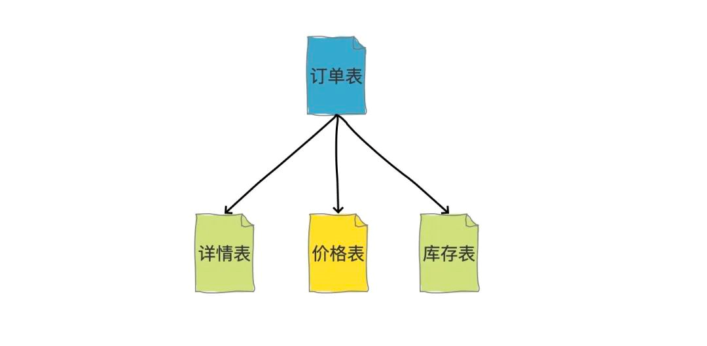
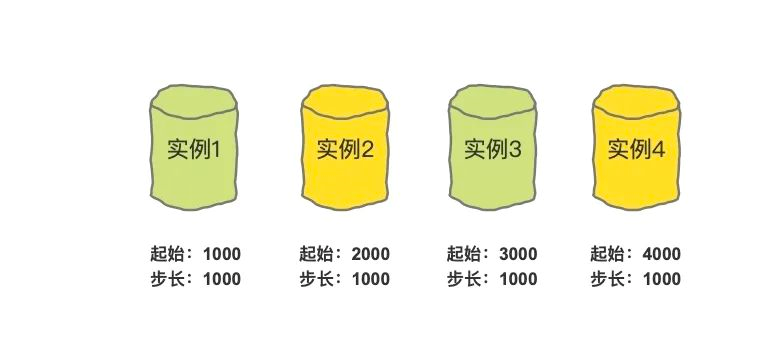

## 分表解决方案及其应用

分表是数据库优化中的重要策略，用于解决单表数据量过大的问题，从而提升查询性能和管理效率。

### 1. 问题背景

单表数据量大时，即使并发量不高，也可能导致存储和查询的性能瓶颈。即便通过索引优化和`SQL`语句调优，问题依然存在，此时分表成为必要的考虑。一般来说，当单表数据超过`500w`行或者单表容量超过`2GB`时，建议考虑分表处理。

### 2. 分表解决方案

#### 2.1 应用场景

1. 宽表问题：表中包含大量列，导致每次查询涉及的列数过多，可以通过分表减少每个查询涉及的列数，提高查询效率。
2. 频繁的数据更新：在高并发环境中，频繁的数据更新可能导致锁竞争，分表可以减轻锁竞争压力，提高并发处理能力。

#### 2.2 分表类型

分表通常涉及两种拆分概念：横向拆分（水平拆分）和纵向拆分（垂直拆分）。横向拆分是拆数据，纵向拆分是拆字段。

横向拆分图解：

纵向拆分图解：

这里重点讲横向拆分。横向拆分离不开一个概念，那就是分表字段，这个字段的值决定这条数据被分到哪张表里。选择一个合适的分表字段非常重要，这个字段的选择会影响数据的均匀分布以及查询的性能。

### 3. 分表字段选择

分表字段的选择原则：

1. 选择高基数字段，也就是字段的值有较大的变化范围，有助于数据均匀分布。
2. 在查询中频繁用于排序或过滤的字段，有助于提高查询性能。
3. 需要考虑未来的数据增长和业务变化，选择能够支持未来扩展的字段。
4. 选择不太容易变更的字段，因为如果变更频繁，数据库需要大规模调整。

例如订单表，可以根据买家`ID`进行分表，因为买家查看自己的订单通常通过买家`ID`进行过滤，这样可以快速定位到数据在哪张表。每个买家的订单信息都存储在同一张表里，确保了数据的一致性和高效访问。

在订单表根据买家`ID`进行分表的基础上，我们还要考虑到根据订单号查询订单的情况，这种情况可以通过基因法来解决。例如有`256`张表，在生成订单号时，使用买家`ID`先根据分表算法（例如哈希取模）生成一个`0~255`之间的数字，将此值作为路由标识嵌入订单号的固定位置。这样，当按照订单号查询时，可以在对应位置解析出路由标识，并从对应的分表`table_000`到`table_255`中查询结果。

对于其他稀少的查询需求，如没有买家`ID`或订单号的情况，通常属于低频或非核心功能查询。这时候可以考虑使用搜索引擎（如`ES`）等方案来处理这类查询，以实现更高效的数据检索和处理。

### 4. 分表算法

常用的分表算法包括直接取模、哈希取模和一致性哈希，它们的概念如下：

1. 直接取模：适用于分表字段是数字类型，并且这个数字需要足够大和分散，以确保均匀分布在多张表中。例如分为`256`张表，就根据分表字段对`256`取模，得到`0~255`之间的结果，再对应放到`table_000`到`table_255`中。
2. 哈希取模：适用于分表字段是字符串或其他类型，需要使用合适的哈希函数进行处理，确保分布均匀。这种情况要求经过哈希处理后的结果是整数数字格式，用这个结果对`256`取模，得到`0~255`之间的结果，再对应放到`table_000`到`table_255`中。
3. 一致性哈希：是一种特殊的哈希算法，其在增减节点（表的数量）时能够最小程度地影响已有的映射关系，因此在动态节点变化较多或需要频繁扩容的场景下具有优势。

直接取模和哈希取模的缺点在于需要扩容时，例如从`256`张表扩展到`512`张表，需要重新计算哈希值并进行数据迁移，这一过程相对复杂和耗时。一致性哈希算法能够有效减少这种影响，这个算法的具体实现和优势可以进一步详细探讨。

### 5. 全局`ID`生成

在涉及分表操作时，唯一`ID`的生成成为一个关键问题。在单表中，我们通常可以使用数据库自增主键来确保唯一性，但一旦引入分表，多张单表中的自增主键就可能发生冲突，无法保证全局唯一性。

为解决这一问题，有几种常见的方案：

1. `UUID`：能够确保强全局唯一性，但通常不推荐作为唯一`ID`使用，因为其长度较长且字符串查询效率较低。
2. 雪花算法：加强版的自增主键生成算法，能够在分布式系统中生成唯一`ID`，保证全局唯一性。（详细内容请参考前述章节）
3. 中心化自增主键：所有表的自增主键都由同一张表生成。但这种方式存在单点故障问题，如果中心化生成`ID`的服务挂掉，整个系统将无法使用。
4. 多表分段自增主键：每张表的自增主键采用不同的起始值和固定步长，使得每张表的主键值分布在各自的范围内，避免主键冲突。例如，表`1`从起始值`1000`开始，步长为`1000`；表`2`从起始值`2000`开始，步长同样为`1000`，依此类推。当某张表的主键达到当前步长范围的上限时，所有表同时生成一个新的起始值，确保主键持续在合理范围内递增且不发生冲突。

推荐使用雪花算法来生成唯一`ID`，它能够有效解决分布式系统中的唯一`ID`生成问题。

### 6. 分表问题

1. 操作需带分表字段：分表后，所有读写操作都必须包含分表字段，以确定数据存储在哪张表中。若缺少分表字段，系统将执行全表扫描，需要逐一检索所有分表，严重影响性能。
2. 跨表事务处理困难：跨多张表的事务处理变得更加复杂和繁琐。事务通常需要确保数据的一致性，分表结构增加了事务管理的难度，可能需要额外的控制和协调机制来处理跨表的操作。
3. 限制了分页查询与排序：分表结构限制了跨多表进行分页查询或排序的能力。由于数据分布在多张表中，无法简单地在全局范围内执行分页或排序操作，需要额外的策略来处理这些需求。
4. 系统扩展性复杂化：分表对系统的扩展性提出了更高的要求和复杂性。扩展现有分表数量或引入新的分表类型需要考虑数据迁移、索引管理和查询优化等方面的问题，这些都增加了系统设计和维护的复杂度。