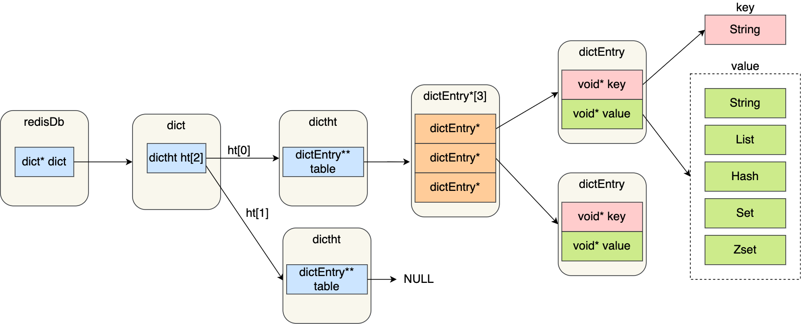

> 参考文章：https://blog.csdn.net/qq_34827674/article/details/121654479

### 1. `Redis`数据结构

`Redis`中的数据以`key-value`形式存储，其中`key`总是字符串，而`value`则有多种数据类型，即数据的保存形式。底层实现这些形式的数据类型就用了不同的具体数据结构。因此，常说的“`Redis`五种数据结构”，严格上应该是“`Redis`五种数据类型”。

`Redis`数据类型和底层数据结构的对应关系图如下：

可以看出，自`Redis 3.0`以来，对象底层数据结构有所不同：

1. 在`Redis 3.0`中，`list`数据类型的底层数据结构由“双向链表”和“压缩列表”实现。而在`3.2`版本之后，`list`数据类型的底层数据结构由`quicklist`实现。
2. 压缩列表数据结构已经废弃，由`listpack`数据结构替代。

因此，在`Redis 3.0`之后的版本中，`Redis`的数据结构有六种：`SDS`（`Simple Dynamic String`，简单动态字符串）、`quicklist`、`listpack`、哈希表、整数集合、跳表。

### 2. `Redis`对象与数据结构关系

`Redis`是一个`key-value`形式的数据库，所有的`key`都是字符串，而`value`可以是字符串，也可以是`list`、`hash`、`set`、`sorted set`等数据类型。

这些键值对是如何在`Redis`中保存的呢？`Redis`使用哈希表来保存所有的键值对。哈希表的优点是能够以`O(1)`的时间复杂度快速查找键值对对象。哈希表本质上是一个数组，每个元素都是一个哈希桶。

哈希表存放键值对的关系如下图所示：

结合上面的`Redis`数据类型和数据结构的关系，我们可以理解`Redis`对象和数据结构的关系。

`Redis`是用`C`语言实现的，所以`Redis`的数据结构实际上就是`C`语言的数据结构。