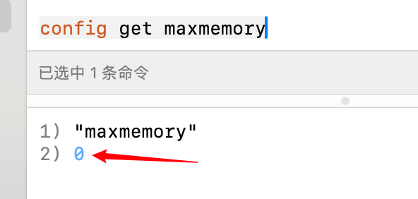

`Redis`的惰性过期和定期清除策略可能导致某些过期数据未能及时删除，从而增加内存使用，甚至引发`OOM`（内存溢出）问题。为确保`Redis`中存储的数据始终为热点数据，我们可以利用内存淘汰机制来优化内存使用。

`Redis`提供六种数据淘汰策略，以帮助管理内存和提高性能：

1. **`volatile-lru`**：在已设置过期时间的数据中，淘汰最近最少使用的数据，适用于需要及时清理过期数据的场景。
2. **`volatile-ttl`**：优先淘汰即将过期的数据，确保系统资源用于更长期的数据。
3. **`volatile-random`**：随机选择已设置过期时间的数据进行淘汰，简单有效，但精确度可能不足。
4. **`allkeys-lru`**：在内存不足时，移除最近最少使用的`key`，这是最常用的策略，有助于保持热点数据。
5. **`allkeys-random`**：随机选择任意数据进行淘汰，虽然策略简单，但不一定能保证最佳性能。
6. **`no-eviction`**：禁止淘汰数据，内存不足时，新写入操作会报错，这是`Redis`的默认淘汰策略。

自`Redis 4.0`起，新增了两种更加智能的淘汰策略：

1. **`volatile-lfu`**：从已设置过期时间的数据中淘汰最不经常使用的数据，适合长期使用的数据。
2. **`allkeys-lfu`**：在内存不足时，移除键空间中最不经常使用的`key`，能够更好地管理内存，确保频繁使用的数据优先保留。

掌握这些策略可以帮助我们在设计系统时更有效地管理内存，从而提高应用程序的性能和可靠性。理解这些机制的细节，将为我们优化`Redis`使用和提升系统整体效能提供更强的支持。

我们可以使用以下命令来查看当前内存淘汰策略：

```sh
config get maxmemory-policy
```

查看到的结果如下所示：


使用以下命令可以修改淘汰策略，例如我们修改为`allkeys-lru`：

```sh
config set maxmemory-policy allkeys-lru
```

使用下面命令，获取`Redis`能使用的最大内存大小：

```sh
config get maxmemory
```

查看到结果如下所示：



如果不设置最大内存大小或将其设置为`0`，在`64`位操作系统下，`Redis`将不限制内存使用。而在`32`位操作系统下，`Redis`的最大内存使用量则限制为`3GB`。我们可以使用以下命令对其进行修改，例如设置最大占用内存为`100MB`：

```sh
config set maxmemory 100mb
```

再次查询最大内存，查看到如下结果：


显示的数字为字节数，也就是`100 * 1024 * 1024 = 104857600`字节。

