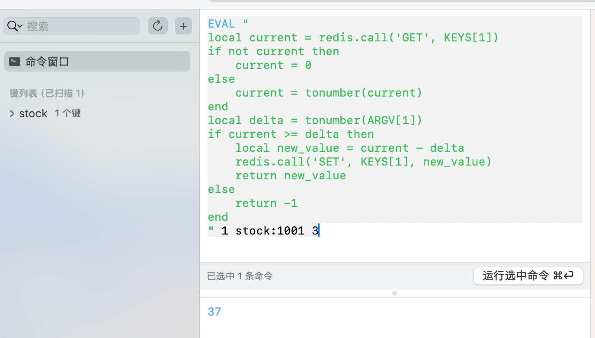
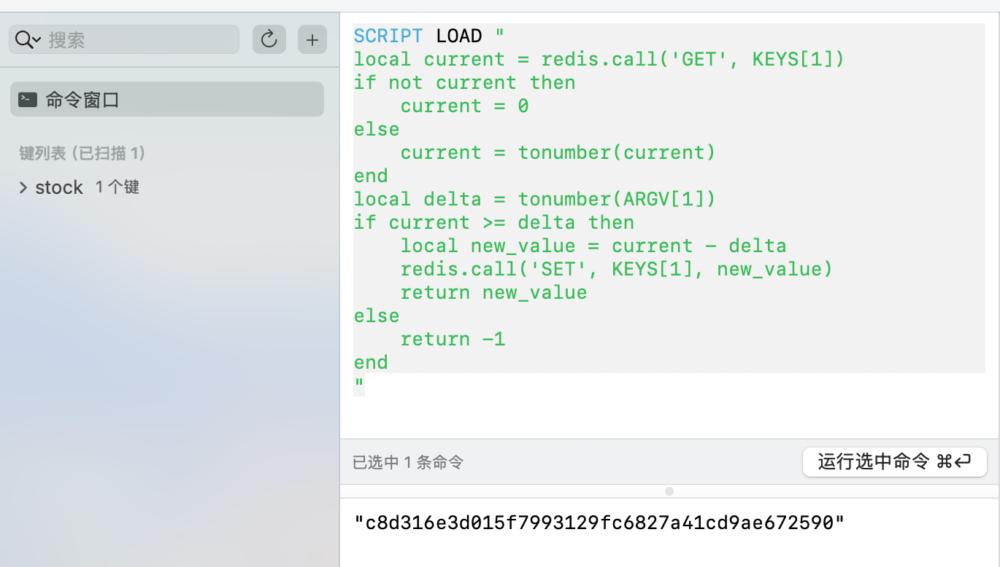
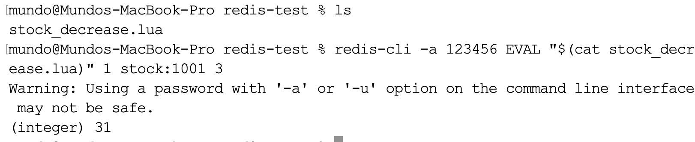
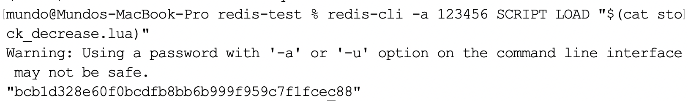
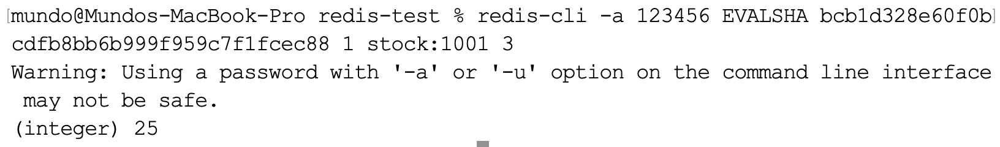

`Redis`的事务可以分为入队阶段与执行阶段：

- 在入队阶段（`MULTI`到`EXEC`之间），事务中的命令只是被加入队列，并未真正执行，在此期间相关`Key`仍可能被其他客户端自由修改。如果在入队阶段出现语法级错误，后续执行`EXEC`将直接失败，队列中的命令不会被执行。

- 在执行阶段（`EXEC`开始后），多条`Redis`命令作为一个整体原子执行，且执行过程中不会被其他客户端的命令穿插执行，对外仅暴露执行前或执行后的最终状态。但`Redis`事务没有提供类似`MySQL`事务的统一提交或统一回滚能力，一旦进入执行阶段，如果某一条命令发生运行期错误，已经成功执行的命令不会被回滚，且后续命令仍然会继续执行。

`Lua`是一门编程语言，具备独立的语法规则，作为脚本存在。`Redis`的`Lua`脚本相比`Redis`事务，增加了以下特性：

1. 脚本执行过程完全原子性，期间其他客户端的命令会被阻塞，从而保证严格的隔离性。
2. 脚本执行过程中遇到错误会立即停止后续命令执行，并退出脚本，但已执行的命令不会回滚。
3. 脚本的业务逻辑在`Redis`内部一次性完成，从而可避免多次网络往返带来的性能损耗。
4. 脚本支持`if`、`for`、`while`等控制结构，以及局部变量、函数调用等语言特性，可完成复杂的条件判断与分支处理。

下面是一个基础的`Lua`脚本示例：

```lua
local current = redis.call("GET", KEYS[1])

if not current then
    current = 0
else
    current = tonumber(current)
end

local delta = tonumber(ARGV[1])

if current >= delta then
    local new_value = current - delta
    redis.call("SET", KEYS[1], new_value)
    return new_value
else
    return -1
end
```

该段`Lua`脚本用于在`Redis`中实现数值的原子扣减。脚本首先读取`KEYS[1]`对应的当前值，若不存在则按`0`处理，随后获取`ARGV[1]`作为扣减量。若当前值大于等于扣减量，则计算扣减后的新值并写回，同时返回该新值，否则不对数据做任何修改，并返回`-1`表示扣减失败。整个逻辑在`Redis`内一次性执行，从而保证并发场景下的数据安全性。

可以在`Redis`客户端中通过`EVAL`命令执行该脚本，并在执行时传入相应参数，如下所示：

```lua
EVAL "
local current = redis.call('GET', KEYS[1])
if not current then
    current = 0
else
    current = tonumber(current)
end
local delta = tonumber(ARGV[1])
if current >= delta then
    local new_value = current - delta
    redis.call('SET', KEYS[1], new_value)
    return new_value
else
    return -1
end
" 1 stock:1001 3
```

这条命令可以拆解为以下几个部分：

```sh
EVAL script numkeys key1..keyN arg1..argM
```

其中，`script`指双引号内的`Lua`脚本；`numkeys`表示后续有多少个`key`参数，这里设为`1`，表示`Redis`会将接下来的`1`个参数放入`KEYS`数组，其余参数放入`ARGV`数组。在本例中，`KEYS[1] == "stock:1001"`，`ARGV[1] == "3"`。

如果有两个`key`参数，执行的命令如下所示：

```sh
EVAL "..." 2 stock:1001 stock:1002 3 5
```

例如，`stock:1001`这个`Key`原本的值为`40`，执行脚本后，其值变为`37`，如下所示：



如果不想每次都粘贴完整脚本，可以先将脚本加载成一个哈希值，命令如下：

```lua
SCRIPT LOAD "
local current = redis.call('GET', KEYS[1])
if not current then
    current = 0
else
    current = tonumber(current)
end
local delta = tonumber(ARGV[1])
if current >= delta then
    local new_value = current - delta
    redis.call('SET', KEYS[1], new_value)
    return new_value
else
    return -1
end
"
```

执行结果如下所示：



后续可以使用`EVALSHA`命令执行脚本，将`script`部分替换为之前加载得到的哈希值，命令如下：

```sh
EVALSHA c8d316e3d015f7993129fc6827a41cd9ae672590 1 stock:1001 3
```

`Lua`脚本的标准文件扩展名是`.lua`，例如可以将上述脚本保存为`stock_decrease.lua`文件。保存为文件后，可以通过`redis-cli`命令加载该文件执行，无需每次都复制整个脚本内容在`Redis`命令终端执行：

```sh
redis-cli -a 123456 EVAL "$(cat stock_decrease.lua)" 1 stock:1001 3
```

执行结果如下所示：



`stock_decrease.lua`文件的相对路径是相对于执行`redis-cli`命令时的当前工作目录，也就是`shell`所在目录。也可以使用绝对路径，路径始终是相对于执行`redis-cli`命令的客户端机器，而非`Redis`服务端。

同样，该方式也支持先将脚本加载为哈希值，命令如下：

```sh
redis-cli -a 123456 SCRIPT LOAD "$(cat stock_decrease.lua)"
```

执行结果如下所示：



这样，后续就可以使用`EVALSHA`命令执行脚本，将`script`部分替换为之前加载得到的哈希值，命令如下：

```sh
redis-cli -a 123456 EVALSHA bcb1d328e60f0bcdfb8bb6b999f959c7f1fcec88 1 stock:1001 3
```

执行结果如下所示：



如果使用`Redis`的第三方库，配合之前创建好的`redisClient`对象，操作`Lua`脚本的示例代码如下：

```go
scriptBytes, _ := os.ReadFile("scripts/stock_decrease.lua")
luaScript := string(scriptBytes)
script := redis.NewScript(luaScript)
ctx := context.Background()
result, _ := script.Run(ctx, redisClient, []string{"stock:1001"}, 3).Result()
fmt.Println(result)
```

其中`Run`方法的方法签名如下所示：

```go
func (s *Script) Run(ctx context.Context, c Scripter, keys []string, args ...interface{}) *Cmd
```

这里调用`Result()`方法返回的`result`对象即为`Lua`脚本的返回值。从`Lua`的语义来看，一次脚本执行只能返回一个值，但这个“一个值”可以是复合类型。由于我们的脚本返回的是数字，因此可以使用`Int64()`方法替代`Result()`来直接获取整数结果：

```go
value, _ := script.Run(ctx, redisClient, []string{"stock:1001"}, 3).Int64()
if value == -1 {
    // 库存不足
} else {
    // 扣减成功，value为剩余库存
}
```

以上就是在`Redis`中操作`Lua`脚本的全部方法。