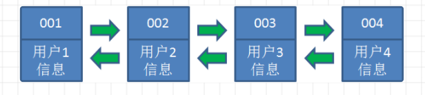
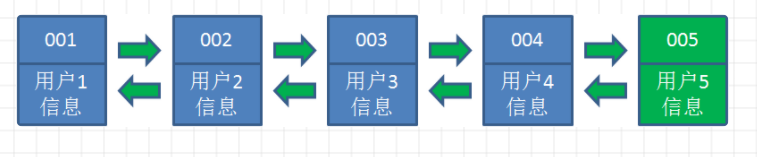
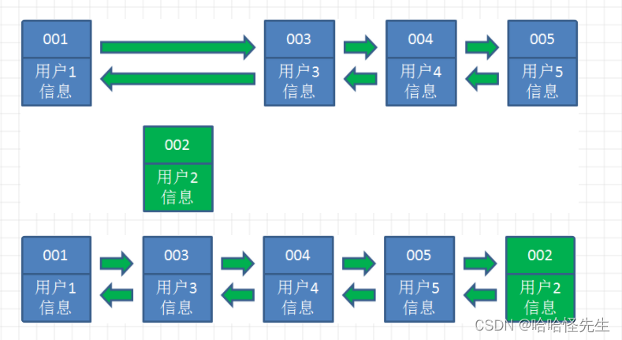
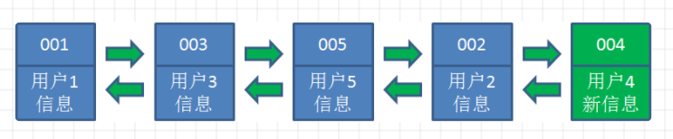
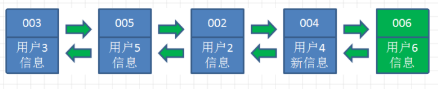

前面在`Redis`的内存淘汰机制中，提到了`Redis`最常用的淘汰策略就是`LRU`，下面我们讲一下。

`LRU`，即`Least Recently Used`，最近最少使用，是一种常用的缓存淘汰策略。其核心思想是基于数据的历史访问记录，即最近最少使用的数据会被优先淘汰。`LRU`缓存的实现结合了哈希表和双向链表，它们各自承担不同的职责：

1. 哈希表：用于快速查找缓存中的数据。通过哈希表可以在常数时间内定位到数据的位置。
2. 双向链表：用于维护数据的访问顺序。双向链表的头部表示最近访问的数据，尾部表示最久未访问的数据。

`LRU`的工作原理如下所示：

- 数据访问：当数据被访问时，首先检查哈希表。如果数据已存在，则将数据节点移动到链表的头部，表示它是最近访问的。
- 数据添加：如果数据不在缓存中，从数据库中读取数据，并将其添加到链表的头部。同时，更新哈希表以存储该数据的位置。
- 容量管理：当缓存达到预设容量时，从链表的尾部移除最久未被访问的数据节点，以腾出空间给新数据。此操作同时更新哈希表，删除尾部的节点，并把新数据放到头部节点。

假设现在缓存中有这四个数据：



当访问用户`5`时，发现哈希链表中没有这个数据，因此需要从数据库中读取，并将其插入缓存链表：



当访问用户`2`时，由于哈希链表中有用户`2`的数据，我们把它掐断，放到链表最右端，表示它是最近使用的。



同理访问用户`4`时，把它掐断放到链表最右端：



当访问用户`6`时，发现哈希链表中没有这个数据，因此需要从数据库中读取，并将其插入缓存链表。由于链表的最大长度为`5`，且当前已满，我们需要先移除最左端的用户`1`，然后再将用户`6`插入到链表中：



相关的`Go`语言实现代码如下所示：

```go
type Node struct {
	key, value int
	prev, next *Node
}

type LRUCache struct {
	capacity   int           // 链表的最大容量
	cacheMap   map[int]*Node // key是Node的key，用来快速定位元素
	head, tail *Node
}

func NewLRUCache(capacity int) *LRUCache {
	head := &Node{}
	tail := &Node{}
	head.next = tail
	tail.prev = head
	return &LRUCache{
		capacity: capacity,
		cacheMap: make(map[int]*Node),
		head:     head,
		tail:     tail,
	}
}

// 将新节点加到链表头节点后
func (c *LRUCache) addNode(node *Node) {
	node.prev = c.head
	node.next = c.head.next
	c.head.next.prev = node
	c.head.next = node
}

// 移除链表中指定节点
func (c *LRUCache) removeNode(node *Node) {
	node.prev.next = node.next
	node.next.prev = node.prev
}

// 将链表中指定节点移动到链表头节点后
func (c *LRUCache) moveToHead(node *Node) {
	c.removeNode(node)
	c.addNode(node)
}

func (c *LRUCache) get(key int) int {
	node, found := c.cacheMap[key]
	if found {
		c.moveToHead(node)
		return node.value
	}
	return -1
}

func (c *LRUCache) put(key, value int) {
	node, found := c.cacheMap[key]
	if found {
		node.value = value
		c.moveToHead(node)
	} else {
		if len(c.cacheMap) == c.capacity {
			// 如果超出链表容量，将尾节点从链表与哈希表中删除
			tailKey := c.tail.prev.key
			c.removeNode(c.tail.prev)
			delete(c.cacheMap, tailKey)
		}
		newNode := &Node{key: key, value: value}
		c.cacheMap[key] = newNode
		c.addNode(newNode)
	}
}
```

