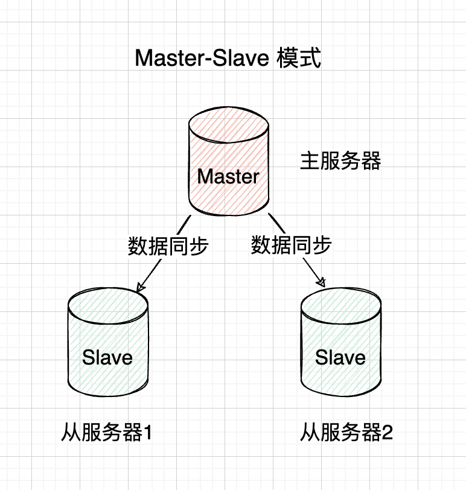
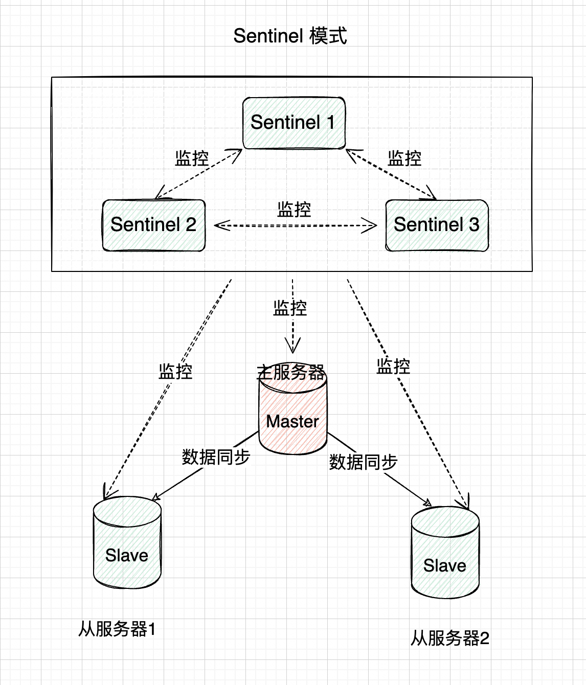
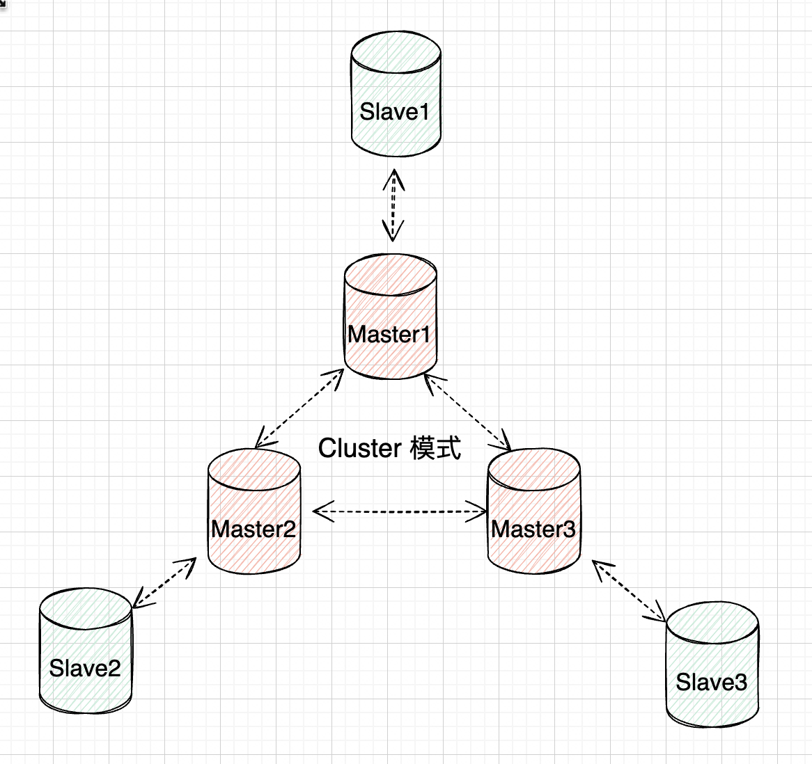

`Redis`的三大集群模式分别是主从复制模式、哨兵模式和`Cluster`模式。这些集群模式解决了高可用性、扩展性和数据一致性问题，适应不同规模和需求的应用场景。

### 1. 主从复制模式

主从复制模式是`Redis`最基础的集群模式。它通过复制数据实现读写分离，提升系统性能和容错能力。

- 主节点（`Master`）：是集群中的核心节点，负责处理所有写操作，如`SET`、`DEL`等，并会将所有的数据更新同步给从节点。

- 从节点（`Slave`）：作为主节点的只读副本，通常只处理读请求，如`GET`操作。从节点会保持和主节点的数据一致性。

一个主节点可以有多个从节点，这些从节点可以分布在不同的物理机器上。主从复制模式的工作架构图如下：

### 2. 哨兵模式

哨兵模式是在主从复制的基础上，通过引入哨兵节点 (`Sentinel`) 来监控`Redis`主从集群的运行状态，实现自动故障检测、转移和通知等功能，确保`Redis`集群的高可用性。哨兵模式的最大特点是能够在主节点发生故障时自动切换主节点，从而减少服务中断时间。

哨兵模式的监控过程如下：

1. 监控：哨兵节点持续监控主节点和从节点的运行状态，定期通过`PING`命令检查`Redis`实例是否正常响应。如果某个节点在指定时间内未响应，则被判定为不可用。
2. 当哨兵检测到主节点宕机时，会发起一次选举过程，选择某个从节点作为新的主节点，并将集群中的其他从节点重新指向新主节点。整个过程是自动完成的，不需要人工介入。
3. 哨兵可以向客户端发送通知，告知它们主从节点的变化。客户端可以据此更新主节点地址，确保写操作可以访问到新主节点。

哨兵本身是一个独立进程，如果仅部署一个哨兵节点，当其故障时，系统的高可用性将无法得到保障，并且单个哨兵无法执行选举。因此，通常需要部署多个哨兵节点，组成哨兵集群，以确保系统的稳定性和可靠性。哨兵模式的工作架构图如下：

### 3. `Cluster`模式

`Cluster`模式是`Redis`的一种高级集群架构，通过数据分片和分布式存储实现负载均衡与高可用性。在`Cluster`模式下，`Redis`将所有键值对分布在多个节点中，每个节点负责存储部分数据（称为哈希槽）。通过数据分片，`Cluster`模式能够突破单节点的内存限制，支持更大规模的数据存储。

`Cluster`模式的工作原理如下：

1. `Cluster`没有中心节点，所有节点是对等的，共同组成一个分布式集群。每个节点可以是主节点（`Master`）或从节点（`Slave`）。主节点负责处理读写请求并管理一定数量的哈希槽，而从节点作为备份，在主节点故障时接管其数据和请求。
2. `Cluster`将数据分散存储在多个节点上，每个节点只存储部分数据，从而实现`Redis`容量和性能的水平扩展。集群通过将数据键映射到`16384`个哈希槽（`Hash Slots`）并将这些哈希槽分配给各个主节点来管理数据。
3. 当一个主节点被标记为下线时，集群会启动选举过程，选择一个从节点作为新的主节点。新主节点接管哈希槽和客户端请求，而原主节点恢复后会作为从节点重新加入集群。
4. 如果从节点发生故障，集群不会立即采取措施，但会尝试恢复该从节点或允许管理员进行修复。如果集群中超过半数的主节点不可用，集群将进入不可写状态，以确保数据一致性，防止因大量节点不可用而导致的数据丢失或不一致。

`Cluster`模式的工作架构图如下：

`Cluster`通过哈希槽（`Hash Slots`）实现数据分片，具体遵循以下规则：

1. `Cluster`将所有数据键通过`CRC16`算法计算哈希值，并取模`16384`，得到一个哈希槽编号（范围为`0`到`16383`）。每个主节点负责管理一部分哈希槽，这样可以提高数据的访问效率并避免某个节点过载。
2. 从节点是主节点的副本，负责复制主节点的数据。当主节点的某个哈希槽中的数据发生变化时，相关的从节点会同步更新，以保持数据的一致性。但是，从节点并不负责管理哈希槽，也不直接处理客户端的读写请求（除非主节点故障，成为新的主节点）。
3. 当`Cluster`接收到客户端的操作命令时，会根据数据键计算其哈希槽，并确定负责该哈希槽的主节点。随后，客户端与该主节点直接通信以执行读写操作。