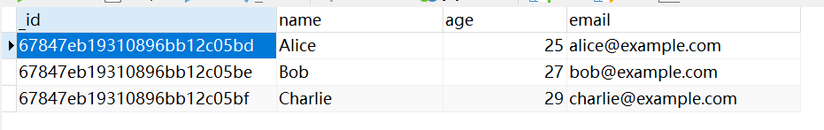
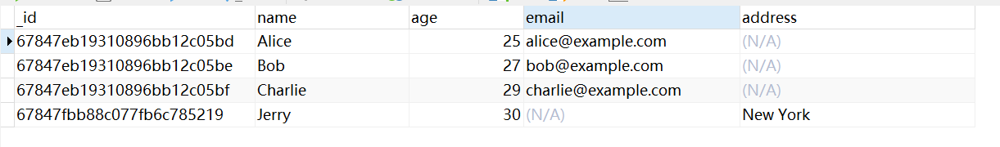

在上一节中，我们介绍了`MongoDB`中关于数据库和集合的基本操作，本节将重点讲解如何对文档进行增、删、改等操作。首先需要明确的是，`MongoDB`的文档必须插入到某个集合中，而不能直接插入到数据库中。接下来，我们切换到`product`集合进行操作演示：

```go
collection := db.Collection("product")
```

### 1. 四种`BSON`类型

在讲解具体操作之前，我们先讲一下`MongoDB`库给我们提供的四种`BSON`的数据类型：

```go
type M map[string]interface{}
type A []interface{}
type E struct {
	Key   string
	Value interface{}
}
type D []E
```

`M`表示`Map`，表示无序的键值对集合，一般作为不保证字段顺序的`MongoDB`文档。示例如下：

```go
doc := bson.M{
    "name":    "Alice",
    "age":     25,
    "address": "123 Main St",
}
```

`M`类型表示一个无序的`BSON`文档，适用于那些不关心元素顺序的场景。如果顺序很重要，则应使用`D`类型。

`A`代表`Array`，表示数组，其元素可以为任何类型，常用于文档中的数组字段。示例如下：

```go
arr := bson.A{"apple", "banana", "cherry"}
```

`E`代表`Element`，表示元素，它由单个键值对组成，包含字段名`Key`和字段值`Value`。示例如下：

```go
elem := bson.E{Key: "name", Value: "Alice"}
```

`E`是`D`的基本组成部分，通常不单独使用，而是用来构建有序文档。

`D`代表`Document`，表示有序的键值对集合，一般作为保证字段顺序的`MongoDB`文档。示例如下：

```go
doc := bson.D{
	{"name", "Alice"},
	{"age", 25},
	{"address", "123 Main St"},
}
```

`D`类型表示一个有序的`BSON`文档，适用于那些元素顺序重要的场景，例如`MongoDB`的命令文档。在`D`类型中，元素的顺序会被保留，从而确保在序列化时按指定顺序处理数据。需要注意的是，`D`类型中不能包含重复的键名，因为这可能导致不确定的服务器行为。

### 2. 插入文档

由于`MongoDB`的文档在大多数情况下不依赖顺序，我们使用`bson.M`格式来表示`MongoDB`文档。首先是插入单个文档的操作：

```go
doc := bson.M{
    "name":  "John Doe",
    "age":   30,
    "email": "john.doe@example.com",
}
result, _ := collection.InsertOne(context.Background(), doc)
```

`InsertOne`方法的方法签名如下所示：

```go
func (coll *Collection) InsertOne(ctx context.Context, document interface{},
	opts ...*options.InsertOneOptions) (*InsertOneResult, error)
```

其中，返回值`InsertOneResult`的结构如下所示：

```go
type InsertOneResult struct {
	InsertedID interface{}
}
```

这里的`InsertedID`就是`MongoDB`自动为文档生成的唯一`id`，示例值：`ObjectID("678093bf726952f21e03ce3b")`。我们也可以在插入时手动设置`_id`键，可以使用`string`类型或`ObjectId`类型：

```go
doc := bson.M{
	"_id":   primitive.NewObjectID(),
	"name":  "John Doe",
	"age":   30,
	"email": "john.doe@example.com",
}
```

如果需要设置某些选项，可以使用`options.InsertOne()`创建一个`InsertOneOptions`对象，并将其传递给`InsertOne`方法：

```go
opts := options.InsertOne().SetBypassDocumentValidation(true) // 跳过文档验证
result, _ := collection.InsertOne(context.Background(), doc, opts)
```

如果想一次插入多个文档，代码如下所示：

```go
docs := []interface{}{
    bson.M{
        "name":  "Alice",
        "age":   25,
        "email": "alice@example.com",
    },
    bson.M{
        "name":  "Bob",
        "age":   27,
        "email": "bob@example.com",
    },
}
result, _ := collection.InsertMany(context.Background(), docs)
```

`InsertMany`方法的返回值，其结构如下所示：

```go
type InsertManyResult struct {
	InsertedIDs []interface{}
}
```

实际上，我们可以使用结构体作为插入文档的格式。相比直接使用`bson.M`，结构体格式具有更高的可读性和可维护性。

例如我们定义这样一个结构体：

```go
type User struct {
    Name  string `bson:"name"`
    Age   int    `bson:"age"`
    Email string `bson:"email"`
}
```

我们需要为结构体字段添加`bson`标签，以指定每个字段在`MongoDB`文档中的键名。

- `bson:"fieldName"`：将`Go`字段映射到`MongoDB`文档中的`fieldName`字段。
- `bson:"-"`：忽略该字段，不将其序列化为`MongoDB`文档的键。
- `bson:"fieldName,omitempty"`：如果字段的值为空，`MongoDB`将不会存储该字段。

我们可以手动指定`MongoDB`的`_id`字段。如果显式提供`_id`字段，`MongoDB`会使用提供的值；如果没有提供，`MongoDB`则会自动生成一个`_id`值。该`ID`字段的类型为`primitive.ObjectID`，如下所示：

```go
type User struct {
    ID    primitive.ObjectID `bson:"_id,omitempty"`  // _id 字段可选
    Name  string             `bson:"name"`
    Age   int                `bson:"age"`
    Email string             `bson:"email"`
}
```

插入结构体对象示例如下：

```go
user := &User{
	Name:  "John Doe",
	Age:   30,
	Email: "john.doe@example.com",
}
result, _ := collection.InsertOne(context.Background(), user)
```

我们可以直接插入结构体对象或其地址。这里的结构体插入时，会被转换为`bson.M`格式。

如果使用的是嵌套结构体，`MongoDB`会递归地将嵌套的结构体转换为`bson.M`格式的文档进行插入。例如下面这个结构体：

```go
type Address struct {
    Street string `bson:"street"`
    City   string `bson:"city"`
}

type User struct {
    Name    string  `bson:"name"`
    Age     int     `bson:"age"`
    Email   string  `bson:"email"`
    Address Address `bson:"address"`
}
```

它对应的`bson.M`对象的格式如下所示：

```go
userBsonM := bson.M{
    "name":   "Alice",
    "age":    25,
    "email":  "alice@example.com",
    "address": bson.M{
        "street": "123 Elm St",
        "city":   "Seattle",
    },
}
```

可以通过构建一个`[]interface{}`类型的切片来一次性插入多条文档：

```go
users := []interface{}{
	&User{
		Name:  "Alice",
		Age:   25,
		Email: "alice@example.com",
	},
	&User{
		Name:  "Bob",
		Age:   27,
		Email: "bob@example.com",
	},
	&User{
		Name:  "Charlie",
		Age:   29,
		Email: "charlie@example.com",
	},
}
result, _ := collection.InsertMany(context.Background(), users)
```

我们可以使用`Navicat`连接该集合，看到里面插入的数据：



如果我们向该集合插入一条不同结构的文档，它们在`Navicat`上展示如下：



我们发现，`Navicat`会将所有文档的字段统一展示，对于不存在该字段的文档，则显示为`N/A`。

在插入文档时，如果插入了两条完全相同的文档且未手动设置`_id`值，`MongoDB`会为每个文档自动分配一个新的`_id`，使它们成为不同的文档。如果手动指定了相同的`_id`值，`MongoDB`会检测到重复的`_id`字段，并在调用插入操作时返回错误，因为`_id`在同一集合中必须是唯一的。如果某个字段（例如`email`）设置了唯一索引（`unique`），那么`MongoDB`会阻止插入具有相同`email`的文档。

